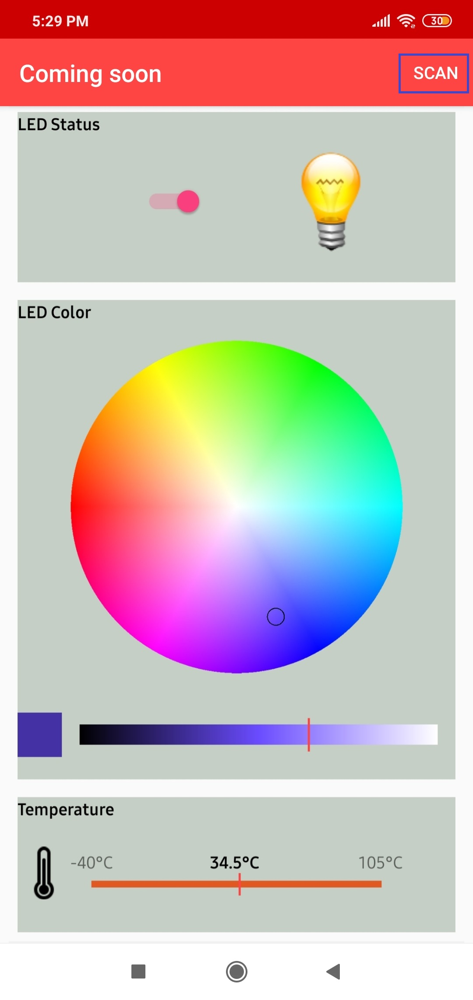
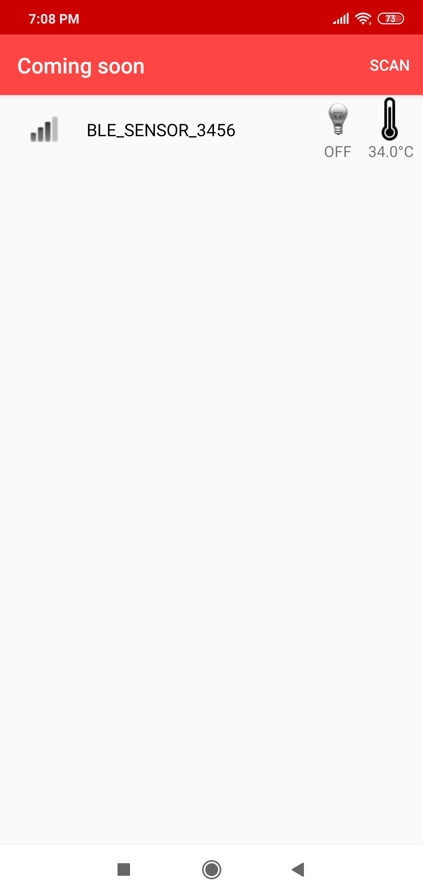
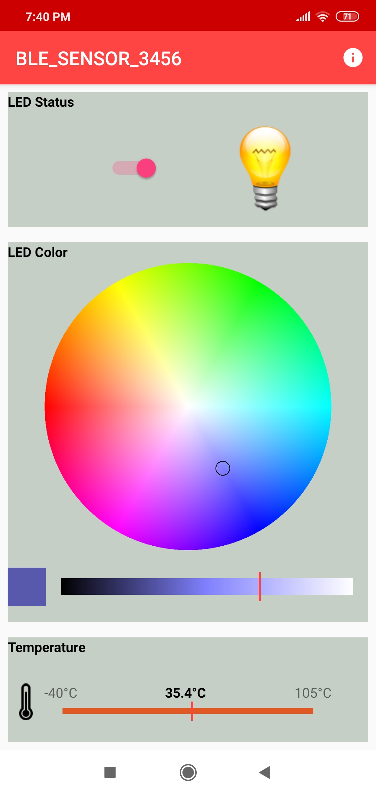
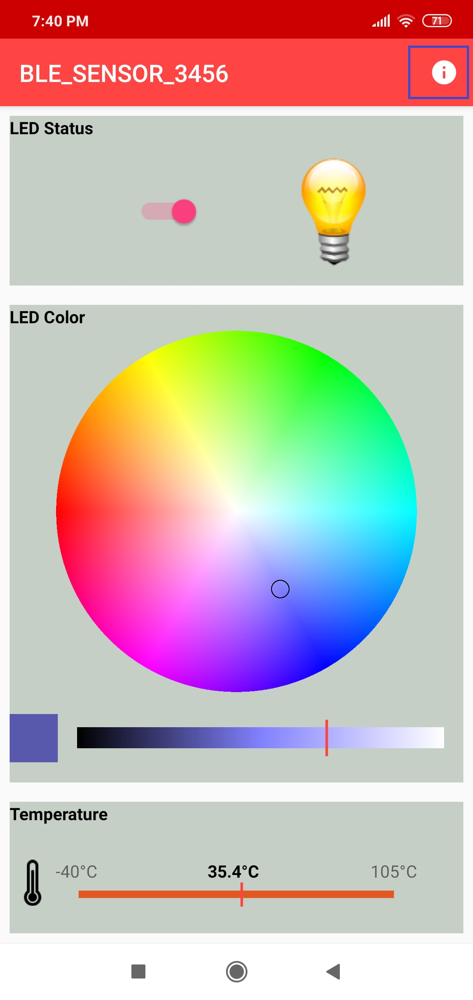
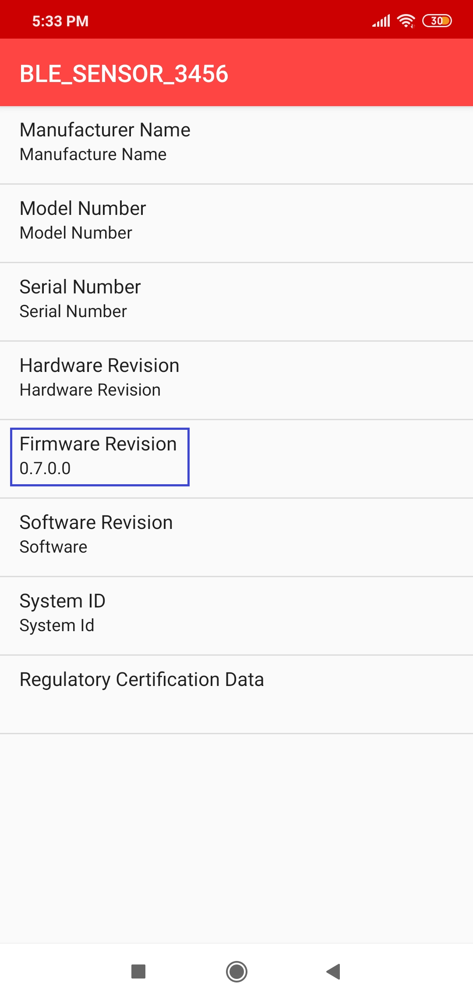
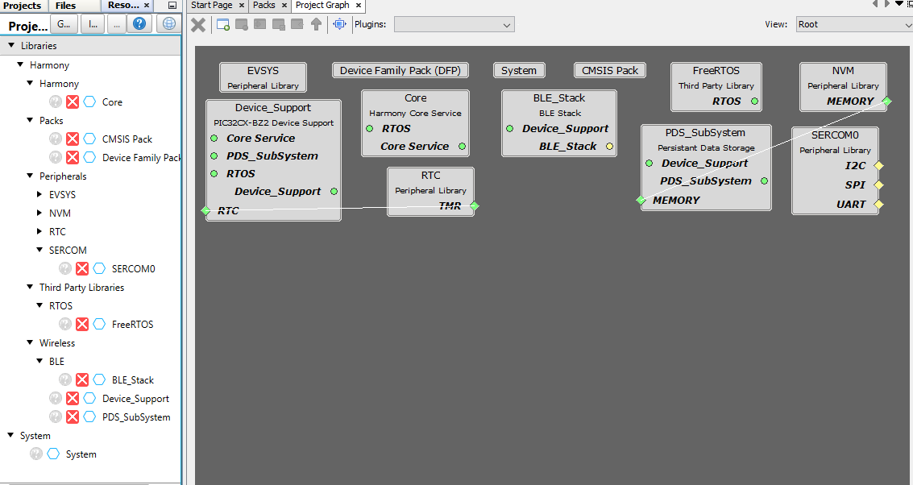

[](https://www.microchip.com)
# WBZ451 BLE Sensor DEMO

---
### WBZ451 Curiosity Board

Devices (Device): \| **PIC32CX1012BZ25048(MCU) on WBZ451 module**  \|

Devices (Used, On-Board): \| **Analog Temperature Sensor** \| **RGB LED** \| **User Button**\| **User LED**\| **UART-USB Converter**\|


### Hardware Block Diagram - Curiosity Board


---
## Hardware Required

  |**Tool**                | **Qty**  |
  |------------------------| ---------|
  |WBZ451 Curiosity Board  | 1        |
  |Micro USB cable         | 1        |
  |Android/iOS Mobile     | 1        |

## Software

1.  <a href="https://ttssh2.osdn.jp/index.html.en"> TeraTerm </a>

## Smartphone App

1.  Microchip Bluetooth Data (MBD) iOS/Android app available in stores

## Demo Description
This application demonstrates the capability of WBZ451 module to connect to a mobile phone through Bluetooth Low Energy(BLE). The RGB LED on the Curiosity board can be controlled by mobile app. The WBZ451 device will also report the temperature data periodically to mobile phone through Bluetooth low energy (BLE).

1. The WBZ451 module will be a BLE peripheral device and will advertise on startup. The user can initiate the connection through mobile application.
    - The [advertisement payload](protocol.md) holds the temperature information and the RGB ON/OFF status.
2. Uses "BLE Sensor" from the Microchip Bluetooth Data (MBD) mobile app for BLE demonstration.
    - Application is supported by iOS & Android Cell Phone devices.
    - Available in the Application Stores
3. When CONNECTED(ING) to the application the BLUE color "User LED" will turn on.
    - Blinks the "User LED" with 500 mSec blink interval when the device sending advertisement packets.
    - Once connected, the "User LED" turns on solidly.
4. From the Phone Application the following actions can be performed.
    - The RGB LED can be switched On/Off from MBD mobile app.
    - When LED is switched On, the RGB color can be changed from mobile app color wheel.
      - The RGB color value is received as HSV (Hue, Saturation, Value) from mobile app through TRPS [transparent profile and service](protocol.md)
      - The HSV value is converted to RGB equivalent value in the device. The corresponding PWM duty cycle for R,G,B will be calculated and the PWM pulse is provided on R,G,B LEDs.
5. From the  WBZ451 module the following actions can be performed.
    - The RGB LED can be switched On/Off by pressing the On board "User Button".
      - When the "User Button" is pressed and released RGB LED is switched ON with default color GREEN or the last stored color.
      - When the "User Button" is pressed and released again, then the RGB LED will be toggled from the previous state.
    - Read the temperature sensor every 1 sec once and send the temperature value to mobile app when the temperature changes about 1 degree C.
---


## Expected Out of Box Behavior
Follow the steps [Programming the precompiled hex file using MPLABX IPE](#tasks) to program the pre-compiled hex image.
- If want to do changes in the demo code and would like to program/debug the customized code follow the instruction in [Build and Program The Application](#tasks_1)

<a name="tasks_2">
</a>

1. Power Up
    - Connect the curiosity board using Micro USB to PC

<p align="left">
  
</p>

2. Power On Behavior

    - Power Supply (PS) Green LED will turn on when connect to PC.

<p align="left">
   
</p>

3. UART Console Behaviour

    - The application activity is shown as "Console Log" through on board UART-USB converter
    - Open Terminal (eg: Tera Term) to look for these logs
```json    
    UART baud settings: 115200 8-N-1 without flow control
```    

<p align="left">
   
</p>

4. BLE Not Connected Behavior
    - The Blue "User LED" will be blinking
    - Scanned from mobile app as "BLE_Sensor_XXXX", where 'XXXX' is a unique number associated with this board. Launch MBD mobile app and follow the below screenshots.
    ```json    
        Note: "User LED" is multiplexed with SWO pin functionality. Hence when device is in debug mode "User LED" will be solid ON always.
    ```      

<p align="left">
   
</p>    

<p align="left">
  
  ---->      
  
  ---->
     
  ---->
    
</p>

5. BLE Connected Behavior (Connected to "BLE Sensor" MBD Mobile Application)
    - The Blue "User LED" will be solid On when connected    

<p align="left">
   
</p>

<p align="left">
  
  ---->   
    
</p>

6. Firmware Version
    - Bluetooth SIG defined "Device Info Service" is implemented in the device to share the device information like "firmware version", "manufacture name", etc..
    - Verify the firmware version shown on console with MBD app

<p align="left">
       
</p>

<p align="left">
    
       ---->
    
</p>

7. The BLE Sensor mobile app will show the temperature (deg C) and LED status received from device, as well as allow the user to vary the RGB color and brightness

<p align="left">
   
</p>

<p align="left">
  
</p>  

8. The RGB LED can also be switched On/Off by pressing the On board "User Button". The On/Off LED status will also be reported to mobile app if connected.
    - When the "User Button" is pressed and released, RGB LED is switched ON. When pressed and released again, the state will be toggled from the previous state.

    <p align="left">
       
    </p>

---

<a name="tasks">
</a>

## Programming the precompiled hex file using MPLABX IPE

1.  Precompiled Hex file is located <a href="precompiled_hex/"> here </a>

2.  Follow the steps mentioned [here](https://microchipdeveloper.com/ipe:programming-device)

 **Caution:** Users should choose the correct Device and Tool information

3. Follow the steps for [running the demo](#tasks_2)

 <a name="tasks_1">
 </a>

## Build and Program The Application

The source code of BLE Sensor demo application is available in "apps/ble/advanced_applications/ble_sensor_app/" folder. If want to do changes in the demo code and would like to program/debug the customized code follow the below instruction.

### SDK Setup
[SDK Setup](../../../docs/pic32cx_bz2_wbz45x_sdk_setup.md)

1. Open the "/firmware/ble_sensor_app.X" MPLABX project from MPLABX
<p align="left">
  
  ---->
    
</p>

2. Do your changes in the code ([Example to add new sensor command](#oob)). Clean and build your application by clicking on the Clean and Build button as shown below.
<p align="left">
  
</p>

3. Program your application to the device, by clicking on the Make and Program button as shown below
<p align="left">
  
</p>

---

## Protocol Exchange
The communication protocol exchange between BLE sensor mobile app (BLE central) and WBZ451 module (BLE peripheral) is explained [here](protocol.md)

---

## Application Flow Diagram

<p align="left">
    
</p>

---
<a name="oob">
</a>

## Hints: Expanding on the Out Of Box (OOB) Application
The BLE Sensor demo protocol based on TRPS profile is a transparent request, response based and not tied only to this BLE sensor application. It can be expanded and customized as per the users need.

<p align="left">
    
</p>

The protocol parser is implemented in app_trps.c and app_trps.h:
  1. **Request and Response:** when user wants to get and modify data on the device
  2. **Notify:** when there is a new data to be sent to mobile app

The protocol commands are defined in app_ble_sensor.h and related sensor functionalities are implemented in app_ble_sensor.c
  1. **Request and Response:** When a command request is received from mobile app, app_trps.c parse the data and forward to specific command callback handler in app_ble_sensor.c
  2. **Notify:** When specific Sensor data to be sent to mobile app, app_ble_sensor.c places the data in data base and calls for notify handler in app_trps.c (/ref APP_TRPS_SendNotification())

### Example: To add a command to get temperature in Fahrenheit
Complete the SDK Setup and open the ble_sensor_app.X MPLABX project from MPLABX as in [Build and Program The Application](#tasks_1)

**app_ble_sensor.h**

1. Define request, response, size of response payload (not including size of length byte and response ID)

  1. Define a new control command ID


    //  Defines BLE Sensor Control Command Set APP_TRPS_CTRL_CMD
    #define    RGB_ONOFF_SET_CMD    0x10
    #define    RGB_ONOFF_GET_CMD    0x11   
    #define    RGB_COLOR_SET_CMD    0x12
    #define    RGB_COLOR_GET_CMD    0x13
```json
#define    TEMP_FAREN_GET_CMD   0x14
```    
  2. Define a new control command response


    //  Defines BLE Sensor Response Command Set APP_TRPS_CTRL_RSP
    #define    RGB_ONOFF_SET_RSP    0x20
    #define    RGB_ONOFF_GET_RSP    0x21   
    #define    RGB_COLOR_SET_RSP    0x22
    #define    RGB_COLOR_GET_RSP    0x23
```json
#define    TEMP_FAREN_GET_RSP   0x24
```    

  3. Define the length for the new response command


    //  Defines BLE Sensor Response Command length APP_TRPS_CTRL_RSP_LENGTH
    #define    RGB_ONOFF_SET_RSP_LEN 0x0
    #define    RGB_ONOFF_GET_RSP_LEN 0x1   
    #define    RGB_COLOR_SET_RSP_LEN 0x0
    #define    RGB_COLOR_GET_RSP_LEN 0x3
```json    
#define    TEMP_FAREN_GET_RSP_LEN 0x2
```    

2. Inside the existing APP_TRPS_SensorData_T structure, add the new data structure which holds the response data

    typedef struct
    	{
    	    uint8_t    rgbOnOffStatus;        /**< RGB LED On/Off Status */
    	    struct __attribute__ ((packed))
    	    {
    	        uint8_t    Hue;         /**The array contains the information about RGB colour value in HSV format. */
    	        uint8_t    Saturation;
    	        uint8_t    Value;
    	    }RGB_color;
    	    struct __attribute__ ((packed))
    	    {
    	        uint8_t    msb;
    	        uint8_t    lsb;
    	    }tempSens;
```json    	   
struct __attribute__ ((packed))
{
     uint8_t    msb;
     uint8_t    lsb;
}tempFaren;
```    	   
    	} APP_TRPS_SensorData_T;    

3. Increase the list size BLE_SENSOR_CMD_RESP_LST_SIZE by one
```json
#define BLE_SENSOR_CMD_RESP_LST_SIZE   5
```    
4. Add new command request/response set in BLE_SENSOR_DEFINE_CTRL_CMD_RESP() list

  #define BLE_SENSOR_DEFINE_CTRL_CMD_RESP()                \
	        { RGB_ONOFF_SET_CMD, RGB_ONOFF_SET_RSP, RGB_ONOFF_SET_RSP_LEN, NULL , APP_TRPS_Sensor_LED_Ctrl},      \
	        { RGB_ONOFF_GET_CMD, RGB_ONOFF_GET_RSP, RGB_ONOFF_GET_RSP_LEN, (uint8_t *)&bleSensorData.rgbOnOffStatus , NULL},       \
	        { RGB_COLOR_SET_CMD, RGB_COLOR_SET_RSP, RGB_COLOR_SET_RSP_LEN, NULL , APP_TRPS_Sensor_Color_Ctrl},      \
	        { RGB_COLOR_GET_CMD, RGB_COLOR_GET_RSP, RGB_COLOR_GET_RSP_LEN, (uint8_t *)&bleSensorData.RGB_color , NULL}, \
```json
{ TEMP_FAREN_GET_CMD, TEMP_FAREN_GET_RSP, TEMP_FAREN_GET_RSP_LEN, (uint8_t *)&bleSensorData.tempFaren , NULL}
```

**app_ble_sensor.c**

5. Read the temperature periodically and store in above defined data structure. Add the below code in APP_TRPS_Sensor_TimerHandler()

```json
  if( bleSensTimer%15)  // temp sensor read every 1.5sec once
    {

      temperature = MCP9700_Temp_Fahrenheit();

      tempS = (uint16_t) (temperature * 10);  // 1 decimal place

      bleSensorData.tempFaren.lsb = (uint8_t) tempS;

      bleSensorData.tempFaren.msb = (uint8_t) (tempS>>8);
    }
```

6. After doing the above changes follow the instruction in [Build and Program The Application](#tasks_1)

### Testing with MBD mobile app

The "BLE Sensor" sub app in MBD mobile app is designed only to work with specific functionality. So, if new command is added in BLE sensor application, "BLE Sensor" mobile app will not know about it. To test the above newly added code, "BLE Smart" sub app in MBD can be used. Follow the below screenshots after launching MBD mobile app.

<p align="left">
  
  ---->      
  
  ---->
     
  ---->
    
  ---->
     
  ---->
     
  ---->
      
</p>

### Using MPLAB Code Configurator

<<<<<<< HEAD
MPLABX Harmony provides the MPLAB® Code Configurator (MCC) tool, a set of modular device and middleware libraries, and numerous example applications, all of which are designed to help developers to quickly and easily develop powerful and efficient embedded software. The following steps can be followed to open MCC tool and generate the code.
=======
MPLAB® Code Configurator (MCC) is a free graphical programming environment that generates seamless, easy-to-understand C code to insert into your project. Using an intuitive interface, it enables and configures a rich set of peripherals and functions specific to your application.  The following steps can be followed to open MCC tool and generate the code.
>>>>>>> 19d9eac030c68ec11a58a5f53f0a67aa2db4e324

1. Open MCC tool from MPLABX
<p align="left">
  
</p>

2. Once the MCC tool is launched, the "Project Graph" shows the list of H3 components used in the specific project

<p align="left">
  
</p>

3. Clicking on the specific component block will allow to change the configuration of that component. eg:SERCOM0 is shown in the screenshot.

<p align="left">
  
</p>

4. New component can also be added by drag and drop from "Device Resources" to "Project Graph". Then configure the component as in step #3. eg: SERCOM1 can be added into "Project Graph"

<p align="left">
<<<<<<< HEAD
  
=======
  
>>>>>>> 19d9eac030c68ec11a58a5f53f0a67aa2db4e324
</p>

5. Once all the required components and configurations are done, [Generate Code](../../../docs/generate_code.md)

<p align="left">
  
</p>

---
