
# BLE UART Application User Guide (v0.7)

## Revision History

| Revision | Date       | Comments                                                                                                                                                                                                                               |
| -------- | ---------- | -------------------------------------------------------------------------------------------------------------------------------------------------------------------------------------------------------------------------------------- |
| v0.1     | 2020-09-28 | Initiate this document                                                                                                                                                                                                                 |
| v0.2     | 2020-09-29 | 1. Update the introduction.  2. Add Reference chapter.  3. Add some description for the supported service/profile.  4. Update the screenshot for firmware version.                                                            |
| v0.3     | 2020-10-14 | 1. Update several screenshots.  2. Revise the LED behavior.  3. Add two chapters for UART Burst mode and Text Mode.  4. Add the Android app chapter.                                                                          |
| v0.4     | 2020-11-30 | 1. Add the user guide of the client role with a central device.                                                                                                                                                                        |
| v0.5     | 2021-01-06 | Add new sections:  - 1.3 LED Indication; 1.4 Button Control; 1.5 Build Option.  - 3. Multi-link With Mobile Phones.  - 4. Pairing & Privacy.   - 5. Supplement for throughput analysis.                                    |
| v0.6     | 2021-03-29 | Add new sections:  - 3.8. Multi-link Central Demo.  - 4.3 Trusted Device Connectable Mode.  - 5. Extended Adverting.   - 6. Long Range.   - 7.3  UART command/event format.  - 7.4 Set Bluetooth Device Address.  |
| v0.7     | 2021-10-12 | 1. Add new sections:  - 8. Sleep mode.   - 3.8.1 Reverse Loopback mode for multilink of central role.   2. Update button control and LED indication for Reverse Loopback mode.   |

## Table of Contents
<!-- TOC depthFrom:1 depthTo:6 withLinks:1 updateOnSave:1 orderedList:0 -->

- [BLE UART Application User Guide (v0.7)](#ble-uart-application-user-guide-v07)
	- [Revision History](#revision-history)
	- [Table of Contents](#table-of-contents)
	- [1. Introduction](#1-introduction)
		- [1.1. Data Beacon for Advertising](#11-data-beacon-for-advertising)
			- [- Advertising Data](#-advertising-data)
			- [- Scan Response Data](#-scan-response-data)
		- [1.2. Supported Service and Profile](#12-supported-service-and-profile)
			- [- Service](#-service)
			- [- Profile](#-profile)
		- [1.3 LED Indication](#13-led-indication)
			- [Peripheral (Server) Role:](#peripheral-server-role)
			- [Central (Client) Role:](#central-client-role)
		- [1.4 Button Control](#14-button-control)
		- [1.5 Build Option](#15-build-option)
	- [2. Interaction with MBD Mobile App](#2-interaction-with-mbd-mobile-app)
		- [2.1. Work with iOS MBD App](#21-work-with-ios-mbd-app)
			- [- How to Scan and Connect to the Device](#-how-to-scan-and-connect-to-the-device)
			- [- Firmware Version](#-firmware-version)
			- [- Select Transparent Profile](#-select-transparent-profile)
			- [- Demo Modes](#-demo-modes)
				- [A. Burst Modes](#a-burst-modes)
					- [1. Checksum Mode](#1-checksum-mode)
					- [2. Fixed Pattern Mode](#2-fixed-pattern-mode)
					- [3. Loopback Mode](#3-loopback-mode)
					- [4. UART Mode](#4-uart-mode)
				- [B. Text Mode](#b-text-mode)
		- [2.2. Work with Android MBD App](#22-work-with-android-mbd-app)
			- [- How to Scan and Connect to the Device](#-how-to-scan-and-connect-to-the-device)
			- [- Firmware Version](#-firmware-version)
			- [- Select Transparent Profile](#-select-transparent-profile)
			- [- Demo Modes](#-demo-modes)
				- [A. Burst Modes](#a-burst-modes)
					- [1. Checksum Mode](#1-checksum-mode)
					- [2. Fixed Pattern Mode](#2-fixed-pattern-mode)
					- [3. Loopback Mode](#3-loopback-mode)
					- [4. UART Mode](#4-uart-mode)
				- [B. Text Mode](#b-text-mode)
		- [2.3. Multi-link Demo With Mobile Phones](#23-multi-link-demo-with-mobile-phones)
			- [How to Establish the Second LE Link With Mobile Phone](#how-to-establish-the-second-le-link-with-mobile-phone)
			- [Demo Mode](#demo-mode)
	- [3. Interaction of both PIC32CX-BZ Devices](#3-interaction-of-both-pic32cx-bz-devices)
		- [3.1. Supported Profile](#31-supported-profile)
		- [3.2. The Topology of PIC32CX-BZ to PIC32CX-BZ:](#32-the-topology-of-pic32cx-bz-to-pic32cx-bz)
		- [3.3. Role Switch between a Central Device and a Peripheral Device](#33-role-switch-between-a-central-device-and-a-peripheral-device)
		- [3.4. BLE Link Creation](#34-ble-link-creation)
		- [3.5. Data Exchange Modes](#35-data-exchange-modes)
		- [3.6. LED Indication](#36-led-indication)
		- [3.7. Data Exchange Demo Procedures](#37-data-exchange-demo-procedures)
		- [3.8. Multi-link For Central Role Demo](#38-multi-link-for-central-role-demo)
			- [3.8.1  Reverse Loopback Modes](#381-reverse-loopback-modes)
	- [4. Security and Privacy](#4-security-and-privacy)
		- [4.1 Security](#41-security)
		- [4.2 Privacy](#42-privacy)
		- [4.3 Trusted Device Connectable Mode](#43-trusted-device-connectable-mode)
	- [5. Extended Adverting](#5-extended-adverting)
	- [6. Long Range](#6-long-range)
		- [6.1 Introduction](#61-introduction)
		- [6.2 Data Exchange Demo Procedures](#62-data-exchange-demo-procedures)
			- [6.2.1  The Mobile Phone V.S The PIC32CX-BZ Device](#621-the-mobile-phone-vs-the-pic32cx-bz-device)
			- [6.2.2 The PIC32CX-BZ Devices](#622-the-pic32cx-bz-devices)
			- [6.2.3 The Link Loss Distance Measurement and The Maximum Link Distatnce Measurement](#623-the-link-loss-distance-measurement-and-the-maximum-link-distatnce-measurement)
		- [6.3 Notification](#63-notification)
	- [7. Supplement](#7-supplement)
		- [7.1. Throughput Filed Test Report](#71-throughput-filed-test-report)
			- [-With Mobile Phones](#-with-mobile-phones)
			- [-PIC32CX-BZ v.s PIC32CX-BZ](#-pic32cx-bz-vs-pic32cx-bz)
		- [7.2. How to Achieve Maximum Throughput with Smart Phones](#72-how-to-achieve-maximum-throughput-with-smart-phones)
			- [Operation Type](#operation-type)
			- [Connection Interval](#connection-interval)
			- [Number of Packets Transmitted Within a Connection Event](#number-of-packets-transmitted-within-a-connection-event)
			- [Data Size of Each Packet](#data-size-of-each-packet)
			- [Limitation of UART](#limitation-of-uart)
			- [Note:](#note)
		- [7.3. UART Command/Event Format](#73-uart-commandevent-format)
		- [7.4. Set Bluetooth Device Address](#74-set-bluetooth-device-address)
	- [8. Sleep Mode](#8-sleep-mode)
		- [8.1. How to use Harmony v3 to Configure Sleep Mode](#81-how-to-use-harmony-v3-to-configure-sleep-mode)
		- [8.2. The Scope of Sleep Mode](#82-the-scope-of-sleep-mode)
	- [Reference](#reference)

<!-- /TOC -->

## 1. Introduction

The purpose of this document is to illustrate the user guide of the BLE UART Application for PIC32CX-BZ.
BLE UART Application is designed to demonstrate several functionalities including:
1.	Connection with mobile phone via BLE
2.	Data transmission between PIC32CX-BZ and mobile phone via BLE and throughput evaluation.
3.	Data transmission between PIC32CX-BZ and mobile phone via BLE; data transmission between PIC32CX-BZ and a host device (such as PC) via UART and throughput evaluation.
In order to do the data comparison in the receiver side, the fixed data pattern shall be provided in the sender side.
4. Data transmission for the UART mode or the loopback mode via BLE between PIC32CX-BZ devices which are both the client role of a central device and the server role of a peripheral device.
5. Data exchange between PIC32CX-BZ and mobile phone via BLE long range or Data exchange between PIC32CX-BZ devices via BLE long range and the link loss distance evaluation for long range or maximum link distatnce evaluation for long range. 

### 1.1. Data Beacon for Advertising

#### - Advertising Data
The Service Data Format is utilized in advertising data. The data format is shown as below:

|        | ADV Length | ADV Type | Service UUID | Additional data |
|:------:|:----------:|:--------:| :-----------:| :--------------:|
| Length |   1 Byte   |  1 Byte  | 2 Bytes      | Up to 27 bytes  |
| Value  |    0xXX    |   0x16   | 0xFEDA\*     | 0xXX...         |

\*Note: 0xFEDA is a 16-bit Service UUID which is purchased by Microchip from Bluetooth SIG.

#### - Scan Response Data
The device name is put in the scan response. And the device name is set as "BLE_UART_XXXX". (XXXX means the last two bytes of the device address.) 

### 1.2. Supported Service and Profile
The supported service and profile are listed in the below section.

#### - Service
1. Transparent Service: MCHP proprietary service, see Reference [1] for the detail.
2. Transparent Credit Based Service: MCHP proprietary service, see Reference [2] for the detail.
3. Device Information Service: Bluetooth SIG standard service, see Reference [3] for the detail.

#### - Profile
1. Transparent Profile (TRP): MCHP proprietary profile, see Reference [4] for the detail.
2. Transparent Credit Based Profile (TRCBP): MCHP proprietary profile, see Reference [5] for the detail. 

### 1.3 LED Indication
The LED indication is defined as below based on the different role and state:
#### Peripheral (Server) Role:
1. Advertising State (No LE link existed): Flash Green LED one time every 500 ms.
2. Connected with one or multiple peer devices: Green LED is always on.
3. Advertising State with at least 1 LE link has been established: Flash Green LED one time every 500 ms.

#### Central (Client) Role:
1. Scanning State: Flash Red LED one time every 500 ms.
2. Connected with one or multiple peer devices: Red LED is always on.
3. UART Demo Mode is selected: Red LED is always on.
4. Loopback Demo Mode is selected: Flash Red LED twice every 3 seconds.
5. Scanning State with at least 1 LE link has been established: Flash Red LED one time every 500 ms. 

Note: Idle State: All LEDs are off. 

### 1.4 Button Control
The user button is used to control the device behavior. 
 
The button control is defined as below table based on the different state:

|                      Current State  (LED Status)                      |                                                                                            Short Press (Action/Next State)                                                                                             |                                                                                          Long Press (Action/Next State)                                                                                          |     Double Press (Action/Next State)     |
|:------------------------------------------------------------------------:|:-------------------------------------------------------------------------------------------------------------------------------------------------------------------------------------------------------------------------:|:-------------------------------------------------------------------------------------------------------------------------------------------------------------------------------------------------------------------:|:-------------------------------------------:|
|        Adverting State (Flash Green LED one time every 500 ms)        |                                                                                                  Scanning/Scanning State                                                                                                  |                                                                                           Disable Advertising/Idle State                                                                                            |                                             |
|         Scanning State (Flash Red LED one time every 500 ms)          |                                                                                               Advertising/Advertising State                                                                                               |                                                                                               Disable Scan/Idle State                                                                                               |                                             |
|  Connected as Peripheral role with 1 device (Green LED is always on)  |                                                                                       Advertising/Connected State with Advertising                                                                                        |                                                                                        Terminate the link/Advertising State                                                                                         |                                             |
|    Connected as Central role with 1 device (Red LED is always on)     |                                                                            Switch Demo mode between UART mode and Loopback mode/Connected Sate                                                                            |                                                                                       Scanning/Connected State with Scanning                                                                                        | Start Reverse Loopback mode/reverse loopback mode |
| Connected as Peripheral role with 1+ devices (Green LED is always on) | 1. Max connected devices approached: No Action/Connected State.  2. Max connected devices is not approached: Advertising/Connected State with Advertising.  Note: BLE UART v0.7.2 can achieve 4 devices multi-link. |                                                                          Terminate the link of the first connected device/Connected State.                                                                          |                                             |
|   Connected as Central role with 1+ devices (Red LED is always on)    |                                                                            Switch Demo mode between UART mode and Loopback mode/Connected Sate                                                                            | 1. Max connected devices approached: No Action/Connected State.  2. Max connected devices is not approached: Scanning/Connected State with Scanning.  Note: BLE UART v0.7.2 can achieve 6 devices multi-link. | Start Reverse Loopback mode/reverse loopback mode |
| Central role multi-link for reverse loopback mode  (Flash Red LED one time every 300 ms) | No Action/reverse loopback mode  |No Action/reverse loopback mode | Start Reverse Loopback mode/reverse loopback mode|
| Idle State (All LEDs are off)                     |                                                                                               Advertising/Advertising State                                                                                               |                                                                                                No Action/Idle State                                                                                                 |            No Action/Idle State |

Note: The user button can't work correctly with Curiosity board hardware version WBZ451 v1. Please use version R2.0 instead. 

### 1.5 Build Option
The features supported in BLE UART could be activated/deactivated by enable/disable the corresponding define in app.h:

|             Feature             |                      Define                       | Default Setting |                                         Note                                         |
|:-------------------------------:|:-------------------------------------------------:|:---------------:|:------------------------------------------------------------------------------------:|
| Transparent Profile Client Role |                  APP_TRPC_ENABLE                  |     Enable      | Used for doing data transmission between two PIC32CX-BZ devices. Refer to section 3. |
|  Multi-link with mobile phones  |             APP_BLE_MULTI_LINK_ENABLE             |     Enable      |                                 Refer to section 3.                                  |
|             Pairing             |                APP_PAIRING_ENABLE                 |     Disable     |                                 Refer to section 4.                                  |
|             Privacy             |                APP_PRIVACY_ENABLE                 |     Disable     |                                 Refer to section 4.                                  |
|       Extended Adverting        |                APP_EXT_ADV_ENABLE                 |     Enable      |                                 Refer to section 5.                                  |
|       UART Commnad/Event        |              APP_UART_CMD_SET_ENABLE              |     Disable     |                                Refer to section 7.3.                                 |
|       Long Range (S=8)       |             APP_BLE_CODED_PHY_ENABLE              |     Disable     |                                  Refer to section 6                                  |
|       Long Range (S=2)       | APP_BLE_CODED_PHY_ENABLE, APP_BLE_CODED_S2_ENABLE |     Disable     |                                  Refer to section 6                                  |
|           Sleep Modes           |                 ENABLE_SLEEP_MODE                 |     Disable     |                                  Refer to section 8                                  |

## 2. Interaction with MBD Mobile App

### 2.1. Work with iOS MBD App

#### - How to Scan and Connect to the Device
The steps of scan and connect to the device via mobile app are described as below:
1. Select BLE UART: 
    
2. Select "Coming Soon"  
    
3. Tap "BLE_UART_XXXX" (XXXX means the last two bytes of the device address) to issue the connection request: 
    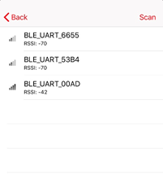

#### - Firmware Version
After LE is connected, press the setting button: 

The firmware version is shown on the below screenshot: 
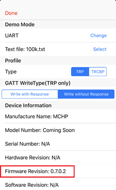

#### - Select Transparent Profile
There are two profiles are supported for the data transmission:
1. Legacy Transparent Profile (TRP)
2. Transparent Credit Based Profile (TRCBP)
Press the setting button to enter the setting page, then select the profile type:
(Use TRP by default setting.) 

#### - Demo Modes
There are two modes are supported in UART mode: Burst Mode and Text Mode. 
Burst Mode is designed for the throughput evaluation via massive data transportation. 
Text Mode is designed for the simple typing. 
The following chapter describes more detail for these two modes.

##### A. Burst Modes
There are four demo modes supported:
1. Checksum mode: Mobile app to the device (Uni-direction)
2. Fixed pattern mode: Device to Mobile app (Uni-direction)
3. Loopback mode: Mobile app → Device → Mobile app (Bi-direction)
4. UART mode: Mobile app → Device → UART output to PC ;  UART input from PC → Device → Mobile app (Bi-direction)

###### 1. Checksum Mode
-	Send the data from Mobile app to device. (Uni-direction)
-	Purpose: Demonstrate the downlink (mobile app to ) throughput.
-	UI Operation:
    1. Select "Checksum" mode on the mobile app. 
        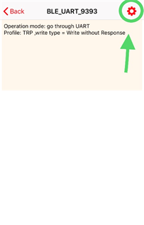 
         
    2. Select file: 
        
         
    3. Press "START" to start transmitting data.
    4. After data transmission finished, the device will send the checksum (one byte) to mobile app. Then the mobile app will compare the checksum sent from the device with the checksum calculated by itself.
    5. Mobile app shows if the data transmission is successful or not and calculate the throughput. 
        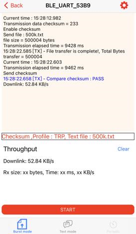
 

###### 2. Fixed Pattern Mode
-	Send the incremental counter data from device to mobile app. (Uni-direction)
-	Purpose: Demonstrate the uplink (PIC32CX-BZ to mobile app) throughput.
-	UI Operation:
    1. Select "Fixed pattern" mode on mobile app. 
        
         
    2. No need to select file from mobile app. The file size sent from device to mobile app is determined by the device (500 Kbytes).
    3. Press "START" to start transmitting data.
    4. Mobile app will examine if the received data is incremental. After data transmission finished, the device will notify the mobile app for the last number value. Then the mobile app will examine the last number value.
    5. Mobile app shows if the data transmission is successful or not and calculate the throughput. 
        
 

###### 3. Loopback Mode
-	Send the data from Mobile app to device then it will be loopback to Mobile app. (Bi-direction)
-	Purpose: Demonstrate the bi-direction throughput.
-	UI Operation:
    1. Select "loopback" mode on mobile app. 
        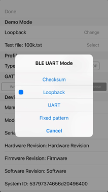
         
    2. Select file: 
        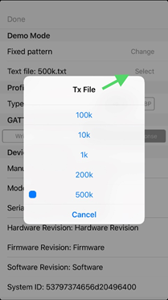
         
    3. Press "START" to start transmitting data.
    4. Mobile app examines if the loopback data is correct or missed.
    5. Mobile app shows if the data transmission is successful or not and calculate the throughput. 
        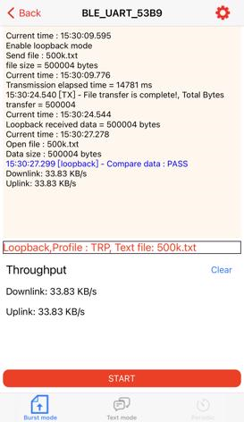
 

###### 4. UART Mode
-	Data flow: Mobile app → Device → PC (via UART); &#x2003;PC (via UART) → Device → Mobile app  
  

-	Purpose: Demonstrate the bi-direction data exchange with UART.
- A proprietary PC utility tool called "MCHP BLE UART Test Tool" is required to do the massive data exchange (up to 500kBytes) between the device and PC via UART and compare/investigate the received data after the data exchange.

-	UI Operation:
    1. PC side: 
        - Set COM port, Baudrate and enable H/W flow control then press "Connect": 
          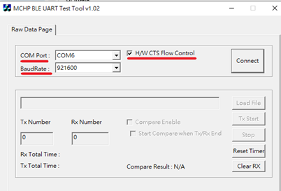 

        - Load File to choose the target test pattern. Then the user can check both "Compare Enable" and "Start Compare when Tx/Rx End" for **Bi-direction** UART test as below screenshot: 
        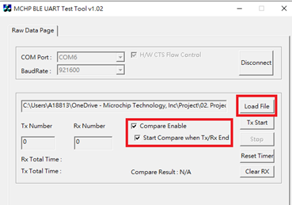 

        - Or only check "Compare Enable" for **Uni-direction** UART test: 
           

    2. Mobile app side: 
        - Select "UART" mode on mobile app. 
           

        - Select file: 
           

        - Press "START" to start transmitting data from mobile app. 

    3. PC side: 
        - Press "Tx Start" to start transmitting data from PC tool. 
          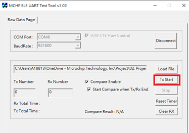 

        - PC Tool will show how many bytes it receives and will show the Compare Result after all the data has been transmitted: 
          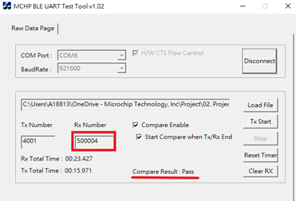 

    4. Mobile app side:
        After all the data sent from PC are received, mobile app shows if the data comparison is PASS or not. 
         

##### B. Text Mode
In Text mode, a generic terminal tool such as "Putty" could be utilized for the simple typing.
-	UI Operation:
    1. PC side (Use Putty as an example): 
        - Set COM port, Baudrate (921600 kbps) and enable H/W flow control: 
          

    2. Mobile app side: 
        - Select "Text Mode" on mobile app. 
           

        - Type the string then press send: 
          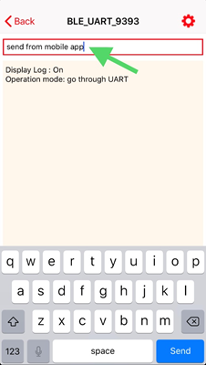 

    3. PC side: 
        - The string sent from the mobile app is shown on the screen. 
           

        - Enter string on Putty: 
           

    4. Mobile app side: 
        - The string sent from the PC is shown on the mobile app. 
          

### 2.2. Work with Android MBD App

#### - How to Scan and Connect to the Device
The steps of scan and connect to the device via mobile app are described as below:
1. Select BLE UART -> Coming Soon: 
    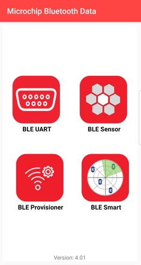   

2. Tap "BLE_UART_XXXX" (XXXX means the last two bytes of the device address) to issue the connection request: 
    

#### - Firmware Version
After LE is connected, press the setting button: 

The firmware version is shown on the below screenshot: 

#### - Select Transparent Profile
There are two profiles are supported for the data transmission:
1. Legacy Transparent Profile (TRP)
2. Transparent Credit Based Profile (TRCBP)
Press the setting button to enter the setting page, then select the profile type:
(Use TRP by default setting.) 
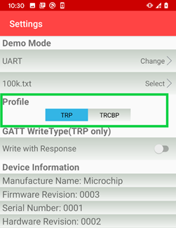

#### - Demo Modes
There are two modes are supported in UART mode: Burst Mode and Text Mode. 
Burst Mode is designed for the throughput evaluation via massive data transportation. 
Text Mode is designed for the simple typing. 
The following chapter describes more detail for these two modes.

##### A. Burst Modes
There are four demo modes supported:
1. Checksum mode: Mobile app to the device (Uni-direction)
2. Fixed pattern mode: Device to Mobile app (Uni-direction)
3. Loopback mode: Mobile app → Device → Mobile app (Bi-direction)
4. UART mode: Mobile app → Device → UART output to PC ;  UART input from PC → Device → Mobile app (Bi-direction)

###### 1. Checksum Mode
-	Send the data from Mobile app to device. (Uni-direction)
-	Purpose: Demonstrate the downlink (mobile app to PIC32CX-BZ) throughput.
-	UI Operation:
    1. Select "Checksum" mode on the mobile app. 
         

    2. Select file: 
        

    3. Press "START" to start transmitting data.
    4. After data transmission finished, the device will send the checksum (one byte) to mobile app. Then the mobile app will compare the checksum sent from the device with the checksum calculated by itself.
    5. Mobile app shows if the data transmission is successful or not and calculate the throughput. 
        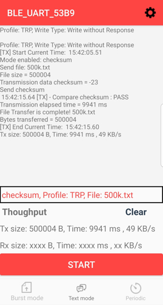
 

###### 2. Fixed Pattern Mode
-	Send the incremental counter data from device to mobile app. (Uni-direction)
-	Purpose: Demonstrate the uplink (PIC32CX-BZ to mobile app) throughput.
-	UI Operation:
    1. Select "Fixed pattern" mode on mobile app. 
        

    2. No need to select file from mobile app. The file size sent from device to mobile app is determined by the device (500 Kbytes).
    3. Press "START" to start transmitting data.
    4. Mobile app will examine if the received data is incremental. After data transmission finished, the device will notify the mobile app for the last number value. Then the mobile app will examine the last number value.
    5. Mobile app shows if the data transmission is successful or not and calculate the throughput. 
        
 

###### 3. Loopback Mode
-	Send the data from Mobile app to device then it will be loopback to Mobile app. (Bi-direction)
-	Purpose: Demonstrate the bi-direction throughput.
-	UI Operation:
    1. Select "loopback" mode on mobile app. 
        

    2. Select file: 
        

    3. Press "START" to start transmitting data.
    4. Mobile app examines if the loopback data is correct or missed.
    5. Mobile app shows if the data transmission is successful or not and calculate the throughput. 
        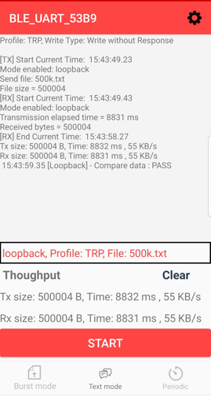
 

###### 4. UART Mode
-	Data flow: Mobile app → Device → PC (via UART); &#x2003;PC (via UART) → Device → Mobile app  
  

-	Purpose: Demonstrate the bi-direction data exchange with UART.
-	There are two modes are supported in UART mode: Burst Mode and Text Mode.  Burst Mode is designed for the throughput evaluation via massive data transportation.  Text Mode is designed for the simple typing. The following chapter describes more detail for these two modes.
- A proprietary PC utility tool called "MCHP BLE UART Test Tool" is required to do the massive data exchange (up to 500kBytes) between the device and PC via UART and compare/investigate the received data after the data exchange.

-	UI Operation:
    1. PC side: (The same with iOS version) 
        - Set COM port, Baudrate and enable H/W flow control then press "Connect": 
           

        - Load File to choose the target test pattern. Then the user can check both "Compare Enable" and "Start Compare when Tx/Rx End" for **Bi-direction** UART test as below screenshot: 
           

        - Or only check "Compare Enable" for **Uni-direction** UART test : 
           

    2. Mobile app side: 
        - Select "UART" mode on mobile app. 
          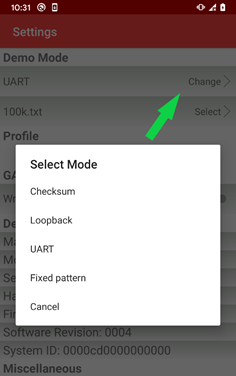 

        - Select file: 
           

        - Press "START" to start transmitting data from mobile app.  

    3. PC side: 
        - Press "Tx Start" to start transmitting data from PC tool. 
           

        - PC Tool will show how many bytes it receives and will show the Compare Result after all the data has been transmitted: 
           

    4. Mobile app side:
        After all the data sent from PC are received, mobile app shows if the data comparison is PASS or not. 
        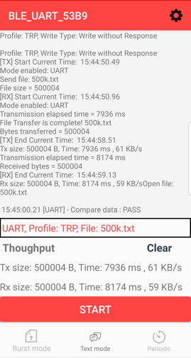 

##### B. Text Mode
In Text mode, a generic terminal tool such as "Putty" could be utilized for the simple typing.
-	UI Operation:
    1. PC side (Use Putty as an example): 
        Set COM port, Baudrate (921600 kbps) and enable H/W flow control: 
         

    2. Mobile app side: 
        - Select "Text Mode" on mobile app and type the string then press send: 
           

    3. PC side: 
        - The string sent from the mobile app is shown on the screen. 
           

        - Enter string on Putty: 
           

    4. Mobile app side:
        The string sent from the PC is shown on the mobile app.

### 2.3. Multi-link Demo With Mobile Phones
- BLE UART supports to connect with two mobile phones at the same time. 
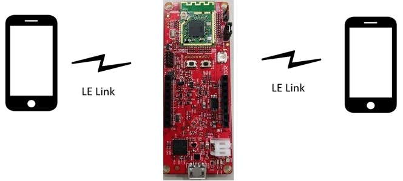 
- Two Transparent methods supported:
	- Transparent Profile (TRP)
	- Transparent Credit Based Profile (TRCBP)  

#### How to Establish the Second LE Link With Mobile Phone
1. Once the first mobile phone is connected with PIC32CX-BZ, short press the user button to enable advertising again.
2. Use the second mobile phone to scan and connect with PIC32CX-BZ. 

#### Demo Mode
- Only Loopback Mode is supported for multi-link.
- Mobile app does not disallow the user to select the other demo mode since it can't know if PIC32CX-BZ is under multi-link or not. Therefore, the user still can select the other demo mode on mobile app during multi-link.
Note: If the user executes UART mode and connect two mobile phones with PIC32CX-BZ, then the PC tool is NOT able to identify the received UART data is sent from which mobile phone. 

## 3. Interaction of both PIC32CX-BZ Devices

### 3.1. Supported Profile
  - Transparent Profile (TRP): MCHP proprietary profile, see Reference [4] for the detail.

### 3.2. The Topology of PIC32CX-BZ to PIC32CX-BZ:
- The topology of PIC32CX-BZ to PIC32CX-BZ is one PIC32CX-BZ of a central device connects the other PIC32CX-BZ of a peripheral device.
- The central device is worked on a client role and the peripheral device is worked on a server role.
- The topology diagram: 
  

### 3.3. Role Switch between a Central Device and a Peripheral Device
- When a user turns on the power or presses the reset button, the default setting is the peripheral device which is advertising enable.
- When the user short presses a user button, the peripheral device is switched to a central device which is scanning enable.
- The user can short press the user button to switch the role between the central device and the peripheral device before the device connects any devices or the device is connected by any device.

### 3.4. BLE Link Creation
- The central device sets the service data and the RSSI value of advertising report as filter conditions.
- If the service data of the received advertising report matches the filter condition and its RSSI value is larger or equal than a threshold (-40dBm, about 60 cm) or the largest in 5 seconds, the reporting device is the target device for BLE link connection.
- The central device triggers service discovery procedure and enables transparent profile after BLE link was connected.
- The user can long press the user button to disconnect the BLE link after BLE link was connected.

### 3.5. Data Exchange Modes
- UART mode:
  - The data path of down link is PC tool -> PIC32CX-BZ (Central device) -> PIC32CX-BZ (Peripheral device) -> PC tool.
  - The data path of Up link is PC tool -> PIC32CX-BZ (Peripheral device)-> PIC32CX-BZ (Central device) -> PC tool.
  - The default setting is UART mode after transparent profile was enable.

- Loopback mode:
  - The data path of loopback mode is PC tool -> PIC32CX-BZ (Central device) -> PIC32CX-BZ (Peripheral device) -> PIC32CX-BZ (Central device) -> PC tool.

- Mode switch between two modes:
  - Switch condition: The central device and the peripheral device are at the idle state without data transmission.
    - Short press the user button to do mode switch.

### 3.6. LED Indication
- Peripheral device:
  - Advertising mode: Flash green LED one time every 500 ms.
  - Connected mode: The green LED is always on.

- Central device:
  - Scanning mode: Flash red LED one time every 500 ms.
  - UART mode: The red LED is always on.
  - Loopback mode: Flash red LED twice every 3 seconds.
  - Reverse loopback mode: Flash red LED twice every 3 seconds.
### 3.7. Data Exchange Demo Procedures
- UART mode
  1. The user connects two WBZ451 Curiosity boards to PC by USB line.
  2. These two boards are the peripheral devices which flash green LED one time every 500 ms.
  3. The user selects one of the two boards to short press the user button and then this board becomes a central device.  
    
  4. The central device connects to the peripheral device and two devices are in UART mode.
  5. In connected mode, the peripheral device will have Green LED always on and the central device will have Red LED always on.
  6. Set COM port, Baudrate and enable H/W flow control and then press "Connect":  
    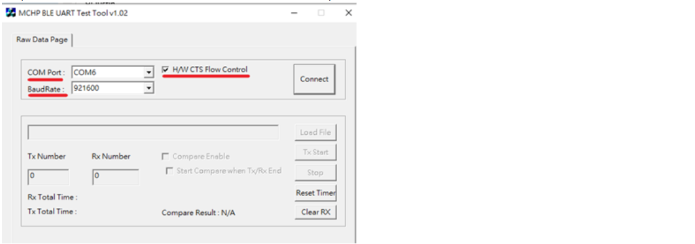
  7. Load File to select the target test pattern.
    - Then the user can check both "Compare Enable" and "Start Compare when Tx/Rx End" for Bi-direction UART test as below screenshot:  
    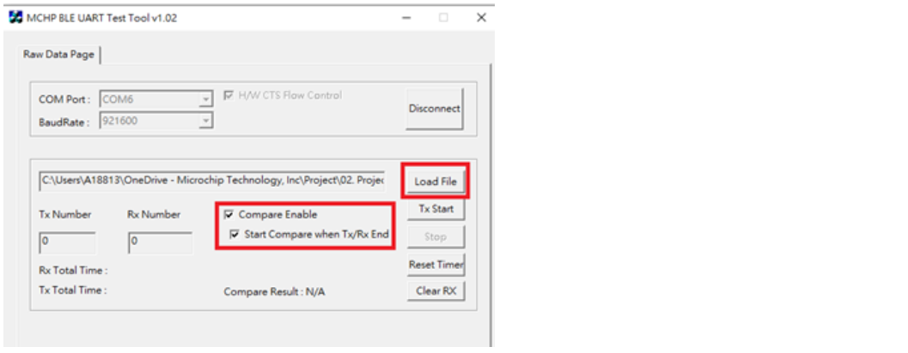
    - Or only check "Compare Enable" for Uni-direction UART test :  
    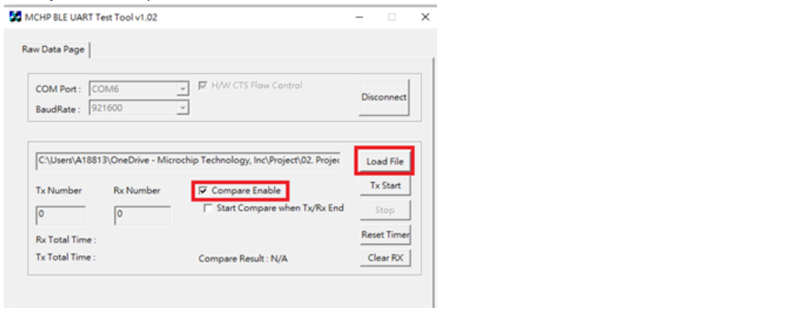
  8. Press "Tx Start" button to start transmitting data from one WBZ451 Curiosity board to the other one.  
    
  9. The user can select Uni-direction (up link or down link) UART test or Bi-direction UART test.
  10. PC Tool will show how many bytes it receives and will show the Compared Result after all data has been transmitted:  
    

- Loopback mode
  1. The user connects two WBZ451 Curiosity boards to PC by USB line.
  2. These two boards are the peripheral devices which flash green LED one time every 500 ms.
  3. The user selects one of the two boards to short press the user button and then this board becomes a central device.  
    
  4. The central device connects to the peripheral device and two devices are in UART mode.
  5. In connected mode, the peripheral device will have Green LED always on and the central device will have Red LED always on.
  6. The user short presses the user button of the central device to switch to loopback mode and then the central device will flash red LED twice every 3 seconds.
  7. Set COM port, Baudrate and enable H/W flow control and then press "Connect":  
    
  8. Load File to select the target test pattern.
    - Then the user can check both "Compare Enable" and "Start Compare when Tx/Rx End" for loopback mode test as below screenshot:  
    
  9. Press "Tx Start" button to start transmitting data from one WBZ451 Curiosity board to the other one and loopback to the original one.  
    
  10. PC Tool will show how many bytes it receives and will show the Compared Result after all data has been transmitted:  
      

### 3.8. Multi-link For Central Role Demo
- BLE UART v0.7.2 can achieve up to 6 devices multi-link when it works as Central role. (Connection establishment only, without massive data transmition)
- BLE UART v0.9.0.3 supports the Reverse Loopback mode for the massive data transmission.
- LED behavior: Refer to section [1.3](#13-led-indication).
- How to Establish the Second LE Link: Refer to section [1.4](#14-button-control).  

#### 3.8.1  Reverse Loopback Modes
- Once the LE link is established, the Reverse Loopback mode can be performed by double clicking SW2 button.
- The data is generated and sent from each peripheral device to the central device, then loopback to each peripheral device. Each peripheral device will compare if the received data is the same with the transmitted data. Then the peripheral device will output a message via UART to indicate the comparison result.
	- Compared Pass message: "Reverse loopback is successful !"
	-	Compared failed message: "Reverse loopback content error !"
-	Note: PC is utilized to check the message of comparison result only.
- The data flow is illustrated in the below diagram:  
  

## 4. Security and Privacy
### 4.1 Security
- If the pairng feature was activated by enabling the define in app.h, the "Encyption Permission" is required when the peer device attempts to send write request to PIC32CX-BZ to enable the Client Characteristic Configuration Descriptor (CCCD) of Transparent Service. Then the peer device will issue the pairing request due to the permission requirement.
- The IO capbility of BLE UART application is set as "NoInputNoOutput", therefore, "Just Works" will be used for the key generation method. 

### 4.2 Privacy
- If the user would like to update the Bluetooth device address on a frequent basis to reduce the ability to track a LE device over a period of time, Application could call BLE GAP API "BLE_GAP_SetLocalPrivacy()". In BLE UART Application, it can be enabled by a build option "APP_PRIVACY_ENABLET".
- If the resolvable private address is generated frequently, connection establishment times may be affected. It is recommended to set the timer to 15 minutes.

### 4.3 Trusted Device Connectable Mode
- In the Trusted Device Connectable Mode, application will add the paired device list into Resolving list and filter accept list
then set the Advertising filter policy as "Process scan and connection requests only from the devices in the filter accept list."
Therefore, if the remote device is not in the filter accept list, it can NOT scan and connect with the local device (PIC32CX-BZ), which means only the trusted devices (the paired devices) can connect to PIC32CX-BZ.
- To include this mode, both of the build option "APP_PAIRING_ENABLE" and "APP_PRIVACY_ENABLE" are needed to be enabled.
- Use a UART command to enter/exit this mode: (Note: Refer to section [7.3](#73-uart-commandevent-format) for the the detail information of UART command format.)
	- Enter: AA 00 06 40 03 0B 00 00 01 FF
	- Exit: AA 00 06 40 03 0B 00 00 00 FF

## 5. Extended Adverting
- After enabling the build option "APP_EXT_ADV_ENABLE", 2 sets of advertising will be activated which makes PIC32CX-BZ compatiable with the remote device supports or not supports Extended Adverting:
	- Legacy advertising.
	- Extended Advertising with 2M PHY setting of secondary channel.
- If the remote device supports Extended Adverting, the whole connection establishment will be based on 2M PHY, no need to issue PHY update to 2M PHY after the connection is established.   (Note: The throughput of data transmition can be increased over 2M PHY link.)
- The maximum length of advertising data is increased to 251 bytes. (Legacy adverting only supports up to 31 bytes for adverting/scan response data.)
- Enable Extended Adverting will impact the power consumption. 

## 6. Long Range
### 6.1 Introduction
- A user makes PHY change to the Coded PHY to approach the long range. There are two types of coding for the Coded PHY and these two types of coding are "S = 8" option and "S = 2" option. In BLE UART Application, the user can enable "APP_BLE_CODED_PHY_ENABLE" definition to get the long range function of "S = 8" option and enable "APP_BLE_CODED_PHY_ENABLE" and "APP_BLE_CODED_S2_ENABLE"	definitions to get the long range function of "S = 2" option.
- The Coded PHY advertising is based on the extended advertising function to enable the advertising. In BLE statck, The extended advertising function, the extended scanning function and the extended create connection fuction are the same command set so the extended advertising function needs to use the extended scanning function and the extended create connection fuction for executing the scanning function and the create connection function.

### 6.2 Data Exchange Demo Procedures
- When PIC32CX-BZ devices are loaded the image with the long range feature, they can be connected by the mobile phone with long range feature or they can be connected by each other with one for central device and the other for peripheral device.

#### 6.2.1  The Mobile Phone V.S The PIC32CX-BZ Device
- Please refer to section 2.

#### 6.2.2 The PIC32CX-BZ Devices
- Please refer to section 3.

#### 6.2.3 The Link Loss Distance Measurement and The Maximum Link Distatnce Measurement
- Making both PIC32CX-BZ devices connected in 0.3 meters to do data exchange and Taking the PIC32CX-BZ Central Device away to measure the Link Lost Distance.
- Go back to the PIC32CX-BZ Peripheral Device every 25 meters and try to initiate BLE connection with data exchange. It is recorded as the Maximum Link Distatnce.

### 6.3 Notification
- More barriers and interference will cause the shorter link distance.
- In order to approach optimal communication distance performance, using smaller packets, suitable connection interval and supervision timeout are the key factors.
	- For example, the data length of application layer is no longer than 20 bytes and the connection interval is 20 ms and the supervision timeout is 720 ms.

## 7. Supplement
### 7.1. Throughput Filed Test Report
#### -With Mobile Phones
The below tables shows the throughput filed test report with iOS and Android devices. 
- Profile: Transparent Profile
- Operation Type:
	- Downlink (Mobile App -> PIC32CX -> UART output to PC): Write Command
	- Uplink (UART input from PC -> PIC32CX -> Mobile App): Notification
1. iOS Device:

|           Phones           | Downlink (Kbytes/sec) | Uplink (Kbytes/sec) |
|:--------------------------:|:---------------------:|:-------------------:|
| iPhone 6 Plus / iOS 12.4.8 |         5.61          |        5.62         |
|   iPhone 7 / iOS 13.5.1    |         18.64         |        19.23        |
|    iPhone 8 / iOS 11.1     |         47.08         |        47.62        |
|    iPhone X / iOS 12.3     |         57.93         |        58.82        |
| iPhone X MAX / iOS 14.0.1  |         55.17         |        62.5         |
|   iPhone 11 / iOS 14.0.1   |         60.29         |        62.5         |
|  iPad Air 3rd / iOS 13.3   |         58.62         |        58.82        |

2. Android Device:

|           Phones           | Downlink (Kbytes/sec) | Uplink (Kbytes/sec) |
|:--------------------------:|:---------------------:|:-------------------:|
|  Samsung S10 /Android 10   |          46           |         65          |
|    OPPO RENO /Android 9    |          36           |         66          |
| Sony Xperia XZ /Android 8  |           4           |          4          |
|    Vivo V11 /Android 9     |          32           |         66          |
|   Nokia 7.2 /Android 10    |          35           |         64          |
|    OPPO R15 /Android 9     |          42           |         66          |
|    OnePlus 3 /Android 9    |          33           |         41          |
| Google Pixel 2 /Android 10 |          50           |         67          |

#### -PIC32CX-BZ v.s PIC32CX-BZ
The below table shows the throughput filed test report of PIC32CX-BZ v.s PIC32CX-BZ.
- Profile: Transparent Profile
- Operation Type:
	- Downlink (UART input from PC -> PIC32CX (Central) ->  PIC32CX (Peripheral) -> UART output to PC): Write Command
	- Uplink (UART input from PC -> PIC32CX (Peripheral) ->  PIC32CX (Central) -> UART output to PC): Notification

| Downlink (Kbytes/sec) | Uplink (Kbytes/sec) |
|:---------------------:|:-------------------:|
|          60           |         66          |

### 7.2. How to Achieve Maximum Throughput with Smart Phones
There are primarily 4 factors which determine the maximum throughput of BLE:
1. Operation type used to transfer data
2. Connection interval
3. Number of packets transmitted within a connection event
4. Data size of each packet 

And the throughput can be expressed as:
Throughput = Number of Packets * Data Size of each Packet / Connection Interval 

#### Operation Type
- From Transparent Profile Client to Server, it is suggested to utilize "Write Command" instead of "Write Request" since a Request requires a round trip Response from the Server before another message is sent.
- From Transparent Profile Server to Client, it is suggested to utilize "Notification" instead of "Indication" since a Indications requires a round trip Confirmation to be sent before another message is sent. 

#### Connection Interval
The connection paramters are negotiated by the peer device and PIC32CX-BZ. 
Lower connection interval will improve the throughput performance but will impact the power consumption. 
The range of connection interval supported by PIC32CX-BZ is 7.5 ms ~ 4 sec. 
However, differnet mobile phones might support differnet range of the connection parameters. 
For example, Apple provies "Accessory Design Guidelines for Apple Devices" [6] to define the
acceptable connection parameters. All the accessories should follow this guideline and request the connection parameters appropriately. 
But Google doesn't provide this kind of guideline for Android devices. Therefore, the connection paramters range of the Android device might depend on the OEMs. 
In BLE UART Application, PIC32CX-BZ will issue the connection parameter update procedure to update the connection interval as 20 ms once the peer device enbles the Client Characteristic Configuration Descriptor(CCCD) of the Control Point in Transparent Servcie [1]. 

#### Number of Packets Transmitted Within a Connection Event
PIC32CX-BZ supports upto 13 packets transmitted within a connection event under 2M PHY. 
However, the capbility of the peer device needs to be considered as well. 
Each mobile phone has its own bandwidth mangement. 
For iOS device, it suppports upto 5~6 packets transmitted within a connection event under 2M PHY. 
For Android device, it depends on the OEMs. 

#### Data Size of Each Packet
For GATT, the maximum amount of data in each packet is the maximum ATT MTU size (247 bytes) subtracted by the ATT header size (3 bytes). 

#### Limitation of UART
Some MCUs might only support up to 921600 bps (112.5 kbytes/sec) UART baudrate. 
However, the maximum value of BLE data throughput might exceed the UART baudrate. 
For example, the connection interval is negotiated as 20 ms. And the number of packets within a connection event is 13. 
Thus, the theoretical throughput value is 244 bytes * 13 / 20 ms = 154.88 kbytes/sec. 
Therefore, the UART baudrate might be the bottleneck under some cases.  

#### Note:
1. Coded PHY is not used for throughput measurement since it is designed to extend the rannge of data transmission at the cost of throughput reduced.
2. It is suggested that the distance between PIC32CX-BZ and the peer device is within 1 meter during a throughput measurement. The longer distance will result in the weaker signal strength.  

### 7.3. UART Command/Event Format
- The UART command/event are desgined for the test purpose. Host side (such as PC tool) could issue an UART command to trigger an action of PIC32CX-BZ.  And PIC32CX-BZ could report current status or related information via an UART event. In BLE UART Application, UART command/event can be enabled by a build option "APP_UART_CMD_SET_ENABLE".
- The format of UART command is defined as:

|        | Start Byte | Length\* | Type\** |      Payload      | End Byte |
|:------:|:----------:|:--------:|:-------:|:-----------------:|:--------:|
| Length |   1 Byte   | 2 Bytes  | 1 Byte  | (Lengh - 1) Bytes |  1 Byte  |
| Value  |    0xAA    |  0xXXXX  |  0x40   |    0xXX....XX     |   0xFF   |

\*Note: The Lengh field indicates the total lengh of Type and Payload fields, excludes the Start Byte, Length and End Byte fields.
\**Note: The Type field indicates this packet is an UART command. 

- The format of UART event is defined as:

|        | Start Byte | Length\* | Type\** |      Payload      | End Byte |
|:------:|:----------:|:--------:|:-------:|:-----------------:|:--------:|
| Length |   1 Byte   | 2 Bytes  | 1 Byte  | (Lengh - 1) Bytes |  2 Byte  |
| Value  |    0xAA    |  0xXXXX  |  0x50   |    0xXX....XX     |  0xFFFF  |

\*Note: The Lengh field indicates the total lengh of Type and Payload fields, excludes the Start Byte, Length and End Byte fields.
\**Note: The Type field indicates this packet is an UART event. 

### 7.4. Set Bluetooth Device Address
BLE SDK provides an API: "BLE_GAP_SetDeviceAddr()" to let Application set the Bluetooth Device Address. 
This API shall be called after "BLE_GAP_Init()".  

## 8. Sleep Mode
### 8.1. How to use Harmony v3 to Configure Sleep Mode
1. Enable Sleep Mode option in the BLE stack module.
		- The RTC component will be added automatically.  
      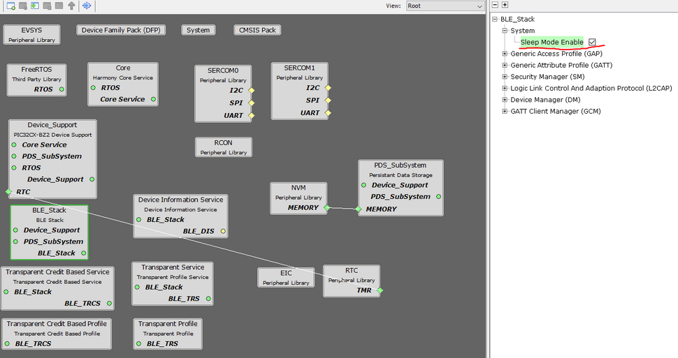  
2. Set the low power clock source as Primary Oscillator (POSC) via clock configurator. 
        
3. Follow the user guide in “app_user_edits.c” to add a few code manually.
4. Note: In BLE UART application, the sleep mode feature is included but it's disabled by default setting. Enable the build option "ENABLE_SLEEP_MODE" to activate this feature.

### 8.2. The Scope of Sleep Mode
- Sleep mode includes BT sleep and system sleep. These two modes are individual features.
- In BT sleep mode, only BT enters sleep.The system might or might not enter sleep.
- In system sleep mode:
	- During system sleep, most of clock will be disabled and the low power clock is utilized. The Primary oscillator (POSC) is selected as the low power clock source.
	- PMU will be configured as BUCK_PSM mode once the system enters sleep. And it will be restored as BUCK_PWM mode when the system exits sleep mode.
	- During system sleep, the system tick is turned off as well. RTC is utilized as the secondary timer due to it still works during sleep mode. Therefore, RTC based tickless idle mode is performed.
	- System is not allowed to enter sleep if BT is active, it means if BT is not in sleep mode, then the system can not sleep either.

## Reference
[1]	Microchip Transparent Service_v1.1 
[2]	Microchip Transparent Credit Based Service v1.0 
[3]	https://www.bluetooth.com/specifications/gatt/ 
[4]	Microchip Transparent Profile_v1.1 
[5]	Microchip Transparent Credit Based Profile_v1.0 
[6] https://developer.apple.com/accessories/Accessory-Design-Guidelines.pdf 
