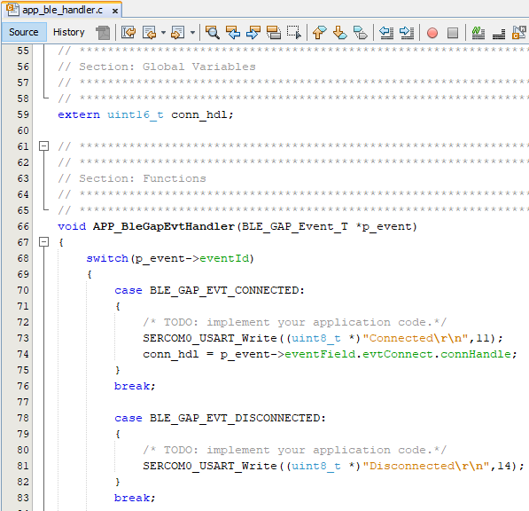

[](https://www.microchip.com)
#  BLE Transparent UART(Peripheral)

[Getting Started](../../../readme.md)

[Getting Started with Peripheral Building Blocks](../../../peripheral/readme.md)

[BLE Connection](../../connection/readme.md) **-->** [Profiles and Services](../../profiles_services/readme.md) **-->** [BLE Transparent UART](readme.md)

## Introduction

This tutorial will help users create a peripheral device and send/receive characters between 2 connected BLE devices over Microchip proprietary Transparent UART Profile. Peripheral device will be WBZ45x Device and Central device can either be a Smartphone with Light Blue App or another WBZ45x Device.The instructions mentioned below are applicable for a BLE Peripheral device.

Users of this document can choose to just run the precompiled Application Example hex file on the WBZ451 Curiosity board and experience the demo or can go through the steps involved in developing this Application from scratch.

## Recommended Reads

1.  [BLE Connection(peripheral)](../../connection/readme.md)

## Hardware Required

  |**Tool**                | **Qty**  |
  |------------------------| ---------|
  |WBZ451 Curiosity Board  | 1        |
  |Micro USB cable         | 1        |

## SDK Setup

1.  [SDK Setup](../../../../../docs/pic32cx_bz2_wbz45x_sdk_setup.md)

## Software

1.  [TeraTerm](https://ttssh2.osdn.jp/index.html.en)

## Smartphone App

1.  Light Blue

## Programming the precompiled hex file or Application Example

### Programming the hex file using MPLABX IPE

1.  Precompiled Hex file is located <a href="hex/"> here </a>

2.  Follow the steps mentioned [here](https://microchipdeveloper.com/ipe:programming-device)

 **Caution:** Users should choose the correct Device and Tool information
### Programming the Application using MPLABX IDE

1.  Follow steps mentioned in section 4 of [SDK Setup](../../../../../docs/pic32cx_bz2_wbz45x_sdk_setup.md) document

2.  Open and program the Application Example <a href="firmware"> trp_uart </a>  in MPLABX IDE

## Demo Description

Upon programming the demo application, WBZ45x will start Advertising (connectable), central device (Smartphone or another WBZ45x) scanning for these advertisements will connect to the device. In case of using Light Blue App search for “Microchip” and connect. After a connection has been made data can be sent back and forth over UART between the two devices that are connected.
Demo will print start of the advertisement “Advertising”, connection “BLE Scanning”, “Connected” and “Disconnected” state on a terminal emulator like TeraTerm @ (Speed: 115200, Data: 8-bit, Parity: none, stop bits: 1 bit, Flow control: none). Application Data to be sent to the connected central device (Smartphone or another WBZ45x) should be entered in the terminal emulator.

## Testing
This section assumes that user has programmed the Application Example on the WBZ451 Curiosity Board
**Demo Experience when using a Smartphone (Light Blue App) as Central Device**
-   Reset the WBZ451 Curiosity board, Open Terminal emulator like Tera Term, select the right COM port@ (Speed: 115200, Data: 8-bit, Parity: none, stop bits: 1 bit, Flow control: none).

    

-   open Light Blue App on your smartphone, Search and select the advertisement with Device Name "Microchip"

    

-   To receive data from WBZ451 Curiosity Board (peripheral) device to central device, users need to select the UUID: 49535343-1E4D-4BD9-BA61-23C647249616 and select listen for notifications

    

-   Enter "test" on Teraterm and data should be displayed on Light Blue App

    


-   To send data from central device to WBZ451 Curiosity Board (peripheral), users need to select the UUID: 49535343-8841-43F4-A8D4-ECBE34729BB3 and select write new value

-   Enter "trp uart" on App and data should be displayed on Terminal Window

    

**Demo Experience when using another WBZ45x as Central device**
Users can use another WBZ451 Curiosity Board configured as [BLE Transparent UART(central)](../../../central/profiles_services/trp_uart/readme.md) instead of using a Smartphone App as central device

## Developing this Application from scratch using MPLAB Code Configurator

This section explains the steps required by a user to develop this application example from scratch using MPLABx Code Configurator

**Tip:** New users of MPLAB Code Configurator are recommended to go through the [overview](https://onlinedocs.microchip.com/pr/GUID-1F7007B8-9A46-4D03-AEED-650357BA760D-en-US-6/index.html?GUID-B5D058F5-1D0B-4720-8649-ACE5C0EEE2C0).

1.  Create a new MCC Harmony Project -- [link](../../../../../docs/creating_new_mplabx_harmony_project.md) for
    instructions

2.  Import component configuration -- This step helps users
    setup the basic components required to start their
    Application Development
    component configuration related to this Application is
    available [here](firmware/peripheral_trp_uart_wbz451_curiosity.X/peripheral_trp_uart_wbz451_curiosity.mc3)      
    Users should follow the instructions mentioned
    [here](https://microchipdeveloper.com/mcc:peripheralconfig) to import the component configuration.

    **Tip:** Import and Export functionality of component configuration will help users to start from a known working setup of configuration  

3.  Accept Dependencies or satisfiers, select "Yes"

4.  Verify if the Project Graph window has all the expected configuration

    

## Verify Advertisement,Connection and Transparent UART Profile Configuration
1. Select **BLE_Stack** component in project graph

    

1. Select **Transparent Profile** component in project graph

    

## Generate Code [link](../../../../../docs/generate_code.md) for instructions

## Files and Routines Automatically generated by the MCC
After generating the program source from MCC interface by clicking Generate Code, the BLE configuration can be found in the following project directories


The [OSAL](http://ww1.microchip.com/downloads/en/DeviceDoc/MPLAB%20Harmony%20OSAL%20Libraries%20Help%20v2.06.pdf), RF System, BLE System  initialization routine executed during program initialization can be found in the project files. This initialization routine is automatically generated by the MCC


The BLE stack initialization routine excuted during Application Initialization can be found in project files. This intitialization routine is automatically generated by the MCC. This call initializes and configures the GAP, GATT, SMP, L2CAP and BLE middleware layers.


Autogenerated, advertisement data format


  |**Source Files**        | **Usage**  |
  |------------------------|------------|
  |app.c                   |Application State machine, includes calls for Initialization of all BLE stack (GAP,GATT, SMP, L2CAP) related componenet configurations            |
  |app_ble.c               |Source Code for the BLE stack related componenet configurations, code related to function calls from app.c                                        |
  |app_ble_handler.c       |All GAP, GATT, SMP and L2CAP Event handlers    |
  |app_trsps_handler.c     |All Transparent UART Server related Event handlers    |
  |ble_trsps.c             |All Transparent Server Functions for user application    |

> **Tip:** app.c is autogenerated and has a state machine based
> Application code sample, users can use this template to develop their
> application                                                                                                   
### Header Files

-   ble_gap.h- This header file contains BLE GAP functions and is
    automatically included in the app.c file

- ble_trsps.h is the Header File associated with API’s and structures related to BLE Transparent Client functions for Application User

### Function Calls

MCC generates and adds the code to initialize the BLE Stack GAP,
GATT, L2CAP and SMP in *APP_BleStackInit()* function

-   APP_BleStackInit() is the API that will be called inside the
    Applications Initial State -- APP_STATE_INIT in app.c

## User Application Development

### Include

-   "ble_trsps.h" in app.c, BLE Transparent UART Server related API's are available here
-   "osal/osal_freertos_extend.h" in app_trsps_handler.c, OSAL related API's are available here
-   definitions.h in all the files where UART will be used to print debug information
Tip: definitions.h is not specific to just UART peripheral, instead it should be included in all application source files where peripheral functionality will be exercised
-   user action is required as mentioned [here](../../../../../docs/user_action.md)

### Set PUBLIC Device Address

-   BLE_GAP_SetDeviceAddr(&devAddr);
```
    BLE_GAP_Addr_T devAddr;
    devAddr.addrType = BLE_GAP_ADDR_TYPE_PUBLIC;
    devAddr.addr[0] = 0xA1;
    devAddr.addr[1] = 0xA2;
    devAddr.addr[2] = 0xA3;
    devAddr.addr[3] = 0xA4;
    devAddr.addr[4] = 0xA5;
    devAddr.addr[5] = 0xA6;

    // Configure device address
    BLE_GAP_SetDeviceAddr(&devAddr);
```

 

### Start Advertisement

-   BLE_GAP_SetAdvEnable(0x01, 0);

  

### Connected & Disconnected Events

-   In app_ble_handler.c BLE_GAP_EVT_CONNECTED event will be generated when a BLE connection is completed

### Connection Handler
-   Connection handle associated with the peer peripheral device needs to be saved for data exchange after a BLE connection
-   p_event->eventField.evtConnect.connHandle has this information

    

### Transmit Data
-   BLE_TRSPS_SendData(conn_hdl , 1, &data);  is the API to be used for sending data towards the central device
**Note:** The precompiled application example uses a UART callback to initiate the data transmission upon receiving a character on UART

Example Implementation for Transmitting the received data over UART using the BLE_TRSPS_SendData API
```
  void uart_cb(SERCOM_USART_EVENT event, uintptr_t context)
  {
    // If RX data from UART reached threshold (previously set to 1)
    if( event == SERCOM_USART_EVENT_READ_THRESHOLD_REACHED )
    {
      uint8_t data;
      // Read 1 byte data from UART
      SERCOM0_USART_Read(&data, 1);
      // Send the data from UART to connected device through Transparent service
      BLE_TRSPS_SendData(conn_hdl, 1, &data);
    }
  }
  uint16_t conn_hdl; // connection handle info captured @BLE_GAP_EVT_CONNECTED event
  // Register call back when data is available on UART for Peripheral Device to send
  // Enable UART Read
  SERCOM0_USART_ReadNotificationEnable(true, true);
  // Set UART RX notification threshold to be 1
  SERCOM0_USART_ReadThresholdSet(1);
  // Register the UART RX callback function
  SERCOM0_USART_ReadCallbackRegister(uart_cb, (uintptr_t)NULL);
```


### Receive Data
- BLE_TRSPS_EVT_RECEIVE_DATA is the event generated when data is sent from central device
- Users need to use the BLE_TRSPS_GetDataLength(p_event->eventField.onReceiveData.connHandle, &data_len; API to extract the length of application data received
- BLE_TRSPS_GetData(p_event->eventField.onReceiveData.connHandle, data); API is used to  retrieve the data

**Tip:** BLE_TRSPC_Event_T p_event structure stores the information about BLE transparent UART callback functions

Example Implementation for printing the received data from central device over UART
```
  /* TODO: implement your application code.*/
  uint16_t data_len;
  uint8_t *data;
  // Retrieve received data length
  BLE_TRSPS_GetDataLength(p_event->eventField.onReceiveData.connHandle, &data_len);
  // Allocate memory according to data length
  data = OSAL_Malloc(data_len);
  if(data == NULL)
  break;
  // Retrieve received data
  BLE_TRSPS_GetData(p_event->eventField.onReceiveData.connHandle, data);
  // Output received data to UART
  SERCOM0_USART_Write(data, data_len);
  // Free memory
  OSAL_Free(data);
```


Users can exercise various other BLE functionalities by
using [BLE Stack API](../../../docs/api/driver/ble/docs/html/modules.html)

## Where to go from here

-   [BLE Profiles and Services](../readme.md)
