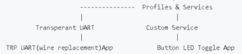

## BLE Profiles and Services (Peripheral)
[Getting Started](../../readme.md)

[Getting Started with Peripheral Building Blocks](../readme.md)

[BLE Connection](../connection/readme.md) **-->** [Profiles and Services](../profiles_services/readme.md) **-->** [Microchip proprietary](trp_uart/readme.md) - Transparent UART Central (Legacy Scan + Connection + Data Exchange)</a>

**GATT Profile** specifies the structure in which profile data is exchanged. This structure defines basic elements such as services and characteristics used in the profile.BLE Profiles are standard collection of services for specific application scenarios/use cases.

**Service** is a collection of data and associated behaviors to accomplish a particular function or feature. Users can choose to use the profiles and services defined by Bluetooth SIG or have custom profiles and services for custom applications.

A **characteristic** is a value used in a service along with properties and configuration information about how the value is accessed and information about how the value is displayed or represented

	

### Blocks
-   [Profiles and services](readme.md)
    -   [Microchip proprietary - Transparent UART Peripheral (Legacy Adv + Connection + Data Exchange)](trp_uart/readme.md)
    	- Data Exchange between 2 devices after a BLE connection using Microchip Transparent UART profile and service 
    -   [Custom Service Peripheral (Legacy Adv + Connection + Data Exchange)](custom_service/readme.md)
      - Data Exchange between 2 devices(peripheral and central) after a BLE connection using Custom Service 

