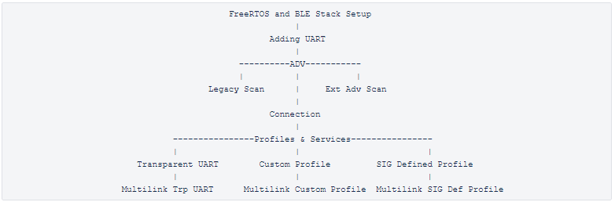

# PIC32CX_BZ2/WBZ45x BLE Application Building Block Examples

Welcome! this repository covers PIC32CX_BZ2_WBZ45x Application Building Blocks
Building blocks are compact training modules revolving around implementing a particular BLE functionality/feature on PIC32CXBZ2 and WBZ45x Devices. These training modules ease users development experience by providing a step by step procedure to build a BLE Feature from Scratch. 
Moving through the building block users will be able to gain familiarity
with SDK, Harmony 3 framework, API's necessary for implementing the BLE features of interest.  
Users who have working knowledge of BLE and no familiarity with
Harmony 3 framework, Microchip BLE SDK, Tools etc., are recommended to start their SW development process with Building Blocks.

**Tip:** New Harmony 3 Users are recommended to go through the [overview](https://microchip-mplab-harmony.github.io/mhc/doc/readme.html) of Harmony 3. Users can add/remove different components like peripheral support and other wireless functionality by following steps mentioned [here](https://microchip-mplab-harmony.github.io/mhc/doc/readme_mhc_configuration.html). 

Building Blocks are divided into 2 catergories based of the device roles and features users are interested to develop. This segregation is important as users interested to develop only a certain type of device would be provided only the training modules related to the device type
-   [Peripheral Building Blocks](./peripheral/readme.md)
-   [Central Building Blocks](./central/readme.md)

## Peripheral Building Blocks 

## Central Building Blocks
	   
					      

