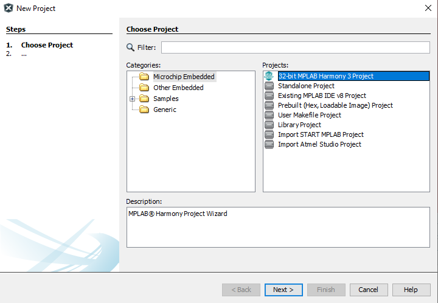
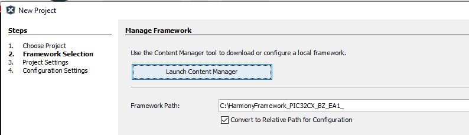
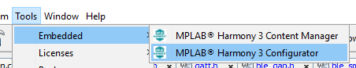
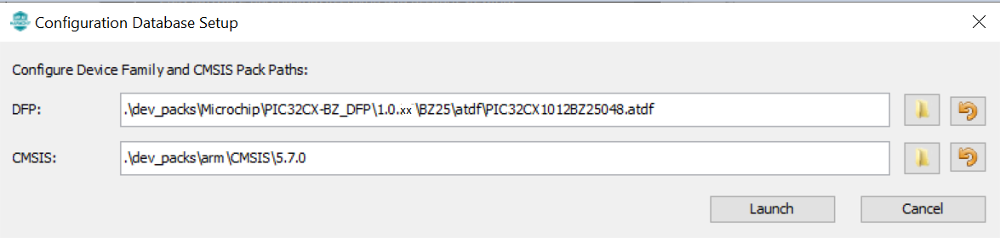
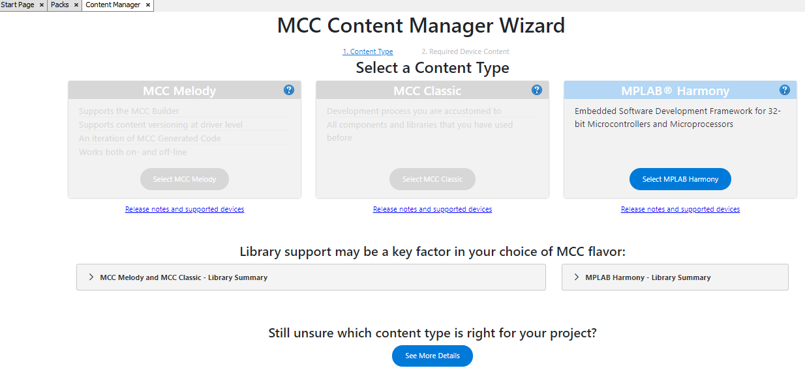
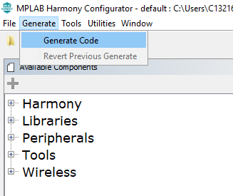

# Creating a new MCC Harmony Project

1.  Create a **new 32-bit MPLAB MCC Harmony** Project

2.  Select the **Framework Path** (Framework path must match SDK setup document)and select **Next**

3.  Select Project Folder and select Next

4.  Select the device and click Finish

or

5.  MPLABx Code Configurator will be launched automatically.

6. Select **"Next"**

7. Select **"MPLAB Harmony"**

8. Select **"Finish"**

9. Project Graph window of the Configurator may have predefined components

10. Project and Device resources

