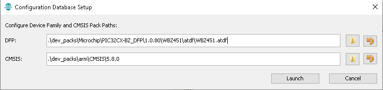

# MPLAB Code Configurator(MCC) Code Generation

1.  Generate code

2.  Select Generate

# Merge Strategy

It is recommended to Select default as the Merge Strategy (i.e.
USER_ALL) and click Generate

Note: Here is a brief explanation of the different merge strategies that
are available:

ALL: The user will be prompted with a merge window for all generated
files. This includes files that have no user modifications but are
changed because of changes in MCC configuration or component updates.
(This choice is always the safest.)

USER_ALL: The user will always be prompted with a merge window for all
generated files that contain user modifications.

USER_RECENT: The user will be prompted with a merge window for all
generated files that contain user modifications.

OVERWRITE: All generated file content will be replaced by the contents
of this generate operation. All user changes will be overwritten.

Below example shows how a user is prompted with a merge window with
merge strategy option - USER_ALL

**Tip:** if a user wants to maintain the modifications made for their
application code development, they should select "Close"
