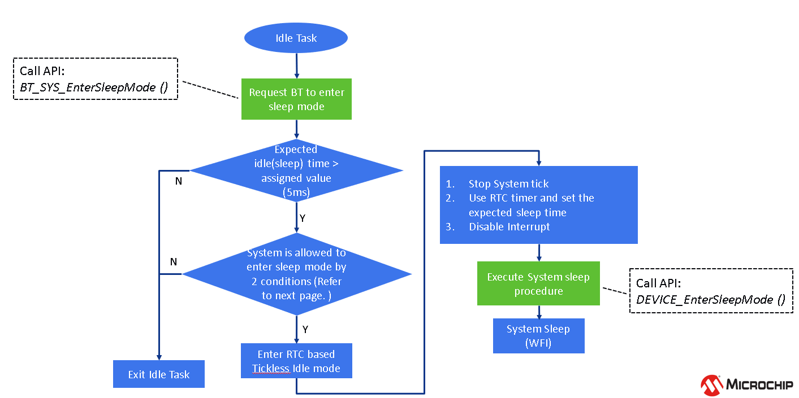
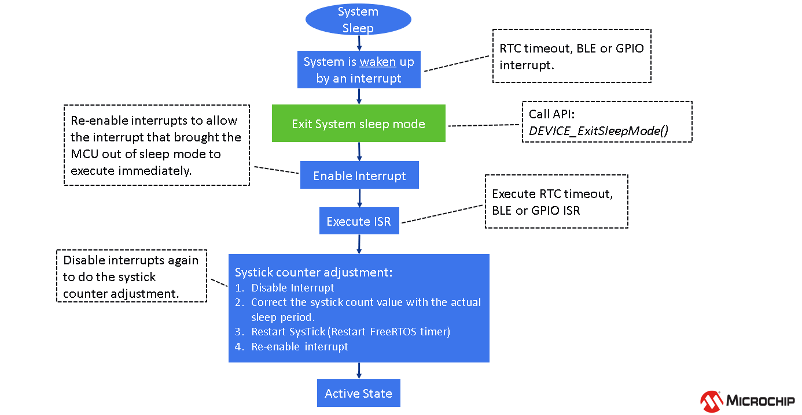
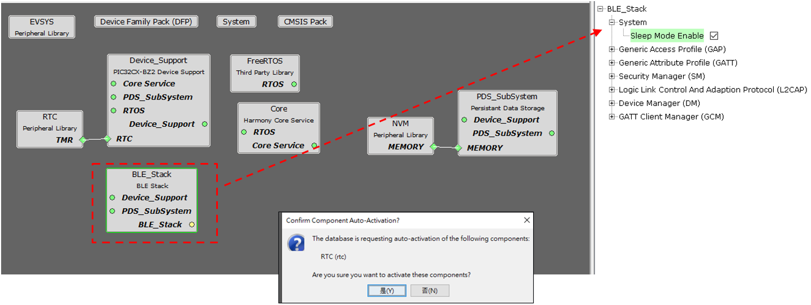
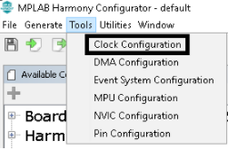
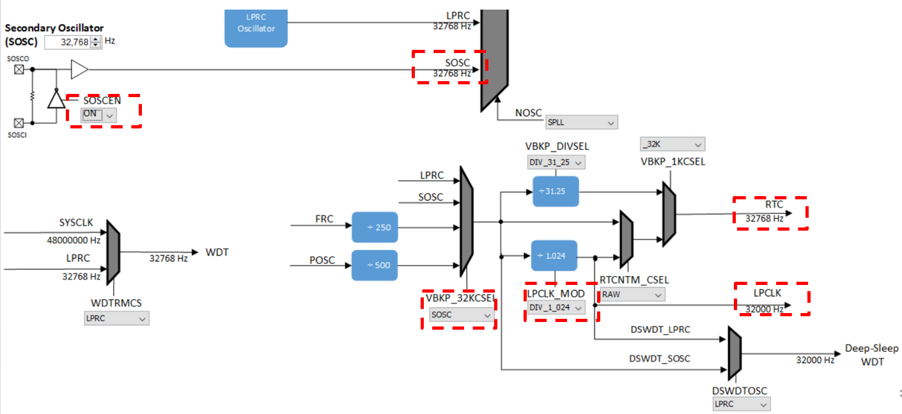

[](https://www.microchip.com)
#  **Low Power Introduction** 

EA3.1 release has system sleep/standby mode implemented as part of Harmony framework for WBZ451. In order for the device to enter sleep mode, Bluetooth/Zigbee wireless subsytem should be ready to go to sleep. BLE/Zigbee can enter sleep if there is no active data tx/reception or the ble advertisement interval/connection interval/zigbee polling period have not expired. So the system sleep cannot be directly edited as a parameter.
During system sleep, clock (system PLL) will be disabled and syatem tick will be turned off. FreeRTOS timer needs to be componsated for the time spent in sleep. RTC timer which works in the sleep mode is used to accomplish this. So overall system sleep time is determined by the following factors - BLE/Zigbee activity interval, RTC timer, external interrupt (like GPIO). 

#  **Sleep Mode Entry Implementation Details**
1. FreeRTOS provides Tickless IDLE Mode for power saving, this can be used to stop periodic tick interrupts during idle periods (periods when there are no application tasks that are able to excute)
For the lost count on time during the IDLE mode, RTC timer is used to make a correcting adjustment to the RTOS tick count value, when it is restarted (after waking up from sleep)
More information on low power tickless mode is available [here](https://www.freertos.org/low-power-tickless-rtos.html). The Tickless Idle Mode will be executed automatically when the Idle task is the only task able to run, because all the application tasks are either in blocked or suspended state. To prevent the system from entering sleep mode and waking up immediately, the minimum sleep time(IDLE time) is automatically set to 5 ms.

**Note:** maximum sleep time is equal to the maximum period of the RTC 32 bit counter - 134217.8 sec (around 37 hours)

2. In order for the system to enter sleep, system needs to request bluetooth/zigbee wireless subsystem to sleep. This is accomplished by calling API - BT_SYS_EnterSleepMode() for BLE and API - ZB_ReadyToSleep() for Zigbee
These API's ensure that the BLE/Zigbee stack can go to sleep

	

	

3. The API to call to ensure subsytem is sleeping (inactive) or ready for system to enter sleep mode is  - BT_SYS_AllowSystemSleep, for zigbee the ZB_ReadyToSleep() API ensures this

	

4. If the expected sleep time is greater than 5 ms, system is allowed to enter sleep mode by checking for 2 conditions 
	- Bluetooth/Zigbee subsystem is inactive 
	- eTaskConfirmSleepModeStatus() returns eNoTasksWaitingTimeout, more information [here](https://www.freertos.org/eTaskConfirmSleepModeStatus.html).
> **Tip:** User can also add their own condition to be checked before system goes to sleep, for example, do not enter system sleep if data transmission over UART is active

	Pseudo code in RTC based Tickless Idle Mode:

	```
	if ((BT_SYS_AllowSystemSleep() || ZB_ReadyToSleep()) && ( eTaskConfirmSleepModeStatus() != eAbortSleep ) && (user_condition))
	{
	        //Enter System Sleep Mode
	        DEVICE_EnterSleepMode ();        //RTC Based Tickless Idle Mode       
	}
	```


5. When both the conditions as mentioned in point 3 are met, we enter RTC based Tickless Idle mode (Stop the system tick, use of RTC timer to set the sleep time, disable interrupts)

6. System will enter sleep mode after setting the RTC based Tickless Idle Mode by calling API - Device_EnterSleepMode() and then wait for Interrupt (WFI) instruction is executed 

	 

#  **Sleep Mode Exit Details**

1. Sytem when in sleep/standby mode can be waken up by RTC timeout, BLE/Zigbee or GPIO interrupt

2. Sleep mode exit is initiated by calling API - DEVICE_ExitSleepMode()

3. Upon exiting the sleep mode, interrupts need to be reenabled to allow the inteerupt service routine to be executed

4. Interrupts are disabled as the sys tick needs to be compensated (Tickless IDLE mode)

	 

# **System Sleep and Wakeup Flow**


# **How to use MPLAB Code Configurator to Generate Sleep Mode**

1. Sytem Sleep Mode needs to be enabled in BLE stack H3 compoenent configuration, after enabling this dependant components like RTC (Timer source during sleep) will be requested to be enabled

	 

	 For Zigbee applications the System Sleep mode is only enabled when using the following device types - Multisensor, Intruder Alarm System and Color Scene controller as per the Zigbee End Device Spec. There is no seperate configuration that a user has to select to enable the System Sleep like for BLE Sleep

2. Upon enabling sleep mode, FreeRTOS related settings will be set automatically
	- Tick Mode will be set to Tickless_Idle
	- Expected idle time before sleep will be set to 5 (ms)
	 
	- Tick Hook will be enabled (For user to add any custom code needed to be executed within each tick interrupt)
	 
	- RTC peripheral library will be added and configured 
	 

	**Note:** RTC counter should not be reset (RTC_Timer32CounterSet()) arbitrarily when the system is running

3. RTC clock source should be set manually, there are 4 options to choose from
	 - FRC (±1% offset)
	 - LPRC ( with larger offset, < ±5%)
	 - POSC  <- Candidate of the clock source (better clock accuracy)
	 - SOSC <- Candidate of the clock source (better clock accuracy)

	**Note:** Users must select POSC/SOSC as the RTC clock source as choosing other clock sources will impact BLE connection stability

4. Manually Setting RTC clock source - POSC, open MCC, select "Clock Configuration" and configure as highlighted
   
	 

5. Manually Setting RTC clock source - SOSC, open MCC, select "Clock Configuration" and configure as highlighted
   
	 

	**Note:** Users can only select one clock source POSC or SOSC, steps are mentioned to choose either

6. It is recommended to use 48MHz as SYS_CLOCK for better power savings. This can be configured by setting SPLLPOSTDIV1 to `2` as shown below.
   

7. Ensure that JTAG Enable is disabled by clearing the JTAGEN bit in CFGCON0 (Configuration Control Register 0) as shown below.

   `CFG_REGS->CFG_CFGCON0CLR = CFG_CFGCON0_JTAGEN_Msk;`

8. All Unused pins in the application needs to be set in input mode and the pulldown should be enabled for these pins. This can be configured through pin configuration in Harmony3 Configurator as shown below.
   

9. Generate Code [link](generate_code.md) for instructions


# **Sleep related code implementation location**


  |**Implementation**                    | **Location**           |
  |--------------------------------------| -----------------------|
  |BT Sleep Mode                         | BLE Stack Library      |
  |Zigbee Sleep Mode                     | Zigbee Stack Library
  |System Sleep Mode                     | Device Support Library |
  |Execute BT/System Sleep               | app_idle_task.c        |
  |RTC Based Tickless Idle Mode          | app_idle_task.c        |


