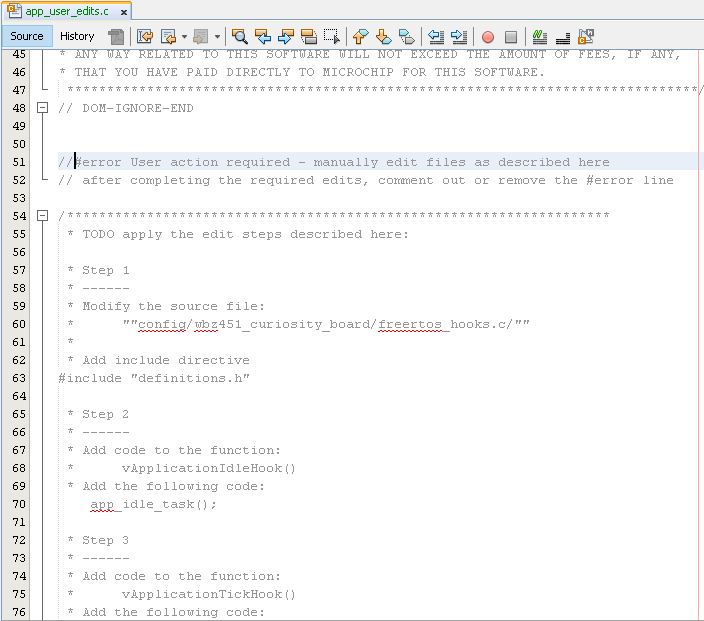

#  **User Action** 

Developers are required to call API - app_idle_task() in vApplicationIdleHook(). This is required to enable periodic Persistent Data Storage, RF calibration. Persistant Data Storage provides means for storing data in non-volatile memory(Flash). User application and stack parameters like peer connection etc are saved. IDLE task is set to execute at the lowest priority in FreeRtos. 

1. Users will be prompted to call app_idle_task() and app_idle_updateRtcCnt(RTC_Timer32CounterGet()) when they compile/build the project with a compile error. 
	

	action required to be taken

	

2. users are required to open freertos_hooks.c file and add **#include "definitions.h"**

	

3. users are required to open freertos_hooks.c file and add API **app_idle_task()**

	

4. users are required to comment out **#error** in app_user_edits.c file 

	

5. Initiate build and user will be able to build successfully  

	

**Note:** User action is only required for the first time code gets generated. 

# **Additional User Action when Low Power is enabled**

Developers are required to call app_idle_updateRtcCnt(RTC_Timer32CounterGet()) in vApplicationTickHook(). This API call is used to compensate for FreeRTOSTimer when in sleep mode.

1. users are required to open freertos_hooks.c file and add API **app_idle_updateRtcCnt(RTC_Timer32CounterGet())**

	

