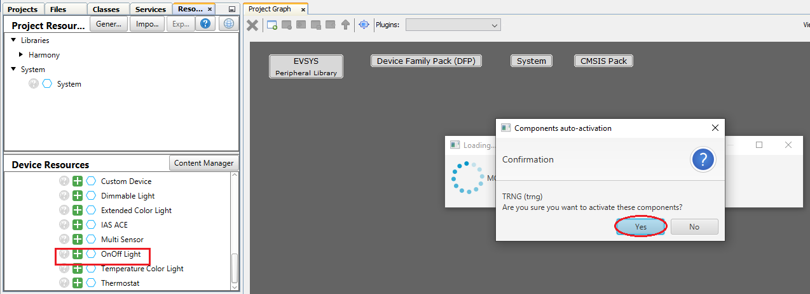
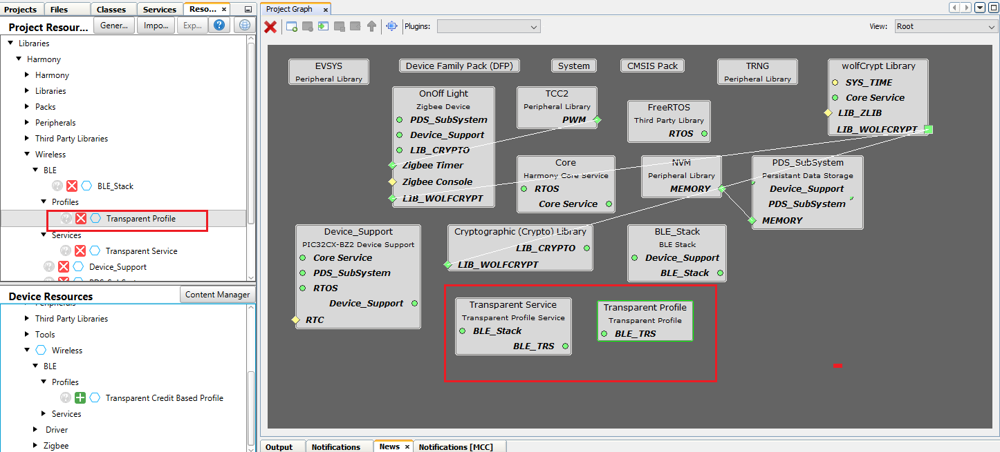
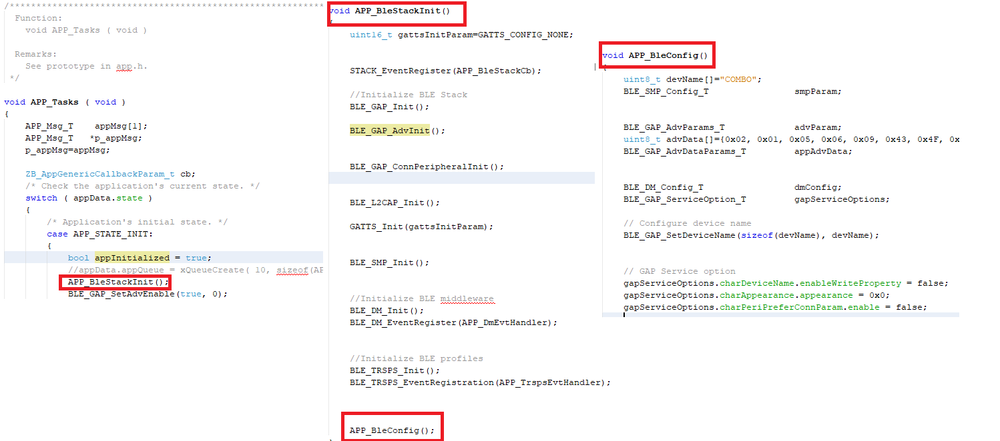
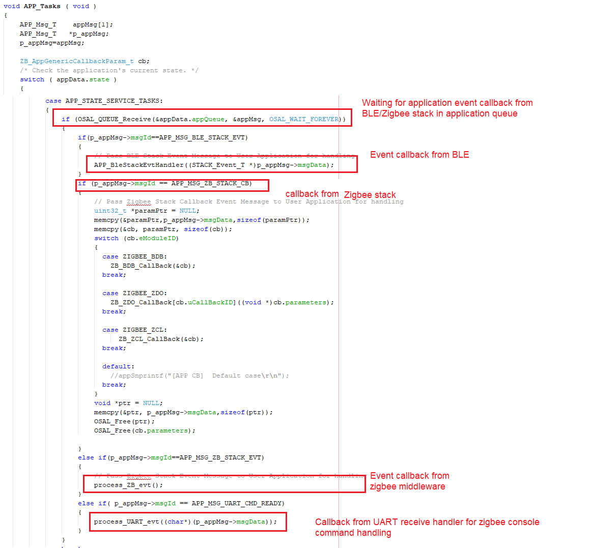
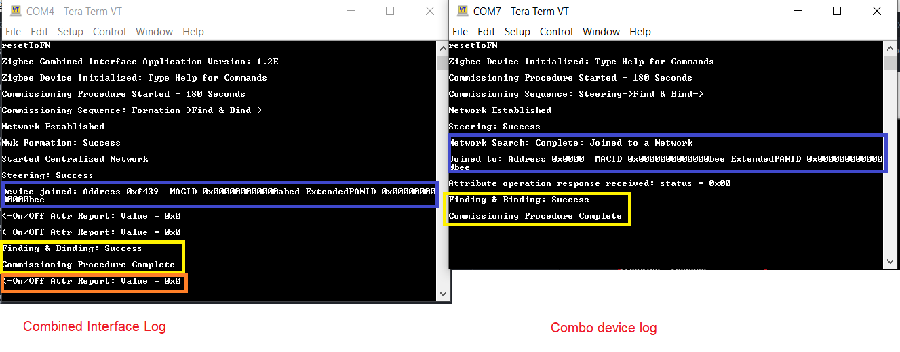
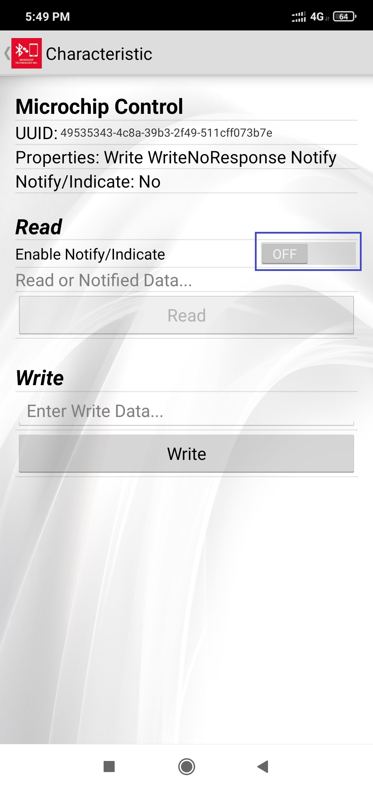
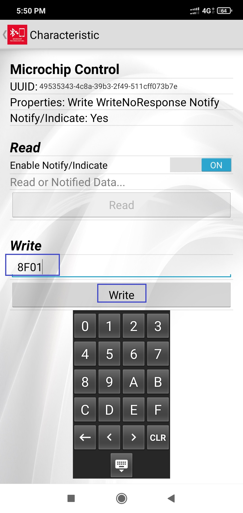
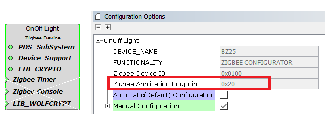

[](https://www.microchip.com)
#  Multiprotocol (BLE+ZIGBEE) Concurrent Application - Tutorial

This tutorial will help users to create multiprotocol (BLE+ZIGBEE) example project using Mplab code configurator. 
The step by step procedure will help the user to generate the multiprotocol project from scratch and will guide 
in understanding few API calls needed for data transaction between 2 protocols.

The project created at end of this tutorial, will look the sample project available <a href="firmware"> here </a>.


## Hardware Required

  |**Tool**                | **Qty**  |
  |------------------------| ---------|
  |WBZ451 Curiosity Board  | 2        |
  |Micro USB cable         | 2        |
  |Android/iOS Mobile     | 1        |

## SDK Setup

[SDK Setup](../../docs/pic32cx_bz2_wbz45x_sdk_setup.md)

## Software

[TeraTerm](https://ttssh2.osdn.jp/index.html.en)

## Smartphone App

Microchip Bluetooth Data (MBD) iOS/Android app available in stores

## Demo Description

This application demonstrate the Zigbee On/Off light joining to Zigbee gateway (Combined Interface) and the Microchip 
Proprietary Transparent Service based BLE peripheral running concurrently with zigbee protocol connects with mobile app. 
When the Zigbee light gets the light on/off command from CI will be displayed in mobile app. 
Hence the simple concurrent operation of multiprotocol is demonstrated here. Lights and Bridge (CI) devices are the 
interest of this tutorial, where the WIFI/Ethernet gateway is not scope of this application. The thirdparty gateway's 
like Amazon Echo plus can also be used instead of CI.


---

## Developing this Application from scratch using MPLab Code Configurator
The following steps will help to understand the PIC32CXBZ2 device ZIGBEE and BLE stack programming structure. 
We recommend to follow the steps. If wish to have Out-of-Box experience with the precompiled hex file [Go Here](#tasks_1)

## Pull-in H3 Components

-  Create a new MPLAB Code Configurator Project -- [link](../../docs/creating_new_mplabx_harmony_project.md) for instructions

-  Drag and Drop the Zigbee components from "Available" components to Project Graph
    - OnOffLight Device component

    "Accept Dependencies or satisfiers, select "Yes""

<div style="text-align:center"></div>

<div style="text-align:center"></div>    

-  Drag and Drop the BLE components
    - BLE Stack component

<div style="text-align:center"></div>              
</br>

    - Transparent Profile and Service components

     "Add  Dependencies or satisfiers"


<div style="text-align:center"></div>        

-  Add UART components needed for console logs


<div style="text-align:center"></div>        

- Verify the Project Graph window has all the expected components


<div style="text-align:center"></div>    

---

## Edit BLE Stack Specific Configurations

<a name="tasks">
</a>

- Select **BLE_Stack** component in project graph and edit as below


<div style="text-align:center"></div>      

- Select **Transparent Profile** component in project graph and edit as below.


<div style="text-align:center"></div>    

## Edit Zigbee Stack Specific Configurations

- Edit **Onoff Light** component in project graph. The "Commissioning Configuration" is edited to enable only Steering option


<div style="text-align:center"></div>    

## Edit Peripheral Specific Configurations

- Edit **SERCOM0** component in project graph for UART pin map and Baud rate


<div style="text-align:center"></div>    

- Edit **Pin Configuration**  in project graph for RED LED GPIO configuration


<div style="text-align:center"></div>    

---

## Generate Code [link](../../docs/generate_code.md) for instructions

---

## Files and Routines Automatically generated by the MHC

After generating the code from MHC interface by clicking Generate Code, below is the project folder structure.


<div style="text-align:center"></div>

1. BLE, Zigbee Stack Initialization and Application callback registration:

The RF System, BLE System, ZIGBEE, PERIPHERAL  initialization routine executed during program initialization can be found in **SYS_Initialize()** of **initialization.c** file

Zigbee Stack provides various APIs for application, and those APIs belong to the specific module within dedicated group. The sequence of initialization is already taken care in the stack when **Zigbee_Init()** from **initialization.c** is called.


<div style="text-align:center"></div>


The BLE stack initialization routine executed during Application Initialization can be found in **APP_BleStackInit()** in **app.c**. This call initializes and configures different BLE layers like GAP, GATT, SMP, L2CAP and BLE middleware layers and registers the application layer callbacks. The event callbacks from BLE stack, BLE middleware and Profile/service layer are registered.

Also, the H3 configured advertisement data payload can be seen in **APP_BleConfig()**


<div style="text-align:center"></div>


Similar to BLE, Zigbee Stack also generate events to inform application if there is any status changed or activity. Application may need to get the relevant information from Zigbee Stack and do the corresponding procedure.

<div style="text-align:center"></div>

2. BLE, Zigbee Stack application events handling:
  **app.c** file is autogenerated and has a state machine for application callback handling from BLE, Zigbee stacks

<div style="text-align:center"></div>


---

## User Application Development

### 1. Compile H3 auto generated project

1. Compile the H3 auto generated project as below


<div style="text-align:center"></div>


2. Addressing the mandatory error: User action required in app_idle_task.c. Follow the steps mentioned in the note and do the necessary changes. Then comment the **#error** message as below.

<div style="text-align:center"></div>


### 2. BLE specific code addition

#### 1. Start Advertisement (app.c)

Advertisement payload is already auto generated based on H3 configuration as mentioned in [Edit BLE Stack Specific Configurations](#tasks). It is only required to start the advertisement, by adding the below API in APP_STATE_INIT state.

-   BLE_GAP_SetAdvEnable(true, 0);

```json
void APP_Tasks ( void )
{
    APP_Msg_T    appMsg[1];
    APP_Msg_T   *p_appMsg;
    p_appMsg=appMsg;

    ZB_AppGenericCallbackParam_t cb;
    /* Check the application's current state. */
    switch ( appData.state )
    {
        /* Application's initial state. */
        case APP_STATE_INIT:
        {
            bool appInitialized = true;
            //appData.appQueue = xQueueCreate( 10, sizeof(APP_Msg_T) );
            APP_BleStackInit();
            BLE_GAP_SetAdvEnable(true, 0);
```

#### 2. Connected & Disconnected Events (app_ble_handler.c)
The BLE application specific callbacks from BLE stack is handled in **app_ble_handler.c** file. Few events needed for this application to be handled by the user code as below.

##### Connection Handler
  -   In **app_ble_handler.c**, BLE_GAP_EVT_CONNECTED event will be generated when a BLE peripheral is connected with Central (mobile app)
  -   Connection handle associated with the peer central device needs to be saved for data exchange after a BLE connection. Add the below code in **APP_BleGapEvtHandler()**.
  -   Console log is also added to print the connected message and respective #include file is also added.

```json
#include <app_zigbee/zigbee_console/console.h>

void APP_BleGapEvtHandler(BLE_GAP_Event_T *p_event)
{
    switch(p_event->eventId)
    {
        case BLE_GAP_EVT_CONNECTED:
        {
            /* TODO: implement your application code.*/
            appSnprintf("[BLE} Connected\n\r");
            conn_hdl = p_event->eventField.evtConnect.connHandle;
            linkState = APP_BLE_STATE_CONNECTED;
        }
        break;
```

- In **app_ble_handler.h** add the below definitions which are used in above step

```json
// *****************************************************************************
// *****************************************************************************
// Section: Type Definitions
// *****************************************************************************
// *****************************************************************************
uint16_t conn_hdl;
uint8_t linkState;

#define APP_BLE_STATE_CONNECTED 0x01
#define APP_BLE_STATE_STANDBY  0x00
```

##### Disconnection Handler
  -   In **app_ble_handler.c**, BLE_GAP_EVT_DISCONNECTED event will be generated when BLE peripheral is disconnected from Central (mobile app)
  -  Advertisement can be started again to enable another connection
  -  Console log is also added to print the disconnected message

```json
case BLE_GAP_EVT_DISCONNECTED:
{
    /* TODO: implement your application code.*/
    appSnprintf("[BLE} DisConnected\n\r");
    BLE_GAP_SetAdvEnable(true, 0);
    linkState = APP_BLE_STATE_STANDBY;               
}
break;
```

### 3. Zigbee specific code addition (app_zigbee_handler.c)

There will be 3 major events which the stack would provide to the user application in **app_zigbee_handler.c** file. They are ,

- Zigbee Events which is defined as "EVENT_ZIGBEE"
- ZCL and Cluster Events defined as "EVENT_CLUSTER"
- Board Specific Package (BSP) Events defined as "EVENT_BSP"

#### 1. ZCL EVENT_CLUSTER event handling for on/off Light cluster

**ZCL (Zigbee cluster library)**
- ZCL is a repository for cluster functionalities
- Regularly updated with new functionality added
- Not to “re-invent the wheel” for new application development

**Cluster**
- Cluster is a set of attributes and commands which are defined for a particular application functionality/feature.
- Attributes and their data types are defined
- Uses client/server model of communication
- Standard commands/messages ensure interoperability, abstracts the commands for developers.

**Ex: On/Off cluster**
Attributes:   OnOff, OnTime, OffWaitTime
Commands:   Off, On, Toggle, OffWithEffect, OnWithRecallGlobalScene, OnWithTimedOff


</br>
<span class='icon icon-search inline-block highlight-info'> <i>-Explore</i></span>
</br>

For more details regarding clusters, please refer to, the specification from Zigbee Alliance ->
<a href="https://zigbeealliance.org/wp-content/uploads/2019/12/07-5123-06-zigbee-cluster-library-specification.pdf" target="_top">Link to Zigbee Cluster Library Specification by Zigbee Alliance</a>


This project uses On/Off device type. Hence uses **On/Off light cluster** from Zigbee defined cluster library. When the On/Off command to control the light is received from Combined Interface gateway, CMD_ZCL_ON, CMD_ZCL_OFF of ZCL EVENT_CLUSTER will be received on light device. A simple console print is already added in those event callbacks as below.

```json
void Cluster_Event_Handler(APP_Zigbee_Event_t event)
{
    switch(event.eventId)
    {
        case CMD_ZCL_ON:
        {
            /* ZCL Command ON received */
            //Access - > event.eventData.zclEventData.addressing;
            //Access - > event.eventData.zclEventData.payloadLength;
            //Access - > event.eventData.zclEventData.payload;
            appSnprintf("On\r\n");
        }
        break;
        case CMD_ZCL_OFF:
        {
            /* ZCL Command Off received */
            //Access - > event.eventData.zclEventData.addressing;
            //Access - > event.eventData.zclEventData.payloadLength;
            //Access - > event.eventData.zclEventData.payload;
            appSnprintf("Off\r\n");
        }
        break;
```

#### 2. EVENT_BSP event handling for on/off Light control
- In addition to above ZCL event, BSP event will also be called when On/Off command is received. This will enable the user to write the board specific functionality code like switch on/off the on board LED. **CMD_LED_BRIGHTNESS** single event is called for both On or Off, since On/Off cluster is added in many other device types like dimmable light, color control light, where light functionality is also mapped to brightness/color and not simple On/Off. Add below code to control on board **RED** LED.

```json
void BSP_Event_Handler(APP_Zigbee_Event_t event)
{
    // User to handle  board Support package events
    switch(event.eventId)
    {
        case CMD_LED_BRIGHTNESS:
        {
            /* Set the given LED brightness */
            //Access - > event.eventData.value;
            //appSnprintf("Led Brightness \r\n");
            if(event.eventData.value == 255)// MAX_BRIGHTNESS_LEVEL for On
               RED_LED_Set();
            else if (event.eventData.value == 0) //MIN_BRIGHTNESS_LEVEL for Off
               RED_LED_Clear();

        }
        break;
```
- Add the include file needed for LED GPIO functionality in **app_zigbee_handler.c**

```json
#include "peripheral/gpio/plib_gpio.h"
```

#### 3. Edit device unique ID (zigbeeAppDeviceSelect.h)
All the zigbee devices/modules will hold their unique IEEE address purchased from IEEE. For the demo purpose, where UID is not present in internal NVM, the pre-compiled fixed UID to be used. Edit the CS_UID to user defined value and not matching with combined interface UID (default 0xbee) as below in **zigbeeAppDeviceSelect.h**

<p align="left">
       
</p>

### 4. Data Transaction between BLE to ZIGBEE protocol and vice versa

Transparent Profile and Service (TRP/TRS) is the proprietary BLE service by microchip to establish data and control channel between BLE Central (Phone) and Peripheral (device). The custom 128-bit GATT  characteristics are defined under this service.

**Definition of Transparent Service and Characteristics UUID's**

| Characteristic Name      | UUID     | Properties     |
| :------------- | :----------: | -----------: |
| TRS Service | 49535343-FE7D-4AE5-8FA9-9FAFD205E455   | |        
| TRS TxD- Tx Data to Client role (Data pipe) | 49535343-1E4D-4BD9-BA61-23C647249616   | Notify, Write|
| TRS TxD - Client Characteristic Configuration Descriptor |  | Read, Write |
| TRS RxD- Rx Data from Client role (Data pipe) | 49535343-8841-43F4-A8D4-ECBE34729BB3   | Write, Write without response|
| TRS Ctrl Pt - Command and Response (Ctrl pipe) |49535343-4C8A-39B3-2F49-511CFF073B7E  | Notify, Write, Write without response |
| TRS Ctrl Pt - Client Characteristic Configuration descriptor | | Read, Write |  {:.table-striped}

#### 1. Send data over BLE (app_zigbee_handler.c)
When the On/Off command is received from CI, send single byte of data to mobile app using Transparent service. We use TRS Ctrl Pt characteristic in this example project to send and receive data from mobile app.

-   **BLE_TRSPS_SendVendorCommand(conn_hdl, 0x8F, 0x01, &onCmd)**  is the API to be used for sending data towards the central device. Here 0x8F is any custom command value for identification and 0x01 is length of the command data. Add this API call in Zigbee On/Off ZCL event callbacks as below.

```json
void Cluster_Event_Handler(APP_Zigbee_Event_t event)
{
    switch(event.eventId)
    {
        case CMD_ZCL_ON:
        {
            /* ZCL Command ON received */
            //Access - > event.eventData.zclEventData.addressing;
            //Access - > event.eventData.zclEventData.payloadLength;
            //Access - > event.eventData.zclEventData.payload;
            appSnprintf("On\r\n");
            uint8_t onCmd;
            onCmd = 0x01;

            if(linkState == APP_BLE_STATE_CONNECTED)
                BLE_TRSPS_SendVendorCommand(conn_hdl, 0x8F, 0x01, &onCmd);            
        }
        break;
        case CMD_ZCL_OFF:
        {
            /* ZCL Command Off received */
            //Access - > event.eventData.zclEventData.addressing;
            //Access - > event.eventData.zclEventData.payloadLength;
            //Access - > event.eventData.zclEventData.payload;
            appSnprintf("Off\r\n");
            uint8_t offCmd;
            offCmd = 0x00;

            if(linkState == APP_BLE_STATE_CONNECTED)
                BLE_TRSPS_SendVendorCommand(conn_hdl, 0x8F, 0x01, &offCmd);             
        }
        break;
```

- Add the include file needed for the above BLE API's in **app_zigbee_handler.c**

```json
#include "app_ble_handler.h"
#include "ble_trsps.h"
```

#### 2. Send data over ZIGBEE (app_trsps_handler.c)

- When the On/Off single byte data is received from mobile app using Transparent service, change the global variable which holds the On/Off attribute value.
- On/Off attribute data is sent periodically at defined MAX interval to CI. When the On/Off attribute value is changed by BLE, an additional report will be sent at MIN report interval with the changed value. The reporting interval is configured in auto generated Zigbee middleware include file  **\firmware\src\config\default\zigbee\zigbee_device\devicetypes\light\include\lightOnOffCluster.h** (unit in seconds)

```json
/******************************************************************************
                    Definition(s) section
******************************************************************************/
#define ONOFF_VAL_MIN_REPORT_PERIOD 30
#define ONOFF_VAL_MAX_REPORT_PERIOD 60
```

- When the non zero value is sent from mobile app using TRPS Ctrl pt characteristic, the LED is switched ON and for zero value LED is switched OFF in BLE_TRSPS_EVT_VENDOR_CMD event callback. Add the below code to update the On/Off attribute Value and to change **RED LED** Status. **ZCL_ReportOnChangeIfNeeded()** API is called to initiate the additional report at **ONOFF_VAL_MIN_REPORT_PERIOD** interval. **lightOnOffClusterServerAttributes.onOff** is the global variable defined in Zigbee middleware which holds the OnOFF attribute value.

```json
void APP_TrspsEvtHandler(BLE_TRSPS_Event_T *p_event)
{
    switch(p_event->eventId)
    {
        case BLE_TRSPS_EVT_VENDOR_CMD:
        {
            /* TODO: implement your application code.*/
            /* TODO: implement your application code.*/
            if(p_event->eventField.onVendorCmd.length)
            {                 
                if(p_event->eventField.onVendorCmd.p_payLoad[1])
                {    
                    lightOnOffClusterServerAttributes.onOff.value = 1;
                    RED_LED_Set();
                    appSnprintf("[BLE} On Command\n\r");                    
                }    
                else
                {    
                    lightOnOffClusterServerAttributes.onOff.value = 0;
                    RED_LED_Clear();
                    appSnprintf("[BLE} Off Command\n\r");                    
                }                   
                ZCL_ReportOnChangeIfNeeded(&lightOnOffClusterServerAttributes.onOff);
            }     
        }
        break;
```

- Add the include file needed for the above ZIGBEE API and GPIO in **app_trsps_handler.c**

```json
#include <app_zigbee/zigbee_console/console.h>
#include <zigbee_device/devicetypes/light/include/lightOnOffCluster.h>
#include "peripheral/gpio/plib_gpio.h"
```

**Note:** The sample project with all the above code changes is available in <a href="firmware"> ble_zigbee_basic </a> for your reference.

---

## Programming the Application using MPLABX IDE
- Build the project after doing all the above changes and program on Curiosity board


- Program the combined interface <a href="../../zigbee/zigbee_combined_interface/precompiled_hex/"> hex </a> image on another curiosity board for Zigbee gateway by following [below steps](tasks_1).

---

<a name="tasks_1">
</a>

## Programming the precompiled hex file using MPLABX IPE

1.  Precompiled Hex file is located <a href="precompiled_hex/"> here </a>

2.  Follow the steps mentioned [here](https://microchipdeveloper.com/ipe:programming-device)

3.  Program the combined interface <a href="../../zigbee/zigbee_combined_interface/precompiled_hex/"> hex </a> image on another curiosity board for Zigbee gateway by following same procedure.

 **Caution:** Users should choose the correct Device and Tool information

---

## Testing
 This section assumes that user has already programmed multiprotocol Application Example and combined interface example on 2 WBZ451 Curiosity boards

 **Demo Experience when using a Smartphone (MBD App) as Central Device**
 1.   Reset the Combined Interface programmed WBZ451 Curiosity board, Open Terminal emulator like Tera Term, select the right COM port@ (Speed: 115200, Data: 8-bit, Parity: none, stop bits: 1 bit, Flow control: none, enable CR+LF for RX, TX in Terminal setup).

 2.  send command: *resetToFN* and look for the below logs for successful zigbee network formation on CI

<div style="text-align:center"></div>


 3. Reset combo device and send command: *resetToFN*. Look for combo device joined with combined Interface. The on/off light cluster search and binding between 2 devices is successful, and combo device on/off light attributes reports are seen in CI. This would take about 180sec.

<div style="text-align:center"></div>

 4. Open Microchip Bluetooth Data (MBD) App on your smartphone, Search and select the advertisement with Device Name "Combo". Connect with the combo device.

 <div style="text-align:center"></div>
 </br>

 5. Enable Notify/Indicate to receive data from combo device

 <p align="left">
   
 </p>

 6. Write **8F01** to switch on RED LED and look for on/off attribute value changing to 0x01 in CI, and also RED LED is getting ON. Similarly write **8F00* to switch off RED LED and look for attribute value changing to 0x00 in CI. As mentioned previously, it would take MIN report interval for the changed report value to appear in CI.

 <p align="left">
   

   
 </p>

 <div style="text-align:center"></div>
 </br>


 7. By sending on/off command from CI the RED LED can be switched On/Off. The value can be seen in MBD app as well.
- The network address of the combo device is needed to send light control commands to combo device from CI. This network address can be got from Combined interface console log while joining was done.

<div style="text-align:center"></div>
</br>


- Another way to get the network address from combo device is executing the below command in combo light side.

```json   
        Command: getNetworkAddress
        Response: 9bfa
```

```json
On/off command:
           onOff 0x0 0x9bfa 0x20 -on

           onOff 0x0 0x9bfa 0x20 -off
```

      0x20 is zigbee end point number used for light can be taken from MHC configurator.

<div style="text-align:center"></div>
</br>
<div style="text-align:center"></div>
</br>


  <p align="left">
     
     
  </p>

---

## Where to go from here

-   [Advanced Multiprotocol Application with Zigbee Provisioning over BLE](../ble_zigbee_light_prov/readme.md) by following the similar implementation. The guide also explains the wrapper protocol written on top of BLE Transparent service for BLE provisioning and light control. The on board RGB colour is controlled in this example, which can be referenced for PWM functionality.
