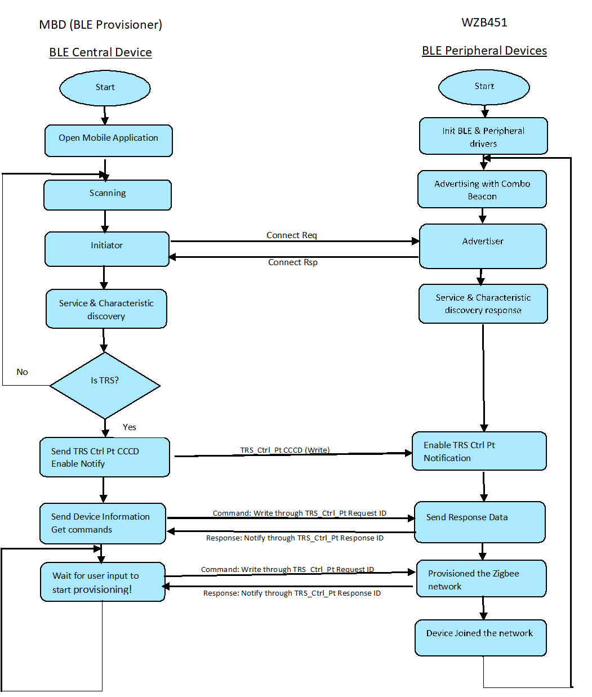
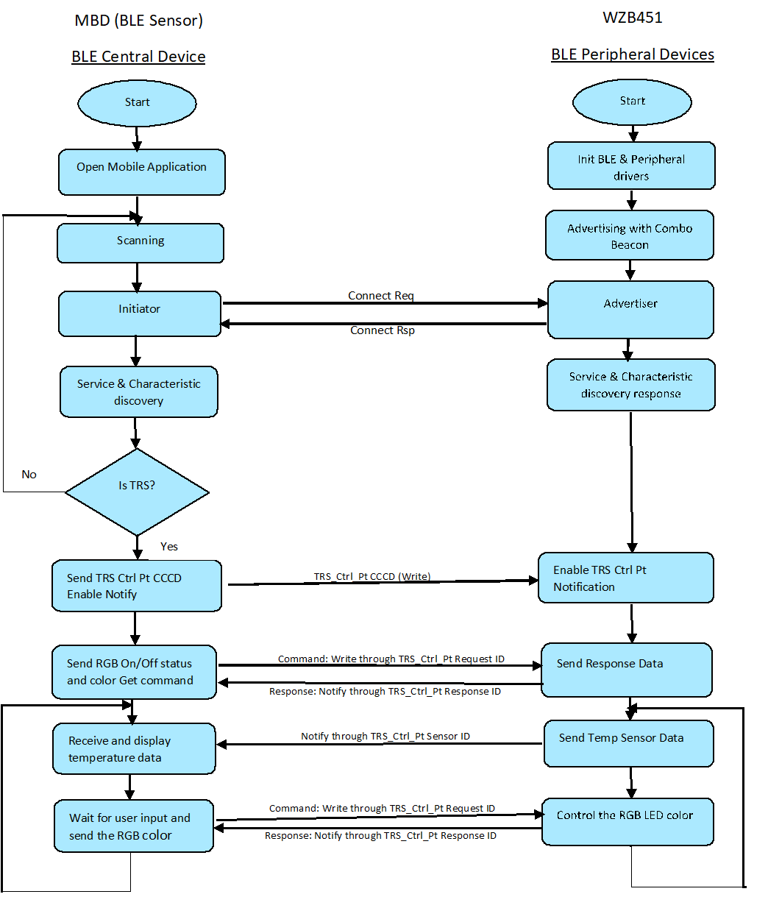

# WBZ451 Multiprotocol Application Demo: Zigbee light and Zigbee commissioning through BLE

## Protocol Exchange
The communication protocol exchange between BLE Provisioner mobile app/ BLE sensor mobile app (BLE central) and WBZ451 module (BLE peripheral) is explained here.

### 1. Advertising Beacon:

   

   - Advertisement Data:
      - Service UUID: 16-bit Service UUID, 0xFEDA is purchased by Microchip from Bluetooth SIG.
      - Other Info: 0x40+Light ON/Off status (1 Byte)+ 0x41+Temperature data (2 bytes)

   - Scan Response Data:
      - The device name is part of the scan response. Device name is set as "COMBO_LIGHT_XXXX” by default (XXXX means the last two bytes of the device address). This device name can be changed using "BLE Provisioner" app as described in demo step #5

### 2. Transparent Profile and Service (TRP/TRS):

Transparent Profile and Service (TRP/TRS) is the proprietary BLE service by microchip to establish data and control channel between BLE Central (Phone) and Peripheral (device).

    

  - Transparent Profile (TRP) enables higher layer application to control and allow data exchange between TRP Client and Server devices
  - Transparent Service (TRS) includes both Ctrl and Data Pipes which are custom 128-bit GATT  characteristics.
      - The Transparent Server shall be a GATT Server
      - The Transparent Client shall be a GATT Client

        **Definition of Transparent Service and Characteristics UUID's**

        | Characteristic Name      | UUID     | Properties     |
        | :------------- | :----------: | -----------: |
        | TRS Service | 49535343-FE7D-4AE5-8FA9-9FAFD205E455   | |        
        | TRS TxD- Tx Data to Client role (Data pipe) | 49535343-1E4D-4BD9-BA61-23C647249616   | Notify, Write|
        | TRS TxD - Client Characteristic Configuration Descriptor |  | Read, Write |
        | TRS RxD- Rx Data from Client role (Data pipe) | 49535343-8841-43F4-A8D4-ECBE34729BB3   | Write, Write without response|
        | TRS Ctrl Pt - Command and Response (Ctrl pipe) |49535343-4C8A-39B3-2F49-511CFF073B7E  | Notify, Write, Write without response |
        | TRS Ctrl Pt - Client Characteristic Configuration descriptor | | Read, Write |  {:.table-striped}

### 3. "BLE Sensor" and "BLE Provisioner" Application over Transparent Service Control Point (TRS Ctrl Pt):

  The combo application uses TRS Control Point Characteristic of TRPS profile to exchange data between "BLE Sensor" and "BLE Provisioner" mobile app and device.

  

      
  

  The combo application follows the below protocol format on TRS control point characteristic.

  | Item      | Opcode     | Length     |Sensor/Provisioning/Control ID| Payload|
  | :------------- | :----------: | -----------: |-----------: |-----------: |
  | Size | 1 Byte   | 1 Byte |1 Byte |Variable|

  The description of each element is as below:

    - The Opcode:
       - (0x81) is fixed 1 byte in size and related to Provisioning commands.
       - (0x8A) is fixed 1 byte in size and related to BLE Sensor/Control commands
    - Length: 1 byte in size (size of Sensor/Control ID + size of Payload)
    - The Sensor/Control ID: 1 byte in size. It could be divided into Control request, Control response, Sensor/Provisioning notify data described in detail in following sections.
    - The Sensor/Provisioning/control data and payload size depends on the ID as listed in the below table.

**BLE sensor specific control and sensor command/response**

| **Control Cmd** | **Opcode** | **Control Request ID** | **Parameter** | **Parameter Length (Byte)** | **Control Response ID** | **Control Response Payload** | **Control Response Payload Length (Byte)** | **Description** |
| --- | --- | --- | --- | --- | --- | --- | --- | --- |
| RGB LED On/Off Set | 0x8A | 0x10 | On/Off | 1 | 0x20 | Status code | 1 | Switch On/Off the RGB LED with the default/last set color |
| RGB LED On/Off Get | 0x8A | 0x11 | |  | 0x21 | Status code + On/Off status | 2 | Send the RGB LED on/off status |
| RGB Color Set | 0x8A | 0x12 | Color value (HSV) | 3 | 0x22 | Status code | 1 | Set RGB color value in HSV format |
| RGB Color Get | 0x8A | 0x13 | | | 0x23 | Status code + RGB color value | 4 | Send RGB color value in HSV format |
| **Sensor Data** | | | | | **Sensor ID** | **Parameter** | **Parameter Length (Byte)** | **Description** |
| RGB LED On/Off status | 0x8A | | | | 0x40 | On/Off status | 1 | RGB LED On/Off Status |
| Temperature data | 0x8A | | | | 0x41 | Temperature sensor data | 2 | Temperature value in Celsius with 0.1 resolution. The MSB bit will be set when the negative temperature is reported |
| RGB Color Values | 0x8A | | | | 0x42 | RGB Color Values | 3 | RGB color values in HSV Format |

**BLE Provisioning specific control and command/response**

| **Commissioning Cmd** | **Op Code** | **Commission Request ID** | **Parameter** | **Parameter Length (Byte)** | **Commission Response ID** | **Commission Response Payload** | **Commission Response Payload Length (Byte)** | **Description**                                  |
| --------------------- | ----------- | ------------------------- | ------------- | --------------------------- | -------------------------- | ------------------------------- | --------------------------------------------- | ------------------------------------------------ |
| GetDeviceType         | 0x81        | 50                        |               |                             | A0                         | Device Type                     | 2                                             | Get Zigbee device type (Device type see table 8) |
| GetSWVersion          | 0x81        | 51                        |               |                             | A1                         | Software Version                | Up to 16 bytes                                | Get Software Version                             |
| SetDeviceName         | 0x81        | 52                        | Device Name   | Up to 16 bytes              | A2                         |                                 |                                               | Get Network State                                |
| GetDeviceName         | 0x81        | 53                        |               |                             | A3                         | Device Name                     | Up to 16 bytes                                | Get Device State                                 |
| SetChannelMap         | 0x81        | 54                        | Channel map   | 4                           | A4                         |                                 |                                               | Set Zigbee channel bit map                       |
| GetChannelMap         | 0x81        | 55                        |               |                             | A5                         | Channel map                     | 4                                             | Get Zigbee channel bit map                       |
| GetDeviceState        | 0x81        | 56                        |               |                             | A6                         | Device State                    | 1                                             | Set Zigbee MAC ID                                |
| GetMACID              | 0x81        | 57                        |               |                             | A7                         | MAC ID                          | 8                                             | Get Zigbee MAC ID                                |
| GetCommisionStatus    | 0x81        | 58                        |               |                             | A8                         | commissioning Status             | 1                                             | Get commissioning Status                          |
| GetCurrentChannel     | 0x81        | 59                        |               |                             | A9                         | Current Channel                 | 1                                             | Get Zigbee install code                          |
| StartCommission       | 0x81        | 5E                        |               |                             | AE                         |                                 |                                               | Start Commission                                 |
| ResetFactoryNew       | 0x81        | 5F                        |               |                             | AF                         |                                 |                                               | Reset to Factory New state                       |
| **Commissioning Cmd** |             |                           |               |                             | **Commission Response ID** | **Commission Response Payload** | **Commission Response Payload Length (Byte)** | **Description**                                  |
| commissioningStatus    | 0x81        |                           |               |                             | 60                         | commissioning Status             | 1                                             |                                                  |

#### 3.1 Control Command Request and Response

The Control command request is used by mobile app to send the command to device. The control request channel is opened only after Client Characteristic Configuration Descriptor of TRS Ctrl Pt Characteristic notification is enabled; it is closed when such notification is disabled.

The format of Control command is an 8bit Opcode, an 8bit request ID followed by optional control payload.

**Format of Control Command**

| **Item** | Op Code | Length | Control Request ID | Control Payload |
| --- | --- | --- | --- | --- |
| **Size (Octet)** | 1 | 1 | 1 | Variable |

The control response is used by the device to send feedback to mobile app. The format of Response is an 8bit Opcode, an 8bit response ID and response status followed by optional Response payload.

**Format of Control Response Data**

| **Item** | Op Code | Length | Control Response ID | Status | Control Response Payload |
| --- | --- | --- | --- | --- | --- |
| **Size (Octet)** | 1 | 1 | 1 | 1 | Variable |

Status code 0x00 means successful execution of control command. Any status code other than 0x00 means error code, as shown in below Table. An error status does not have optional control Response payload.

**Definition of Status Code**

| **Status Code** | **Definition** | **Description** |
| --- | --- | --- |
| **0x00** | Success | Response for successful operation |
| **0x01** | Op Code Not Supported | Response if unsupported Op Code is received |
| **0x02** | Invalid Parameter | Response if Parameter received does not meet the requirements of the service. |
| **0x03** | Operation Fail | Response for fail operation |
| **0x04-0xFF** | Reserved for Future use |

#### 3.2 Sensor/Provisioning Notify Data

The Sensor data is sent to mobile app periodically by WBZ451 device. Similarly the commissioning status is sent to "BLE provisioner" during the commissioning procedure. The data channel is opened only after Client Characteristic Configuration Descriptor of TRS Ctrl Pt notification is enabled; it is closed when such notification is disabled.

The format of sensor data is an 8bit Opcode, an 8bit ID followed by notify data payload.

**Format of Sensor/Provisioning Data**

| **Item** | Op Code | Length | Sensor/Provisioning ID | Sensor/Provisioning Payload |
| --- | --- | --- | --- | --- |
| **Size (Octet)** | 1 | 1 | 1 | Variable |

---

## Application Flow Diagram

    

    

---
