[](https://www.microchip.com)
# WBZ451 Multiprotocol Application Demo: Zigbee light and Zigbee commissioning through BLE

---
### WBZ451 Curiosity Board

Devices (Device): \| **PIC32CX1012BZ25048(MCU) on WBZ451 module**  \|

Devices (Used, On-Board): \| **Analog Temperature Sensor** \| **RGB LED** \| **User Button**\| **User LED**\| **UART-USB Converter**\|


### Hardware Block Diagram - Curiosity Board


---
## Hardware Required

  |**Tool**                | **Qty**  |
  |------------------------| ---------|
  |WBZ451 Curiosity Board**  | 2         |
  |Micro USB cable         | 2        |
  |Android/iOS Mobile     | 1        |
  |Amazon Echo Plus**     | 1        |

**Amazon Echo Plus acts gateway / WBZ451 curiosity board programmed with “Combined interface” example if Echo Plus is not available.

## Software

1.  <a href="https://ttssh2.osdn.jp/index.html.en"> TeraTerm </a>

## Smartphone App

1.  Microchip Bluetooth Data (MBD) iOS/Android app available in Stores
2. 	Alexa App installed on android/iOS mobile phone if Amazon Echo plus is used as Gateway

---
## Demo Description
This application demonstrates the multi-protocol (concurrent operation of both Zigbee and BLE stacks) functionality of PIC32CXBZ family of devices and modules. The Zigbee commissioning over BLE uses Bluetooth Low Energy (BLE) link to exchange Zigbee commission data and run both Zigbee and BLE tasks simultaneously under FreeRTOS. The local zigbee lights (on board RGB LED) can be controlled over BLE or from Zigbee network.
Multi-protocol can also be referred as "combo" for ease of readability in this doc.

<p align="center">
  
</p>

#### BLE light control (Zigbee device is not yet commissioned):
- If the combo device is not yet commissioned and not connected to Zigbee network, still would be able to control the RGB LED through BLE using *“BLE sensor”* sub app of MBD (Microchip Bluetooth Data) mobile app.

#### Zigbee device commissioning:
- By connecting the device to the *“BLE provisioner”* sub app of MBD mobile app, the Zigbee part of combo device can be commissioned and brought to the existing zigbee network or can create new zigbee network (if there is no nearby network).

#### Zigbee local light control (Zigbee device is commissioned):
- Combo light RGB LED can be controlled from Zigbee Gateway of the same network.
- RGB LED can also be controlled through BLE using *"BLE sensor"* MBD app.
- When the light status is changed from BLE, the light change report will be sent to zigbee gateway through Zigbee communication.
- When the light status is changed from zigbee gateway through Zigbee communication, the light status will be notified to *"BLE sensor app"* if it is connected.

---

## Expected Out of Box Behavior
Both the WBZ451 Curiosity board is already pre-programmed with ble_zigbee_light_prov application. Any third-party gateway like Amazon Echo Plus can also be used as Zigbee Gateway. If Amazon Echo plus is not available, one of the WBZ451 Curiosity board can be programmed with Combined Interface pre-compiled image, which acts as zigbee gateway. Amazon Echo Plus Gateway as well as WBZ451 Curiosity based Combined Interface Gateway solutions are explained in the following demo steps.

- To program the pre-compiled hex image on Combined interface follow the procedue in [Programming the precompiled hex file using MPLABX IPE](#tasks)
- If want to do changes in the demo code and would like to program/debug the customized code follow the instruction in [Build and Program The Application](#tasks_1)

### On-board Resource Usage
| **Sensor**         | **Peripheral Used**                   | **I/O Pin**   | **Comment**                                                                                     |
| ------------------ | ------------------------------------- | ------------- | ----------------------------------------------------------------------------------------------- |
| LED Control        | TC2 (WO0, WO1), TC3 (WO0) in PWM Mode | PB0, PB3, PB5 | RGB LED color control.                                                                          |
| Switch             | EXTINT0                               | PB4           | SW1 button in curiosity board to do Reset To Factory new                                         |
| Temperature Sensor | ADC                                   | PB6           | Read the room temperature from the MCP9700A sensor available in curiosity board                 |
| Timer              | RTOS Systick Timer                    |               | Periodic timer functionality to initiate the sensor read operation and for Adv User LED control |
| User LED           | GPIO                                  | PB7           | User LED in curiosity board. To indicate BLE advertisement/connect status                       |

<a name="tasks_2">
</a>

### Demo Steps

1. Supply power to WBZ451 Curiosity Board by connecting a USB cable. Power Supply (PS) Green LED will turn on when connect to PC. The Blue "User LED" will be blinking. This indicates that BLE Advertisement is in progress.

```json    
    Note: "User LED" is multiplexed with SWO pin functionality. Hence when device is in debug mode "User LED" will be solid ON always.
```

<p align="left">
  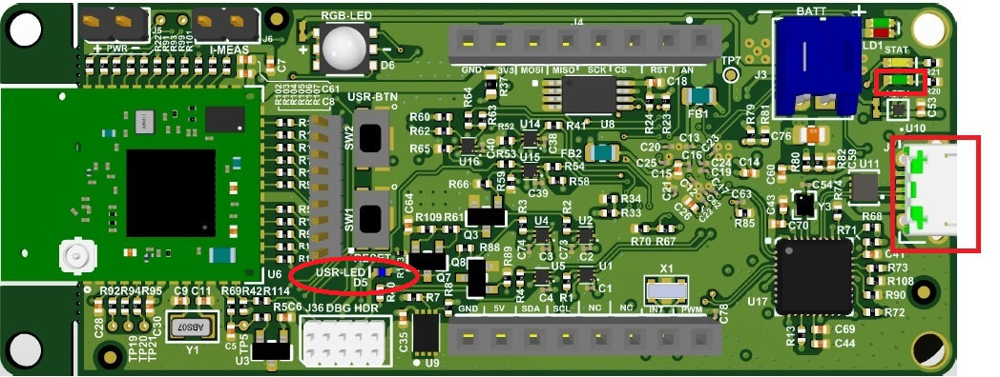
</p>

2. The application activity is shown as "Console Log" through on board UART-USB converter
    - Open Terminal (eg: Tera Term) to look for these logs
```json    
    UART baud settings: 115200 8-N-1 without flow control
```    
<p align="left">
   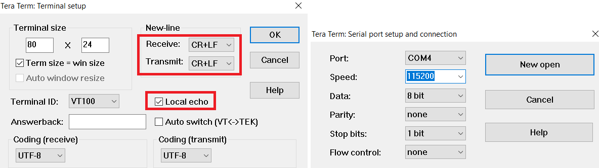
</p>
<p align="left">
   
</p>

#### Demo Steps: commissioning
3. The combo light can be connected to any zigbee gateway. The steps explained in **3A** can be followed if Amazon Echo Plus acts as Zigbee gateway available. The steps explained in **3B** can be followed for WBZ451 based combined interface acts as Zigbee gateway.
##### 3A. Discovery of Combo Light from Amazon Echo Plus
- **Voice Commands:** Open Alexa to discover the Combo light device. Say “Discover my devices”.
or
- **Alexa App:**
i. Launch Alexa app, from the menu, select the Add Device.
ii. Select the type of smart home device “Light” and select other.
iii. Initiate Discover Devices
```json
Note: Echo Plus is in discovery mode for 45 secs. Devices (Lights/other) wanting to join Echo Plus should initiate joining/connecting procedure within this time limit for a successful join
```
<div style="text-align:center"></div>
</br>


##### 3B. Discovery of Combo Light from WBZ451 Combined Interface (CI) gateway

- Supply power to another WBZ451 Curiosity Board which is programmed with Combined interface image by connecting a USB cable [Programming the precompiled hex file using MPLABX IPE](#tasks). Power Supply (PS) Green LED will turn on when connect to PC.
- Program Combined interface precomplied hex file by following the procedure
- Follow step 2 for UART terminal Setup
- send command: *resetToFN* and look for the below logs for successful zigbee network formation on CI
<p align="left">
  
</p>

- CI will open up the network for other zigbee devices to join for first 180sec from the first powerON. If commissioning of combo light is initiated after this 180sec, combo light will not get joined. This is same as Alexa saying "Discovering and put the device is pairing mode". To open up the network after 180sec, send the below commands in CI, before commissioning is initiated in combo device.
    1. *setPermitJoin 180*  -> This command opens up the network for next 180sec
    2. *invokeCommissioning 8 0*  -> This command opens up the network for "finding and binding procedure"
<p align="left">
      
</p>


4. Connecting Combo Light to Zigbee Gateway (Echo plus or combined interface) through BLE commissioning
- Launch MBD Microchip Bluetooth Data app from mobile. Open "BLE Provisioner" sub app and scan for the devices. The device name "COMBO_LIGHT_XXXX" is seen when Scanned from mobile app. 'XXXX' is a unique number associated with this combo device. Connect to device and follow the below screenshots for the commissioning procedure.
- Observe that the Blue "User LED" will be solid On when device is connected to mobile app.
- Observe that RGB LED will be blinking when the device joins/forms a network at the interval of 1sec for next 180sec. This indication is required as per zigbee specification.
```json
Note: The combo light is configured with default primary channel mask (11,15,20,25) as per zigbee specification. The channel configuration from mobile app is needed only when the Gateway channel is not in any of the default channels.
Tips: If commissioning procedure, does not find the nearby network (eg: Echo Plus), try to find the channel of the network, and configure the same channel while commissioning
```
<p align="left">
  
  ---->      
    
</p>


<div style="text-align:center"></div>
</br>

When the combo light is joined to an existing network/formed its own network, the device state can be seen as "Commissioned"
<p align="left">
  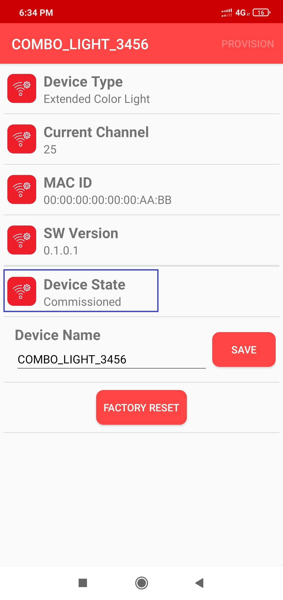  
</p>


##### 4A. Success log on combo light when commissioned with Echo plus

<p align="left">
  
  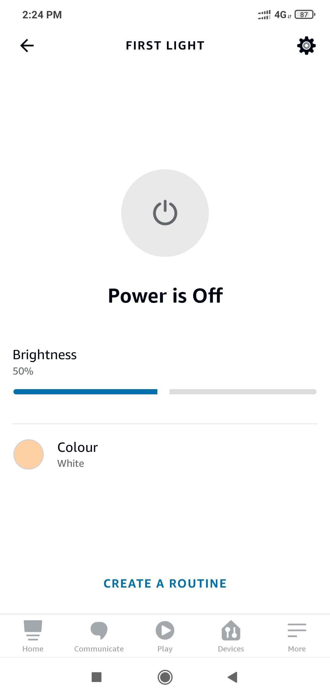  
</p>


##### 4B. Success log on combo light when commissioned with Combined Interface

<p align="left">
  
    
</p>


5. Status messages during commissioning:
Below status messages can be observed during the commissioning procedure based on the conditions.

- Device Joined to an existing network
<p align="left">  
  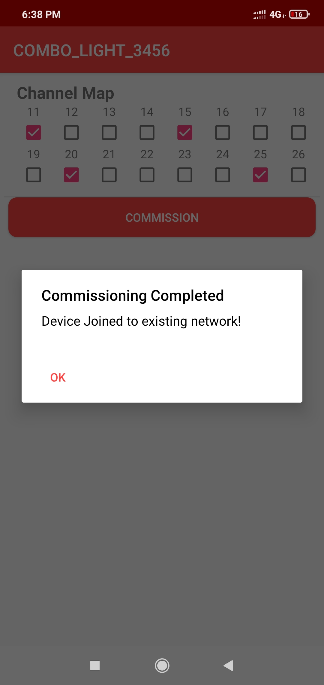
</p>  


- Device formed its own network.
<p align="left">  
  
</p>  


When the commissioning procedures is initiated, the combo device search for any nearby network to get joined. If it does not find any network, then it form its own new network, since Zigbee light has the capability of forming its own distributed network.  

- Fail Status -Commissioning has failed (Did not join/create own network)

<p align="left">  
  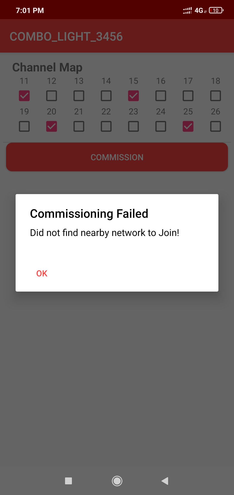
</p>  


5. Other Features in "BLE Provisioner" App:
- Info page shows some useful information like device type, current channel, device IEEE address and device state (Commissioned, Not-Commissioned)
- Device name can be changed to any user preference name. While the device is scanned from MBD app, this device name will be seen in the scanned list. The name can be changed irrespective of commissioning state

<p align="left">  
  
</p>


6. Re-commissioning:
- If the combo light already joined to a network, and wanting to recommission to new network, the current networking related information to be deleted from NVM (Non volatile memory). Connect the combo device from "BLE Provisioner" app and press on "FACTORY RESET". This will delete networking information and the device will reset. Connect with combo light again and do the commissioning by following the steps 3 and 4
<p align="left">
    
</p>

**Note:** If the combo light was joined to an Echo Plus previously, remember to remove the light info from Alexa app before initiating the recommissioning. 

#### Demo Steps: Light Control

RGB LED on WBZ451 curiosity board is tied with Zigbee and BLE functionality. The LED color and brightness can be changed through Zigbee network as well as from mobile app through BLE. The RGB color is synced with both Zigbee and BLE network.

7. RGB color control from MBD "BLE Sensor" mobile app
- Launch MBD Microchip Bluetooth Data app from mobile. Open "BLE Sensor" sub app and scan for the devices. The device name "COMBO_LIGHT_XXXX" or changed device name in **Step5** is seen when Scanned from mobile app. Connect to device and follow the below screenshots for the light control.
- Observe that the Blue "User LED" will be solid On when device is connected to mobile app.
- The BLE Sensor mobile app will show the temperature (deg C) and LED status received from device, as well as allow the user to vary the RGB color and brightness

<p align="left">
   
</p>

<p align="left">
  
  ---->   
    
  ---->   
  
  ---->   
  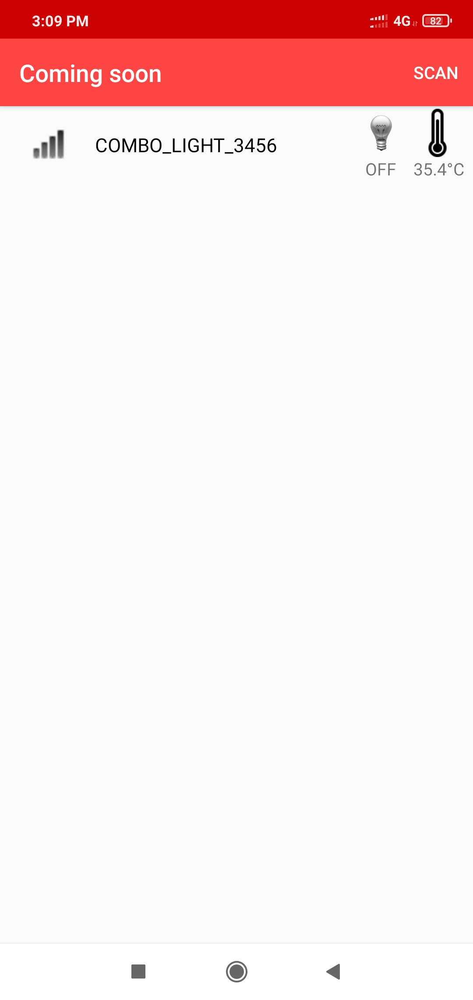   
  ---->   
          
</p>


8. RGB color control from Alexa
- Either through voice commands like "Alexa, Turn on my first light", "Alexa, Change color of my first light to "GREEN"", "Alexa, increase the brightness of my first light" or from Alexa app the RGB LED can be controlled through Zigbee network.

- When the color is changed from Alexa, if combo light is connected with "BLE Sensor" mobile app, the changed color can be seen in mobile app as well.

- If  color is changed from "BLE Sensor", it will be reflected in Alexa app. There may be delay in syncing, since it depends on read attribute request from Alexa as explained in the below note and hence expect max 20sec of delay.

**Notes:**
  - Echo Plus does the zigbee binding only for On/Off and Level Control Clusters. The color control cluster binding is not done from Echo Plus. Also, Echo Plus send the configure reporting command to combo light to disable periodic reporting of light attributes.
	Hence combo light will not report periodically. Instead Echo plus send the read attribute command to combo light every ~20sec and get the light values.
	Also, the read attribute command for color values will start only when the first color change is initiated from Alexa. Hence it is required to do first color change from Alexa, before changing from BLE sensor app for color synchronization to take place.

  - When the LED color is controlled from Alexa, there are 2 color control options available. One is temperature color control (SHADES of WHITE in below figure) and another is HueSaturation (colors in below figure) color control. BLE light is synced only for HueSaturation color control. So, if the color is changed for temperature color control, the RGB LED will be changed, but, the values will not be updated on BLE app.

<p align="left">
  
  ---->
  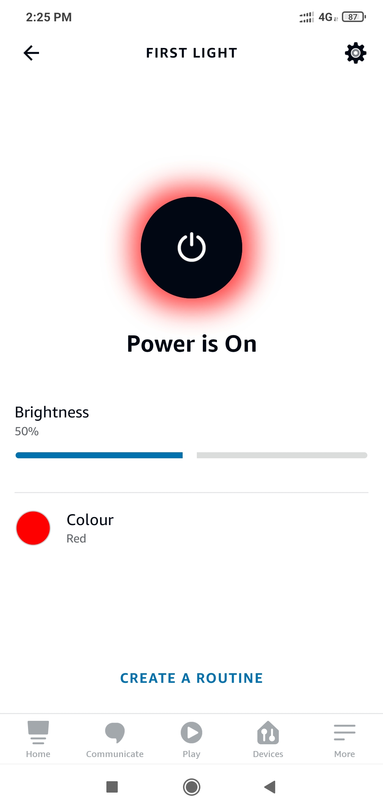  
  ---->
         
</p>


9. RGB color control from Combined Interface
- The RGB color can be controlled from Combined Interface through console commands.
- Similar to Alexa, when the RGB color is changed from Combined Interface, will be reflected in "BLE Sensor" app if connected. Changing from "BLE Sensor" app will be seen in next received report in combined Interface
- The network address of the combo light is needed to send light control commands to combo light.
   a. This network address can be got from Combined interface console log while commissioning was done. Refer to Step 4B log for combo light network address
   <p align="left">
         
   </p>   
   b. Another way to get the network address from combo light is executing the below command in combo light side.
```json   
   Command: getNetworkAddress

   Response: f088
```

   0x23 in the below commands is zigbee end point number used for light.

  1. RGB LED On/off command

```json  
      onOff 0x0 0xf088 0x23 -on

      onOff 0x0 0xf088 0x23 -off
```

  2. RGB LED brightness change command

```json
      moveToLevel 0x0 0xf088 0x23 0x45 0x0 0x1 0x0 0x0
```

      0x45 is the configurable brightness value

  3. RGB LED color change command
```json  
      moveToHueAndSaturation 0x0 0xf088 0x23 0x45 0x67 0x0 0x0 0x0
```

      0x45 and 0x67 are the configurable Hue and Saturation values


10. Firmware Version
    - Bluetooth SIG defined "Device Info Service" is implemented in the combo device to share the device information like "firmware version", "manufacture name", etc..

<p align="left">
  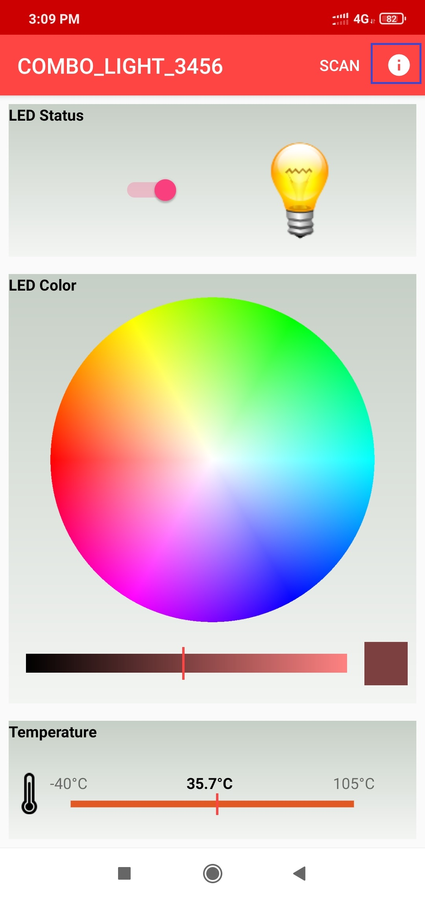  
       ---->
    
</p>


#### Demo Steps: Other Features

11. On board button actions:
    - When the on board "User Button" is pressed for more than 10sec, it can delete all the networking information and will bring the device to factory default state


12. Persistent Data Storage (PDS):
 The RGB light status (On/Off) and brightness values are stored in NVM. So, power off/on of combo light, these values persist and RGB LED will reflect accordingly. This PDS storage is tied to zigbee network.
    -   Combo device is not yet commissioned: Light values are not stored in NVM in this Scenario. So, power Off/On the light values will default to Off Status and default color (white, HSV = 0,0x7F, 0x7F)
    -  Combo device is commissioned: The light On/Off status and light brightness is being stored in non-volatile memory in this case. So, power off/on, the LED will be updated with light on/off and brightness values retrieved from previous transaction, whereas color values remain default HS = 0x00,0x7F

---
<a name="tasks">
</a>

## Programming the precompiled hex file using MPLABX IPE

1.  Precompiled Hex files for combo light is located <a href="precompiled_hex/"> here </a>

 **Note:** If Amazon Echo Plus acts as gateway is not available then program the combined interface <a href="../../zigbee/zigbee_combined_interface/precompiled_hex/"> hex </a> image on another curiosity board.

2.  Follow the steps mentioned [here](https://microchipdeveloper.com/ipe:programming-device)

 **Caution:** Users should choose the correct Device and Tool information

3. Follow the steps for [running the demo](#tasks_2)

<a name="tasks_1">
</a>

## Build and Program The Application

The source code of BLE Sensor demo application is available in Harmony 3 framework firmware/src. If want to do changes in the demo code and would like to program/debug the customized code follow the below instruction.

### SDK Setup
[SDK Setup](../../docs/pic32cx_bz2_wbz45x_sdk_setup.md)

1. Open the "/firmware/ble_zigbee_light_prov.X" MPLABX project from MPLABX

<p align="left">
  
  ---->
  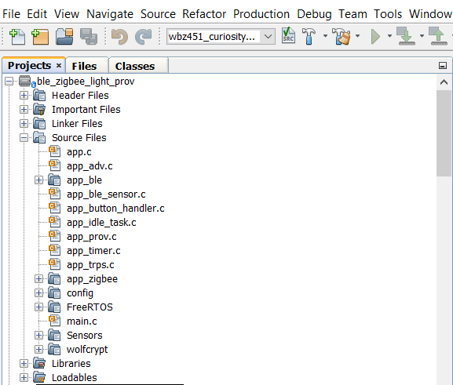  
</p>

2. Project Folder structure:

<div style="text-align:center">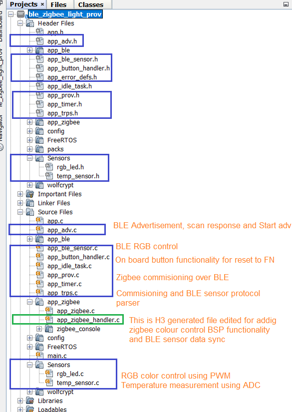</div>


3. Do your changes in the code. Clean and build your application by clicking on the Clean and Build button as shown below.
<p align="left">
  
</p>

4. Program your application to the device, by clicking on the Make and Program button as shown below
<p align="left">
  
</p>

---

## Protocol Exchange
The communication protocol exchange between BLE Provisioner mobile app/ BLE sensor mobile app (BLE central) and WBZ451 module (BLE peripheral) is explained [here](protocol.md)

---
