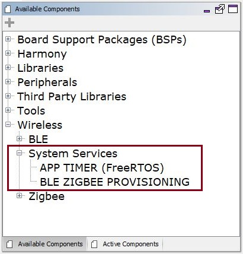
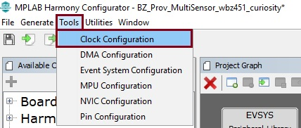
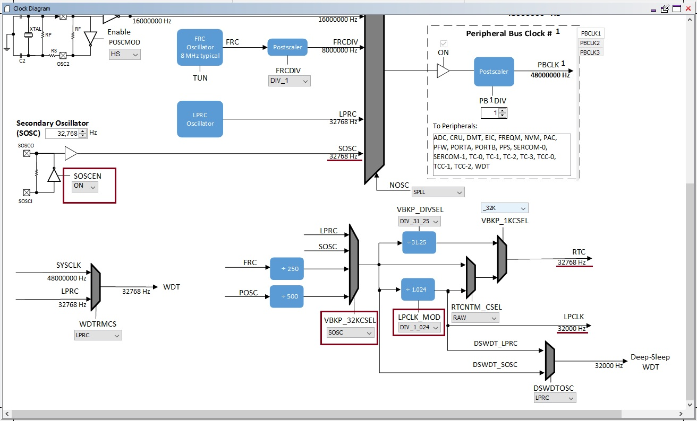
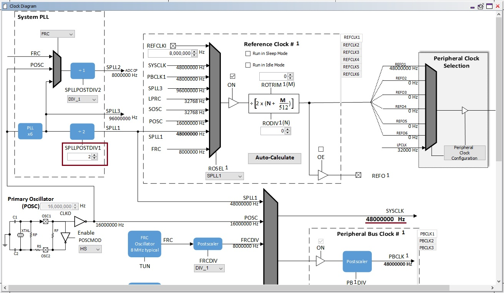
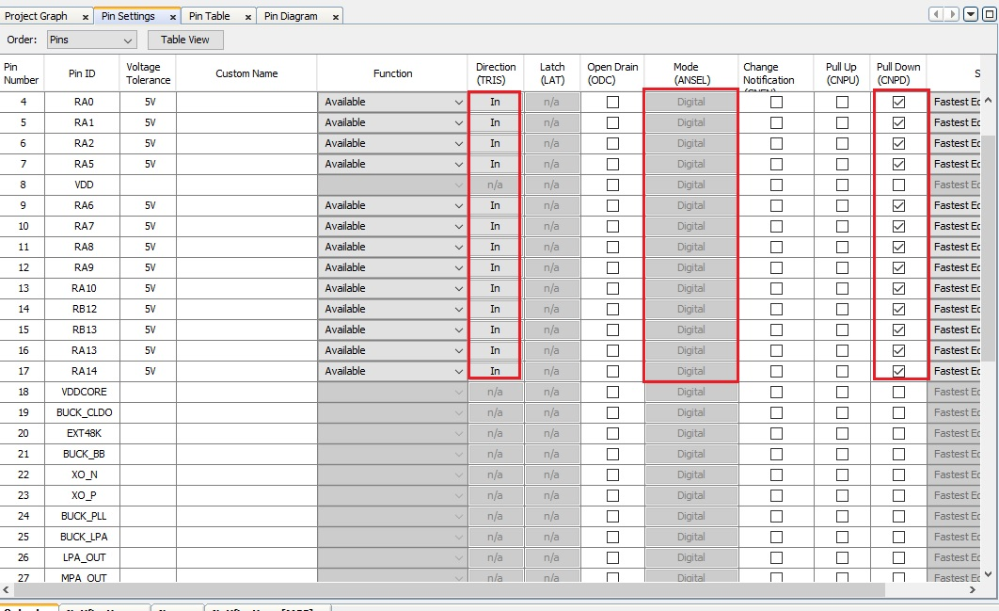
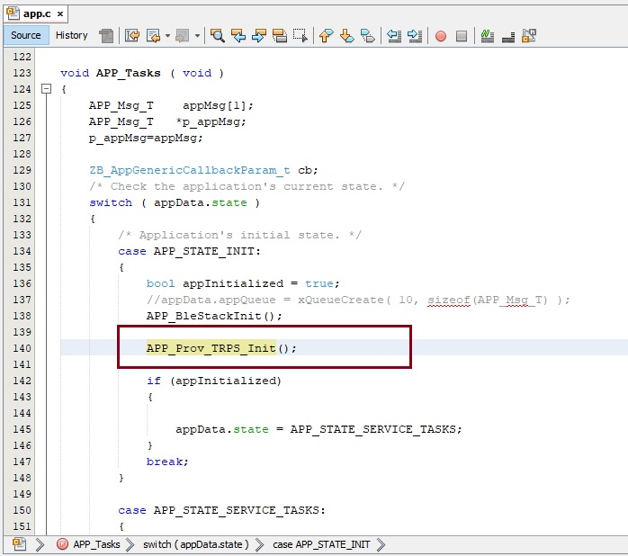
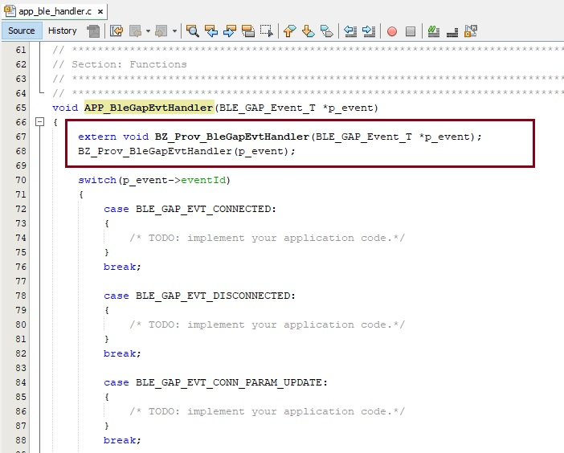
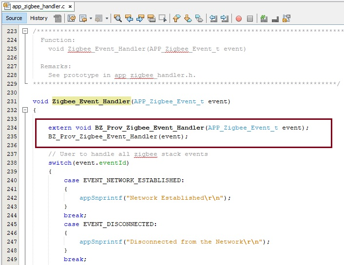

# PIC32CX-BZ2/WBZ45 BLE ZigBee Provisioning Low Power Application Demo: Zigbee Multi-Sensor and Zigbee commissioning through BLE 

This tutorial will help users to create a low power enabled multiprotocol (BLE+ZIGBEE) example project using Mplab code configurator. The step by step procedure will help the user to generate a 
Zigbee Multi-Sensor application and commission the Multi-Sensor to a Zigbee network through BLE from scratch.

## Hardware Required

  |**Tool**                | **Qty**  |
  |------------------------| ---------|
  |WBZ451 Curiosity Board  | 1        |
  |Micro USB cable         | 1        |
  |Android/iOS Mobile     | 1        |

## SDK Setup

[SDK Setup](../../../apps/docs/pic32cx_bz2_wbz45x_sdk_setup.md)

## Smartphone App

Microchip Bluetooth Data (MBD) iOS/Android app available in stores

## Demo Description

This application demonstrate the Zigbee Multi-Sensor end device joining to Zigbee Coordinator (Combined Interface, The thirdparty gateway's like Amazon Echo plus can also be used instead of CI.) 
by receiving the commissioning parameters from user using a mobile phone through BLE Link. The mobile application uses Microchip Proprietary Transparent Service to send and receive data PIC32CX-BZ2/WBZ45 device. 

The BLE provisioner in the MBD App (available in Google Play Store and Apple Store) is utilized to demo the provisioning functionality.

## Developing this Application from scratch using Mplab Code Configurator
The following steps will help to understand the PIC32CXBZ2 device ZIGBEE and BLE stack programming structure. Ensure that wireless_system_pic32cxbz2_wbz45 repo is available locally as documented in SDK Setup.pdf.
Following are recommended steps.

### Pull-in H3 Components

-  Create a new MPLAB Code Configurator Project -- [link](../../../apps/docs/creating_new_mplabx_harmony_project.md) for instructions

-  Open MPLABx Code Configurator. The Wireless System Service components will be displayed in available components. Select Multi Sensor from Device Resouces --> Wireless -->Zigbee --> Device Types 
as shown in the below figure.

- Click on Multi Sensor from available Device Types. It will create project graphs as shown the following picture. Accept all dependencies by selecting "Yes".

 

 
	
-  Select the Multi Sensor Zigbee device component by click on the component in the project graph. Now the *Configuration Options* tab will list the Configurations for the selected Zigbee device.
	Ensure that the *Manual Configuration* is selected and *Network Formation Commissioning Enable* and *AUTOMATIC COMMISSIONING ON STARTUP* is deselected as shown in below figure.
	
 

 
-  Select the BLE Stack component by clicking on the component. In the Configuration Options tab, Expand Generic Access Profile (GAP) --> Advertising and then expand Advertising Data and Scan Response Data.

-  In *Advertising Data* menu, ensure that *Local Name* is deselected and selected in *Scan Response Data* --> *Local Name*. 
    In *Advertising Data* menu, ensure that *Service Data* is selected, *Service UUID* is selected as 0xFEDA and *Service Data* is set as 0xFF03 as shown in below figure.

 

**Note**: 
- 0xFEDA is a 16-bit Service UUID which is purchased by Microchip from Bluetooth SIG. 
- In order to list the device while scanning in Microchip Bluetooth Data (MBD) mobile application, the device should advertise with Service UUID as 0xFEDA and Service Data as 0xFF03.

### Low power Configuration

- Enable Sleep Mode in BLE stack H3 component configuration, after enabling this dependent component like RTC (Timer source during sleep) will be requested to be enabled

 

 
    For Zigbee applications the System Sleep mode is only enabled when using the following device types - Multisensor, Intruder Alarm System and Color Scene controller as per the Zigbee End Device Spec. 
	There is no separate configuration that a user has to select to enable the System Sleep like for BLE Sleep

- Upon enabling sleep mode, FreeRTOS related settings will be set automatically.
	- Tick Mode will be set to Tickless_Idle
	- Expected idle time before sleep will be set to 5 (ms)
	- Tick Hook will be enabled (For user to add any custom code needed to be executed within each tick interrupt)
	- RTC peripheral library will be added and configured 
	

	
	**Note:** RTC counter should not be reset (RTC_Timer32CounterSet()) arbitrarily when the system is running
	
- RTC clock source should be set manually, there are 4 options to choose from
	 - FRC (±1% offset)
	 - LPRC ( with larger offset, < ±5%)
	 - POSC  <- Candidate of the clock source (better clock accuracy)
	 - SOSC <- Candidate of the clock source (better clock accuracy)

	Users can select POSC or SOSC as the RTC clock source. Choosing FRC and LPRC  as clock sources for RTC will impact BLE connection stability. In this example SOSC is configured as RTC clock source.

- In Mplab Code Configurator, Click Plugins select "Clock Configuration" from drop down menu
	

- In Clock Diagram, 
	 - Enable Secondary Oscillator (SOSC) by setting `SOSCEN` to `ON`
	 - Select `SOSC` as clock source for `VBKP_32KCSEL` and set `LPCLK_MOD` to `DIV_1_024` as hown in below below.
	 

	 - It is recommended to use 48MHz as SYS_CLOCK for better power savings. This can be configured by setting SPLLPOSTDIV1 to 2 as shown below.
	 

	 - Ensure that JTAG Enable is disabled by clearing the JTAGEN bit in CFGCON0 (Configuration Control Register 0) as shown below.\
     `CFG_REGS->CFG_CFGCON0CLR = CFG_CFGCON0_JTAGEN_Msk;`
	  **Note:** This is done in `APP_Prov_TRPS_Init()`
- All Unused pins in the application needs to be set in input mode and the pulldown should be enabled for these pins. This can be configured through pin configuration in Mplab Code Configurator as shown below.
     

### BLE Zigbee Provisioning addition

16. Open app.c file and include the header file app_prov.h as shown in below figure.

    `#include "app_prov/app_prov.h"`

 

17. In app.c, Add the following code after APP_BleStackInit() in APP_Tasks function.

    `APP_Prov_TRPS_Init();`

	

18. Open app_ble_handler.c file located in app_ble project folder. In APP_BleGapEvtHandler() function, add the below code as shown in figure.

    `extern void BZ_Prov_BleGapEvtHandler(BLE_GAP_Event_T *p_event);`\
    `BZ_Prov_BleGapEvtHandler(p_event);`
	
    

19. Open app_trsps_handler.c file. In APP_TrspsEvtHandler() function, add the below code as shown in figure.

    `extern void APP_TRPS_EventHandler(BLE_TRSPS_Event_T *p_event);`\
    `APP_TRPS_EventHandler(p_event);`

    

 
20. Open app_zigbee_handler.c file located in app_zigbee project folder. In Zigbee_Event_Handler() function, add the below code as shown in figure.

    `extern void BZ_Prov_Zigbee_Event_Handler(APP_Zigbee_Event_t event);`\
    `BZ_Prov_Zigbee_Event_Handler(event);`

    

21. Open app_user_edits.c file. Comment out or remove the #error line. Update the freertos_hooks.c as mentioned in app_user_edits.c file

22. Compile and Run the project in WBZ45x device.

### Demo Steps: commissioning

23. To Commission the Zigbee Multi-Sensor device, follow the step mentioned [here](../../../apps/multiprotocol/ble_zigbee_light_prov/readme.md#demo-steps-commissioning)

### Protocol Exchange

24. The communication protocol exchange between BLE Provisioner mobile app and WBZ451 module (BLE peripheral) is explained [here](../../../apps/multiprotocol/ble_zigbee_light_prov/protocol.md)