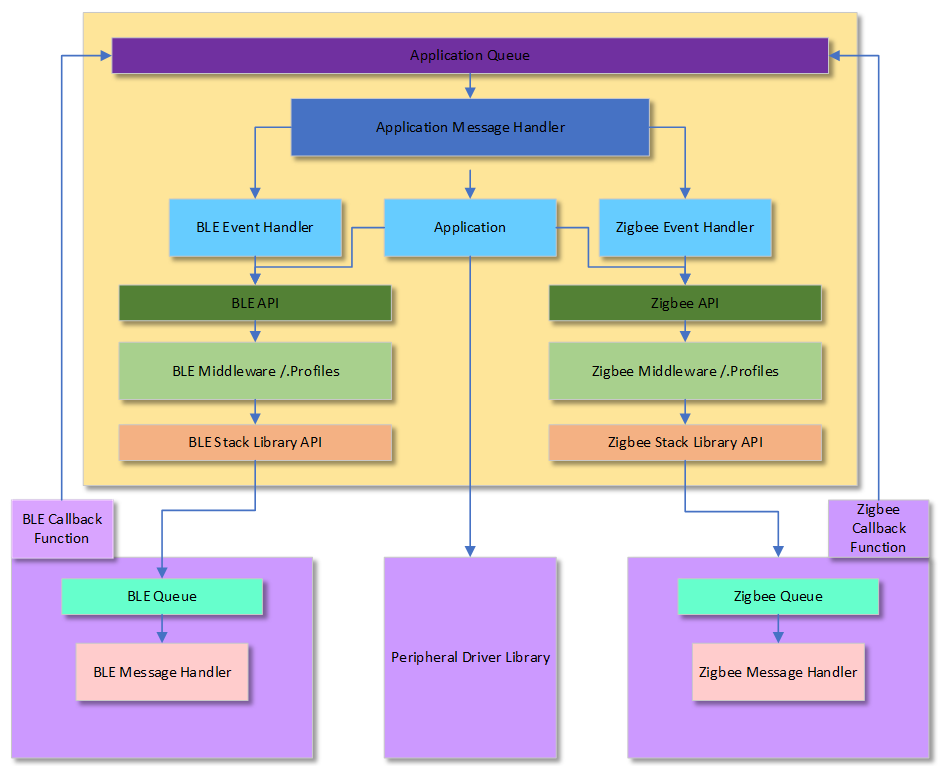

# Multiprotocol Application Framework

---
Multiple protocols on a single SoC helps to connect smart device to a smartphone over BLE, and then join a Zigbee mesh network to connect to dozens or even hundreds of end nodes. Multiprotocol provides higher level of control of connected devices and makes data sampling easier.

Targeting different applications and environments:
1. Programmable: Only one wireless protocol either BLE or Zigbee application programmed and run on the device.
  - *Use case: BLE sensor, Zigbee light*
  - Example applications available in <a href="../ble"> BLE only Applications </a>, <a href="../zigbee"> Zigbee only Applications </a>

2. Switchable: A device can switch from one wireless protocol to another, but uses only one at a time.
  - *Use case: Zigbee light commissioned based using BLE. Initially only BLE protocol will be active. Once command is sent from mobile app, to start the Zigbee commisioning, Zigbee will be active, BLE will be switched off.*

3. Concurrent: Multiple protocol run on the device simultaneously. Sharing a single radio between 2 protocols BLE and Zigbee is challenging since protocols access the radio in different modes and with different time patterns. Radio abstraction layer for dynamically sharing the radio based on the priority of the requests. Furthermore, concurrent operation of protocols is achieved with the help of priority based multitasking of FreeRTOS operating system.
  - *Use case: BLE based light control from mobile app on a Zigbee-connected light. ble_zigbee_light_prov demo available in this package is an example for this concurrent mulitprotocol.*

## Multiprotocol Application Framework

   

## Demo Examples
1. <a href="ble_zigbee_basic/readme.md"> ble_zigbee_basic - Simple steps to bring the multiprotocol base project from H3 project generation

2. <a href="ble_zigbee_light_prov/readme.md"> ble_zigbee_light_prov - Zigbee light control and Zigbee commisioning through BLE</a>
