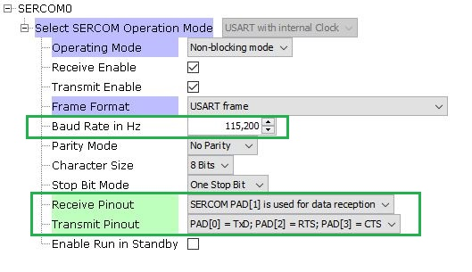
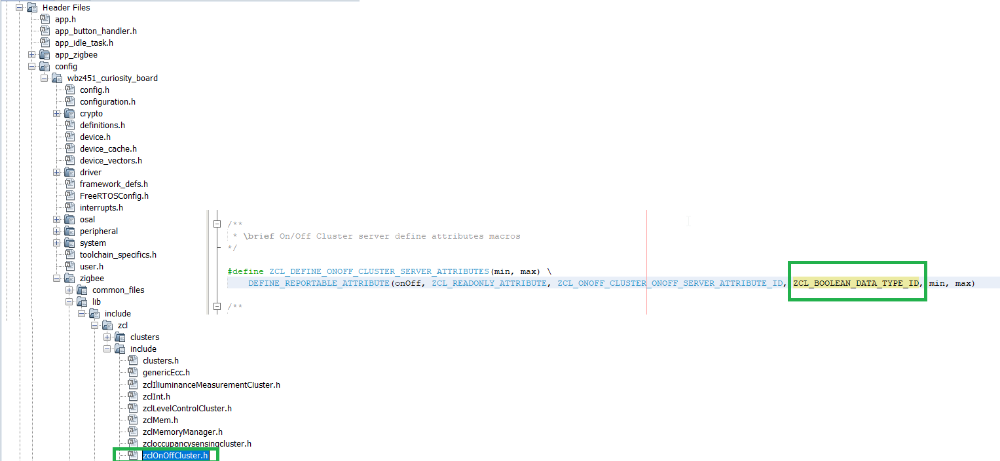

[](https://www.microchip.com)
# Serial Console Commands
The ZigBee application support includes implementation of a serial console that allows control and monitoring of the ZigBee device over a serial connection using a terminal program (HyperTerminal, Tera Term, etc.) on a PC.

**Note:**
- These commands are mainly used for testing or demonstration purpose only.
- The end customer application may or may not use this command based approach.
- But the code implementation used in these commands internally uses global zigbee stack API's which can be taken as reference for API usage.

## Setup
-  To enable the use of console, In MPLAB Code Configurator (MCC), Connect "Zigbee console" in the Zigbee device component to USART Driver Component and to SERCM0 component (for WBZ Curiosity Board) as shown below.

 <div style="text-align:center"></div>

- Configure the SERCOM0 component as shown in the below figure to set the uart baud rate, parity, data bits and Sercom Tx and Rx pins

 <div style="text-align:center"></div>


- The MCC configurator also gives the flexibility to select commands based on different Groups. It is highly modularised.

<div style="text-align:center"></div>


- The MCC generated code for console can be seen in application folder:


 <div style="text-align:center"></div>


- On the PC side virtual COM port connection that corresponds to the board shall have following settings:

- BAUD RATE: 115200 (as configured in SERCOM configuration)
- PARITY: None
- DATA BITS: 8
- STOP BITS: 1
- FLOW CONTROL: None

- Additionally, local echo and sending line ends with line feeds shall be enabled in the PC serial terminal application.

 <div style="text-align:center"></div>

## Commands
Once the COM port is opened in the PC terminal application, the console commands can be entered in terminal application. Type ‘help’ to list the help commands type as shown in below figure.

 <div style="text-align:center"></div>

### Help
<style>
td, th {
    border: 1px solid grey
}
</style>
|**Command Syntax**|**Response**|**Description**|
|---------|----------------------------------|-------------------------------|
|help|<p>Commands:</p><p>[zdoHelp](#_zdoHelp)</p><p>[commissioningHelp](#_commissioningHelp)</p><p>[zclHelp](#_zclHelp)</p>|<p>Shows supported help sections.</p><p>The console commands are categorized into three sections commissioningHelp, zdoHelp & zclHelp.</p><p></p><p></p>|
|commissioningHelp|<p>Commands:Refer [Commissioning Help](#_Commissioning_Help)|<p>*commissioningHelp* list the command that are related to commissioning of the Zigbee device.</p>|
|zdoHelp|<p>Commands: Refer [ZDO Help](#_ZDO_Help)|<p>*zdoHelp* list the group of commands that are categorized to zdo (zigbee device object) functionality.</p>|
|zclHelp|<p>Commands: Refer [ZCL Help](#_ZCL_Help) |<p>*zclHelp* list the group of commands that are categorized to zcl (zigbee cluster library) functionality. The clusters are specific to device type and the zclHelp list commands based on clusters that are supported in the device type of the project</p>|

## 1. Commissioning Help <a name="_Commissioning_Help"></a>

<p>When commissioningHelp is entered in the terminal application, the device lists all the supported commands that are related to commissioning of the zigbee device.</p>

|**Command Syntax**|**Response**|**Description**|
| :- | :- | :- |
|<p><a name="_invokeCommissioning"></a> invokeCommissioning < mode > < gid ></p><p></p><p>e.g.: *`invokeCommissioning 4 0`*</p>|<p>Nwk Formation: Success</p><p>CommissioningStatus = 0</p>|<p>Invokes commissioning with the groupid (bdbCommissioningGroupID) and input modes enabled</p><p>- 1 - Touchlink</p><p>- 2 - Steering</p><p>- 4 - Forming</p><p>- 8 - Finding and Binding</p><p>Multiple modes can be enabled.  Details of different commissioning methods is explained <a href="readme.md"> here </a></p>|</p>|.
|<p><a name="_getAppDeviceType"></a>getAppDeviceType</p><p></p><p>e.g.: *`getAppDeviceType`*</p>|HADeviceType = 0x0007|<p>Request for Application Device Type</p><p>The response 7 indicate that the device is combined interface</p><p>Refer [Application Device Type Responses table](#_AppDeviceTypeTable) for more details</p>|
|<p><a name="_getDeviceType"></a>getDeviceType</p><p></p><p>e.g.: *`getDeviceType`*</p>|DeviceType = 2|<p>Request for Zigbee Device Type</p><p>The response 2 indicate that device is of type Zigbee Coordinator</p><p>Refer [Zigbee Device Type table](#_ZigbeeDeviceTypeTable) for more details</p>|
|<p><a name="_getExtAddr"></a>getExtAddr</p><p></p><p>e.g.: *`getExtAddr`*</p>|0000000000000bee|<p>Return the extended Address (MAC Address) of the Zigbee device</p><p>Here 0x0000000000000bee is the extended address</p>|
|<p><a name="_getNetworkAddress"></a>getNetworkAddress</p><p></p><p>e.g.: *`getNetworkAddress`*</p>|0000|<p>Return the network address / short address of the zigbee device.</p><p>Here 0000 is the network address of the Zigbee device in hex format</p>|
|<p><a name="_getChannel"></a>getChannel</p><p></p><p>e.g.: *`getChannel`*</p>|25|<p>Return the current operational channel</p><p>Here the device is operating in channel 25</p>|
|<p><a name="_setExtAddr"></a>setExtAddr < upper > < lower ></p><p></p><p>eg(in hex): *`setExtAddr 0xaabbccdd 0x1122334`*</p><p></p><p>eg(in dec): *`setExtAddr 2864434397 287454020`*</p>|<p></p><p>-</p>|<p>Set the extended Address (MAC Address) of the Zigbee device</p><p>Here 0xaabbccdd11223344 is the extended address. The extended address is IEEE address purchased from IEEE and will be programmed in OTP page of module. So, this setExtAddr is needed only for testing purpose. </p>|
|<p><a name="_setPrimaryChannelMask"></a>setPrimaryChannelMask < mask ></p><p></p><p>e.g.: *`setPrimaryChannelMask 0x2108800`*</p>||<p>Set Primary channel mask</p><p>Here the primary channel mask is set to channels to 11,15,20&25</p>|
|<p>setSecondaryChannelMask < mask ></p><p></p><p>e.g.: *`setSecondaryChannelMask 0x2108800`*</p>||<p>Set Secondary channel mask</p><p>Here the Secondary channel mask is set to channels to 11,15,20&25</p>|
|<p><a name="_powerOff"></a>powerOff</p><p></p><p>e.g.: *`powerOff`*</p>||Emulates Power off  of the device by disabling RF. reset command or press the reset button of the device is required to return to power on status|
|<p><a name="_reset"></a>reset</p><p></p><p>e.g.: *`reset`*</p>|Zigbee Device Initialized: Type Help for Commands|Perform HW reset for the device. Upon reset the device will attempt to restore data from NVM and apply it instead of starting as factory new|
|<p><a name="_resetToFN"></a>resetToFN</p><p></p><p>e.g.: *`resetToFN`*</p>|Zigbee Device Initialized: Type Help for Commands|Resets the device to Factory New state by deleting network and application data from NVM. However, this command does not reset the outgoing NWK security counter, and hence device is able to join its previous network.|
|<p><a name="_formAndSteer"></a>formAndSteer</p><p></p><p>e.g.: *`formAndSteer`*</p>|<p>Nwk Formation: Success</p><p>Steering: Success</p><p>CommissioningStatus = 0</p>|Forms a network and steers. This command is same as using invokeCommissioning 6 0|
|<p><a name="_formSteerAndFB"></a>formSteerAndFB</p><p></p><p>e.g.: *`formSteerAndFB`*</p><p></p>|<p>Nwk Formation: Success</p><p>Steering: Success</p><p>Device joined: Address 0x256a  MACID 0x000000000000aabb ExtendedPANID 0x0000000000000bee</p><p>addGroupResponseInd()</p><p>Finding & Binding: Success</p><p>CommissioningStatus = 0</p>|forms network, steers and initiate Finding & Binding. This command is same as using invokeCommissioning 0xE 0|
|<p><a name="_SetInstallCode"></a>SetInstallCode  < ext\_addr\_upper > < ext\_addr\_lower > < code > </p><p>e.g.: *`SetInstallCode 0xAABBCCDD 0x11223344 B5C305D51669B239C6A52397937A40D3FE83`*</p>|Status = 0|<p>Sets the install code</p><p>Here 0xAABBCCDD 0x11223344 is the for the extended address 0xaabbccdd11223344</p><p>Here the product key is “83FE D340 7A93 9723 A5C6 39B2 6916 D505 C3B5”</p>|
|<p><a name="_SetAllowRemoteTCpolicyChange"></a>SetAllowRemoteTCpolicyChange < type ></p><p></p><p>e.g.: *`SetAllowRemoteTCpolicyChange 1`*</p>|-|<p>Enable/Disable Trust Center policy </p><p>1 – enables Remote Tust center Policy Change </p><p>0 - 1 – disables Remote Tust center Policy Change</p>|
|<p><a name="_SetInstallCodeDevice"></a>SetInstallCodeDevice < code > </p><p></p><p>e.g.: *`SetInstallCodeDevice B5C305D51669B239C6A52397937A40D3FE83`*</p>|Status = 0|<p>Sets the install code</p><p>Here the product key is “83FE D340 7A93 9723 A5C6 39B2 6916 D505 C3B5”</p>|
|<p><a name="_setAllowTLResetToFN"></a>setAllowTLResetToFN < type ></p><p></p><p>e.g.: *`setAllowTLResetToFN 1`*</p>|-|<p>Set the device to allow to accept Touch Link reset to FN</p><p>1 – allow Touch Link Reset To Factory New</p><p>0 – disallow Touch Link Reset To Factory New</p>|
|<p><a name="_SetTLRole"></a>SetTLRole < initiator ></p><p></p><p>e.g.: *`SetTLRole 1`*</p>|-|<p>Sets the Touchlink role</p><p>1 – initiator</p><p>0 - target</p>|
|<p><a name="_setTCLKExchangeMethod"></a>setTCLKExchangeMethod < method ></p><p></p>|-|<p>Set Touch Link exchange method</p><p></p>|
|<a name="_setTCLKMaxRetryAttempts"></a>setTCLKMaxRetryAttempts < attempt >||Set Touchlink Max retry attempt|
|<p><a name="_setTCRequireKeyExchange"></a>setTCRequireKeyExchange < require ></p><p></p><p>e.g.: *`setTCRequireKeyExchange 1`*</p>|-|Enable or disable Trust Center Key exchange|
|<p><a name="_setGlobalKey"></a>setGlobalKey < option ></p><p></p><p>e.g.: *`setGlobalKey 1`*</p>|-|<p>Set Global Link (for testing)</p><p>0 -  HA Link key will be used</p><p>[0x5a,0x69,0x67,0x42,0x65,0x65,0x41,0x6c,0x6c,0x69,0x61,0x6e,0x63,0x65,0x30,0x39]</p><p>1 – [0xd0, 0xd1 …. 0xdf]</p><p>2 – [0xc0, 0xc1 …. 0xcf]</p><p>3 – [0x66, 0xB6, 0x90, 0x09, 0x81, 0xE1, 0xEE, 0x3C, 0xA4, 0x20, 0x6B, 0x6B, 0x86, 0x1C, 0x02, 0xBB]</p><p>Here in the example setGlobalKey 1 the key used will be [0xd0, 0xd1, 0xd2, 0xd3, 0xd4, 0xd5, 0xd6, 0xd7, 0xd8, 0xd9, 0xdA, 0xdb, 0xdc, 0xdd, 0xde, 0xdf]</p>|
|<p><a name="_setPermitJoin"></a>setPermitJoin < duration ></p><p></p><p>e.g.: *`setPermitJoin 180`*</p>|setPermitJoinRsp 0|<p>Allow other devices to join the network for the specified duration (in secs)</p><p>Here the zigbee device allow other devices to join the network for a duration of 180 sec.</p><p>setPermitJoinRsp 0 - indicate that a ZDO MGMT\_PERMIT\_JOINING\_CLID packet is send.</p>|

## 2. ZDO Help <a name="_ZDO_Help"></a>

When zdoHelp is entered in the terminal application, the device lists all the supported commands that are related to network management and information gathering.  

|**Command Syntax**|**Response**|**Description**|
| :- | :- | :- |
|<p><a name="_activeEpReq"></a>activeEpReq < DstAddr > < nwkAddrOfInterest ></p><p>e.g.: *`activeEpReq 0x7766 0x7766`*</p>||<p>This console command requests the list of all active endpoints on a </p><p>remote device.</p><p>Here the *DstAddr* is the short / network address of the remote device to which Active\_EP\_req command (ClusterID=0x0005) will be send. </p><p>*nwkAddrOfInterest* is the short address of the remote device for which the active endpoint list is required.</p><p>This *activeEpReq* should be a unicast to the remote device itself or to an alternative device that contains the discovery information of the remote device</p>|
|<p><a name="_bindReq"></a>bindReq <[addrMode](#_Address_Mode_table)> < DstAddr > < extDstAddrHigh > < extDstAddrLow > <ep> < ClusterId ></p>|BindRsp 0|<p>This console command requests a remote node to insert an entry to its binding table.</p><p>Here [addrMode](#_Address_Mode_table) specifies the format of *DstAddr*.</p><p>Refer [Address Mode table](#_Address_Mode_table) for more details. </p><p>*DstAddr* is the short address of the remote device.</p><p>*extDstAddrHigh* & *extDstAddrLow* is the extended address of the destination device. </p><p>*ep* is the destination endpoint for the binding entry. </p><p>*ClusterId* is the cluster on the source device that is bound to the destination.</p>|
|<p><a name="_bindReq2"></a>bindReq2 < [addrMode](#_Address_Mode_table)> < DstAddr > < extSrcAddrHigh > <extSrcAddrLow> < extDstAddrHigh> < extDstAddrLow / GroupID> < ep\_Src > < ep\_Dst > < ClusterId ></p>|BindRsp 0|<p>This console command requests a remote node to insert an entry to its binding table.</p><p>Here [addrMode](#_Address_Mode_table) specifies the format of *DstAddr*.</p><p>*DstAddr* is the short address of the remote device. </p><p>*extSrcAddrHigh* & *extSrcAddrLow* is the extended address of the source device. *extDstAddrHigh* & *extSrcAddrLow* is the extended address of the destination device. </p><p>Refer [Address Mode table](#_Address_Mode_table) for more details.</p><p>*ep\_Src* is the source endpoint for the binding entry.</p><p>*ep\_Dst* is the destination endpoint for the binding entry.</p><p>*ClusterId* is the cluster on the source device that is bound to the destination.</p>|
|<p><a name="_ieeeAddrReq"></a>ieeeAddrReq < dstAddr > < nwkAddOfInt > < reqType ></p><p></p><p>e.g.: *`ieeeAddrReq 0x7011 0x7011 0`*</p>||<p>This console command requests the IEEE (extended) address of a remote node with a given short (network) address.</p><p>*dstAddr* is the short address of the remote device to which IEEE\_addr\_req command (ClusterID=0x0001) will be send.</p><p>*nwkAddOfInt* is the short address of the remote device for which the extended address (IEEE address) is required.</p><p>*reqType* is Request type for this command.</p><p>0 - *`SINGLE_RESPONSE_REQUESTTYPE`* - Only the address of the target device is requested</p><p>1 - *`EXTENDED_RESPONSE_REQUESTTYPE`* - Address of all target's child nodes (only end devices) are also requested.</p>|
|<p><a name="_macBanNode"></a>macBanNode < extAddrHigh > < extAddrLow > < shortAddr > < cost > < rssi ></p><p></p><p>e.g.: *`macBanNode 0xaabbccdd 0x11223344 0x7011 0xFF -100`*</p>||<p>This console command bans any frame from the node or correct link cost for all the frames.</p><p>*extAddrHigh* & *extAddrLow* - extended address of the node affected.</p><p>*shortAddr* - short address of the node affected. If the short address of banned node is unknown then pass 0xFFFE (MAC\_NO\_SHORT\_ADDR).</p><p>*cost* - link cost value for all the frames received from the node. If node shall be baned - use link cost value 0xFF (LINK\_COST\_VALUE\_NODE\_BANNED).</p>|
|<p><a name="_macResetBanTable"></a>macResetBanTable</p><p></p><p>e.g.: *`macResetBanTable`*</p>|Done|This console command reset the ban table and reloads from the config server.|
|<p><a name="_matchDescReq"></a>matchDescReq < nwkAddr > < srcEp ></p><p></p><p>e.g.: *`matchDescReq 0xFFFD 0x20`*</p>||<p>This Command launches a search for devices that have endpoints supporting at least one of the specified clusters.</p><p>*nwkAddr*: is the short / network address of the remote device to which Match\_Desc\_req command (ClusterID=0x0006) will be send. </p><p>*srcEp* is the endpoint to be found.</p><p>Here *0xFFFD* is the broadcast address of the device which have rx on idle enabled. (RX\_ON\_WHEN\_IDLE\_ADDR)</p>|
|<p><a name="_NodeDescReq"></a>NodeDescReq < dstnwkAddr > < nwkAddrOfInt ></p><p></p><p>e.g.: *`NodeDescReq 0xb389 0xb389`*</p>||<p>This console command requests the node descriptor of a remote device. (Node descriptor contains information about the capabilities of the ZigBee node)</p><p>*dstnwkAddr* is the short address of the remote device to which Node\_Desc\_req command (ClusterID=0x0001) will be send.</p><p>*nwkAddrOfInt* is the short address of the remote device or to an alternative device for which the node descriptor is required.</p>|
|<p><a name="_nwkAddrReq"></a>nwkAddrReq < dstAddr > < ieeeAddOfIntHigh > < ieeeAddOfIntLow > < reqType ></p><p></p><p>*`nwkAddrReq 0xb670 0xaabbccdd 0x1223344 0`*</p>||<p>This console command requests the short address (network address) of a remote node with a given Extended address (IEEE address).</p><p>*dstAddr* is the short address of the remote device to which NWK\_addr\_req command (ClusterID=0x0000) will be send.</p><p>*ieeeAddOfIntHigh & ieeeAddOfIntLow* is the extended (IEEE) address to be matched by the Remote </p><p>Device.</p><p>*reqType* is Request type for this command.</p><p>0 - *`SINGLE_RESPONSE_REQUESTTYPE`* - Only the address of the target device is requested</p><p>1 - `EXTENDED_RESPONSE_REQUESTTYPE` - Addresses of all target's child nodes (only end devices) are also requested.</p>|
|<p><a name="_sendBeaconReq"></a>sendBeaconReq</p><p></p><p>e.g.: *`sendBeaconReq`*</p>||This console command sends a beacon request. All other coordinators and routers will respond with a beacon.|
|<p><a name="_sendMgmtBindReq"></a>sendMgmtBindReq < address > < startIndex ></p><p></p><p>e.g.: *`sendMgmtBindReq 0x2de0 0`*</p>|MgmtBindRsp 0|<p>This console command retrieves the content of the binding table from a remote device.</p><p>*address* is the short address of the remote device to which Mgmt\_Bind\_req command (ClusterID=0x0033) will be send.</p><p>*startIndex* is the starting Index for the requested elements of the Binding Table.</p><p>Here *MgmtBindRsp 0* indicate success response.</p>|
|<p><a name="_sendMgmtLeaveReq"></a>sendMgmtLeaveReq < dstShortAddr > < devExtAddrHigh > < devExtAddrLow > < rejoin > < removeChildren ></p><p></p><p>e.g.: *`sendMgmtLeaveReq 0xd108 0xaabbccdd 0x11223344 0 1`*</p>|LeaveRsp 0|<p>This console command requests network leave either for a current device or a remote device.</p><p>*dstShortAddr* is the short address of the remote device to which Mgmt\_Leave\_req command (ClusterID=0x0034) will be send.</p><p>*devExtAddrHigh* & devExtAddrLow is the extended address of the device that should leave the network.</p><p>*rejoin* = 1:  the device being asked to leave from the current parent is requested to rejoin the network. </p><p>*rejoin* = 0: the device being asked to leave will not rejoin the network.</p><p>*removeChildren* = 1: the device being asked to leave the network is also being asked to remove its child devices. Otherwise, it has a value of 0.</p><p>Here *LeaveRsp 0* indicate success response.</p>|
|<p><a name="_sendMgmtLqiReq"></a>sendMgmtLqiReq < address > < startIndex ></p><p></p><p>e.g.: *`sendMgmtLqiReq 0xd108 0`*</p>|MgmtLqiRsp 0|<p>This console command obtains the list of a remote device’s neighbors, </p><p>along with corresponding LQI values.</p><p>*address*: is the short address of remote device to which Mgmt\_Lqi\_req command (ClusterID=0x0031) will be send.</p><p>*startIndex*: is the Starting Index for the requested elements of the Neighbor Table</p>|
|<p><a name="_sendMgmtPermitJoin"></a>sendMgmtPermitJoin < dstAddr > < dur > < tcSig ></p><p></p><p>e.g.: *`sendMgmtPermitJoin 0xd108 60 0`*</p>|setPermitJoinRsp 0|<p>This console command configures the target node to allow other nodes to enter the network via MAC association (joining the network for the first time) through this node.</p><p>*dstAddr*: is the short address of remote device to which Mgmt\_Permit\_Joining\_req command (ClusterID=0x0036) will be send.</p><p>*dur*: is time span in seconds during which the ZigBee coordinator or router will allow associations. The value 0x00 or 0xff indicate that permission is disabled or enabled permanently, respectively.</p><p>*tcSig* = 1: indicating a request to change the Trust Center policy</p>|
|<p><a name="_sendNwkMgmtUpdateReq"></a>sendNwkMgmtUpdateReq < channel > < scanDuration > < nwkAddr ></p><p></p><p>e.g.: *`sendNwkMgmtUpdateReq 20 0xfe 0xd108`*</p>|Update Done|<p>This console command sends a remote device about the update of network configuration parameters such as channel, Scan duration,network address etc.</p><p>*Channel*: indicate which channels are to be scanned.</p><p>*scanDuration* = 0 to 5: (ZDO\_MGMT\_ED\_SCAN\_DUR\_0 to ZDO\_MGMT\_ED\_SCAN\_DUR\_5)request to perform an ED scan with duration depending exponentially on the parameter value.</p><p>*scanDuration* = 0xFE: request to change the working channel.</p><p>*scanDuration* = 0xFF: request to change the device scanChannels and nwkManagerAddr values to those contained in the request.</p><p>*nwkAddr*: is the short address of remote device to which Mgmt\_NWK\_Update\_req command (ClusterID=0x0038) will be send.</p><p>The example shows the *sendNwkMgmtUpdateReq* command which request remote device *0xd108* to change the channel.</p>|
|<p><a name="_simpleDescReq"></a>simpleDescReq < nwkAddr > < dstEp ></p><p></p><p>e.g.: *`simpleDescReq 0xb670 0x23`*</p>||<p>This console command requests the simple descriptor of the specified endpoint on a remote node. The simple descriptor contains information specific to each endpoint contained in that node.</p><p>*nwkAddr*: is the short address of remote device to which Simple\_Desc\_req (ClusterID=0x0004) will be send.</p><p>dstEp: The endpoint on the destination.</p>|
|<p><a name="_unbindReq"></a>unbindReq <[addrMode](#_Address_Mode_table)> < DstAddr > < extDstAddrHigh > < extDstAddrLow > < ep > < ClusterId ></p>|<p>UnBindRsp 0</p>|<p>Requests a remote node to remove an entry from its binding table with the specified сlusterID, source and destination endpoint and extended address.</p><p>Here [addrMode](#_Address_Mode_table) specifies the format of *DstAddr*.</p><p>Refer [Address Mode table](#_Address_Mode_table) for more details. </p><p>*DstAddr*: is the short address of the remote device.</p><p>*extDstAddrHigh* & *extDstAddrLow*: is the extended address of the destination device. </p><p>*ep*: is the destination endpoint for the binding entry. </p><p>*ClusterId*: is the cluster on the source device that is bound to the destination.</p>|
|<p><a name="_unbindReq2"></a>unbindReq2 < [addrMode](#_Address_Mode_table)> < DstAddr > < extSrcAddrHigh > <extSrcAddrLow> < extDstAddrHigh> < extDstAddrLow / GroupID> < ep\_Src > < ep\_Dst > < ClusterId ></p>|<p>UnBindRsp 0</p>|<p>Requests a remote node to remove an entry from its binding table with the specified сlusterID, source and destination endpoint and extended address.</p><p>Here [addrMode](#_Address_Mode_table) specifies the format of *DstAddr*. Refer [Address Mode table](#_Address_Mode_table) for more details.</p><p>*DstAddr*: is the short address of the remote device. </p><p>*extSrcAddrHigh* & *extSrcAddrLow*: is the extended address of the source device.</p><p>*extDstAddrHigh* & *extDstAddrLow*: is the extended address of the destination device.</p><p>*ep\_Src*: is the source endpoint for the binding entry.</p><p>*ep\_Dst*: is the destination endpoint for the binding entry.</p><p>*ClusterId*: is the cluster on the source device that is bound to the destination.</p>|

## 3. ZCL Help <a name="_ZCL_Help"></a>

ZCL Help command lists the supported commands related to ZCL functionality. As the clusters and attributes are specific to device type, the list of commands also dependent on the device type of the project.

#### General

| Command Syntax  | Description  |
| :- | :- |
| [readAttribute](#_readAttribute) &lt;addrMode&gt; &lt;addr&gt; &lt;ep&gt; &lt;clusterId&gt; &lt;attId&gt; | Read value of specified attribute on specified cluster from remote device|
| [writeAttribute](#_writeAttribute) &lt;addrMode&gt; &lt;addr&gt; &lt;ep&gt; &lt;ClusterId&gt; &lt;attrId&gt; &lt;type&gt;  &lt;attrValue1&gt;&lt;attrSize&gt; | Sends Write Attribute command for specified attribute and cluster|
| [configureReporting](#_configureReporting) &lt;addrMode&gt; &lt;addr&gt; &lt;ep&gt; &lt;min&gt; &lt;max&gt;| Configure reporting of the occupancy sensor with min and max values |
| [configureReportingWRC](#_configureReportingWRC) &lt;addrMode&gt; &lt;addr&gt; &lt;ep&gt; &lt;ClusterId&gt; &lt;attrId&gt; &lt;type&gt; &lt;min&gt; &lt;max&gt; &lt;repChange&gt; |  Configure reporting of the occupancy sensor with min and max values |
| [resetToFactoryDefaults](#_resetToFactoryDefaults) &lt;addrMode&gt; &lt;addr&gt; &lt;ep&gt; |  reset all clusters to factory defaults|

#### Supported Commands in Device Types which has Identify, Basic and Group cluster supported: All Devices


| Command Syntax  | Description  |
| :- | :- |
| [setTargetType](#_setTargetType) &lt;type&gt; &lt;addr&gt; &lt;ep&gt; |  Set as target(1)/initiator(0)|
| [getGroupMembership](#_getGroupMembership) &lt;addrMode&gt; &lt;addr&gt; &lt;ep&gt; &lt;count&gt; &lt;groupId1&gt; &lt;groupId2&gt; &lt;groupId3&gt; &lt;groupId4&gt; &lt;groupId5&gt; |   Sends the Get Group Membership command.(count)specifies how many group IDs following it should be considered, but five values must be provided as group IDs always. |
| [identify](#_identify) &lt;addrMode&gt; &lt;addr&gt; &lt;ep&gt; &lt;idTime(secs)&gt; |   Sends the Identify command to the specified node(s) |
| [identifyQuery](#_identifyQuery) &lt;addrMode&gt; &lt;addr&gt; &lt;ep&gt; |    Sends the Identify Query command|
| [triggerEffect](#_triggerEffect) &lt;addrMode&gt; &lt;addr&gt; &lt;ep&gt; &lt;eftId&gt; &lt;eftVar&gt; |    Sends trigger effect command|
| [addGroup](#_addGroup) &lt;addrMode&gt; &lt;addr&gt; &lt;ep&gt; &lt;group&gt;|   Sends the Addr Group command to the specified node(s).|
| [addGroupIfIdentifying](#_addGroupIfIdentifying) &lt;addrMode&gt; &lt;addr&gt; &lt;ep&gt; &lt;groupId&gt;|   Sends the Addr Group If Identifying command(s). |
| [removeGroup](#_removeGroup) &lt;addrMode&gt; &lt;addr&gt; &lt;ep&gt; &lt;group&gt;|   Sends the Remove Group command to the specified node(s). |
| [viewGroup](#_viewGroup) &lt;addrMode&gt; &lt;addr&gt; &lt;ep&gt; &lt;group&gt;|   Sends the View Group command t|
| [resetTargetToFN](#_resetTargetToFN) |   reset the target to factory new|


#### "Lights" Specific commands
The device implements light specific client clusters supports below commands: Combined Interface, Colorscene controller.


| Command Syntax  | Description  |
| :- | :- |
| [addScene](#_addScene) &lt;addrMode&gt; &lt;addr&gt; &lt;ep&gt; &lt;groupId&gt; &lt;sceneId&gt; &lt;transitionTime&gt; &lt;onOff&gt; &lt;level&gt; |   Sends the Add Scene command|
| [viewScene](#_viewScene) &lt;addrMode&gt; &lt;addr&gt; &lt;ep&gt; &lt;groupId&gt; &lt;sceneId&gt;|   Sends the View Scene command|
| [removeScene](#_removeScene) &lt;addrMode&gt; &lt;addr&gt; &lt;ep&gt; &lt;groupId&gt; &lt;sceneId&gt; |   Sends the Remove Scene command|
| [removeAllScene](#_removeAllScene) &lt;addrMode&gt; &lt;addr&gt; &lt;ep&gt; &lt;groupId&gt;|   Sends the Remove All Scene command|
| [storeScene](#_storeScene) &lt;addrMode&gt; &lt;addr&gt; &lt;ep&gt; &lt;groupId&gt; &lt;sceneId&gt;|   Sends the Store Scene command|
| [recallScene](#_recallScene) &lt;addrMode&gt; &lt;addr&gt; &lt;ep&gt; &lt;groupId&gt; &lt;sceneId&gt;|   Sends the Recall Scene command|
| [addSceneToDL](#_addSceneToDL) &lt;addrMode&gt; &lt;addr&gt; &lt;ep&gt; &lt;groupId&gt; &lt;sceneId&gt; &lt;transitionTime&gt; &lt;onOff&gt; &lt;level&gt;|   Sends the Store Scene command|
| [getSceneMembership](#_getSceneMembership) &lt;addrMode&gt; &lt;addr&gt; &lt;ep&gt; &lt;groupId&gt; | Sends the Get Scene Membership command|
| [onOff](#_onOff) &lt;addrMode&gt; &lt;addr&gt; &lt;ep&gt; &lt;"-on"/"-off"&gt;|  Turn the specified light device(s) on or off|
| [offWithEffect](#_offWithEffect) &lt;addrMode&gt; &lt;addr&gt; &lt;ep&gt; &lt;effectId&gt; &lt;effectVariant&gt;|   Sends off with effect command|
| [onWithRecallGlobalScene](#_onWithRecallGlobalScene) &lt;addrMode&gt; &lt;addr&gt; &lt;ep&gt;|   Sends on the Recall Global scene command|
| [onWithTimedOff](#_onWithTimedOff) &lt;addrMode&gt; &lt;addr&gt; &lt;ep&gt; &lt;onOffCtrl&gt; &lt;onTime&gt; &lt;offWaitTime&gt;|  Sends on with timed off|
| [moveToLevel](#_moveToLevel) &lt;addrMode&gt; &lt;addr&gt; &lt;ep&gt; &lt;level&gt; &lt;transitionTime&gt; &lt;onOff&gt; &lt;optMask&gt; &lt;optOvrd&gt;|   Send the Move to level (with On/Off) command|
| [move](#_move) &lt;addrMode&gt; &lt;addr&gt; &lt;ep&gt; &lt;rate&gt; &lt;onOff&gt;|  Send the Move (with On/Off) command|
| [step](#_step) &lt;addrMode&gt; &lt;addr&gt; &lt;ep&gt; &lt;mode&gt; &lt;stepSize&gt; &lt;transitionTime&gt; &lt;onOff&gt;|  Send the Step (with On/Off) command|
| [stop](#_stop) &lt;addrMode&gt; &lt;addr&gt; &lt;ep&gt; &lt;onOff&gt;|  Send the Stop (with On/Off) command|


#### IAS ACE


| Command Syntax  | Description  |
| :- | :- |
| IASACEArmCommand &lt;addrMode&gt; &lt;addr&gt; &lt;ep&gt; &lt;ArmMode&gt; &lt;Arm/Code&gt; &lt;Zone/Id&gt; |Sends IAS ACE Arm command to the CI(CIE) along with Arm mode with its code to the zoneId|
| IASACEBypassCommand &lt;addrMode&gt; &lt;addr&gt; &lt;ep&gt; &lt;zone_numbers&gt; &lt;zone_id1&gt; &lt;zone_id2&gt; &lt;zone_id3&gt; &lt;arm_code_code&gt; |Sends IAS ACE Bypass command with the listof zoneIds along with the code to the CI (CIE)|
| IASACEEmergencyCommand &lt;addrMode&gt; &lt;addr&gt; &lt;ep&gt; |Sends IAS ACE Emergency command to the CI (CIE)|
| IASACEFireCommand &lt;addrMode&gt; &lt;addr&gt; &lt;ep&gt; |Sends IAS ACE Fire command to the CI (CIE)|
| IASACEPanicCommand &lt;addrMode&gt; &lt;addr&gt; &lt;ep&gt; |Sends IAS ACE Panic command to the CI (CIE)|
| IASACEGetZoneIdMapCommand &lt;addrMode&gt; &lt;addr&gt; &lt;ep&gt; |Sends IAS ACE Get Zone Id Map command to the CI (CIE)|
| IASACEGetZoneIdInformationCommand &lt;addrMode&gt; &lt;addr&gt; &lt;ep&gt; &lt;zone_id&gt; |Sends IAS ACE Get Zone Information Command to get the complete information of the zoneId|
| IASACEGetPanelStatusCommand &lt;addrMode&gt; &lt;addr&gt; &lt;ep&gt; |Sends IAS ACE Get Panel Status command to the CI(CIE) to get the Panel's status|
| IASACEGetZoneStatusCommand &lt;addrMode&gt; &lt;addr&gt; &lt;ep&gt; &lt;starting_zone_id&gt; &lt;max_number_zoneids&gt; &lt;zonestatus_maskflag&gt; &lt;zonestatus_mask&gt; |Sends IAS ACE Get Zone Status Command to get the Zone status. The command would list the starting zoneId with the maximum number to read from there|
| ZoneEnrollReqCmd &lt;addrMode&gt; &lt;addr&gt; &lt;ep&gt; &lt;zone_type&gt; &lt;manuf_code&gt; |Sends IAS Zone Enroll Request Command to the CI (CIE) as part of Zone Enrollment|
| ZoneStatusChangeNotifiCmd &lt;addrMode&gt; &lt;addr&gt; &lt;ep&gt; &lt;zonestatus&gt; &lt;ext_status&gt;|Sends IAS Zone Status Change. a notification to the CI(CIE)|
| ZoneStatusChange &lt;Device_Spec_Bits&gt; |To change the internal zone status to trigger a change notification to the CI(CIE)|
| GetByPassZoneList &lt;addrMode&gt; &lt;addr&gt; &lt;ep&gt;|Sends IAS ACE GetByPassZone list which were already bypassed and part of the bypass table|


#### Thermostat


| Command Syntax  | Description  |
| :- | :- |
| setOccupancy &lt;0- UnOccupied/ 1- Occupied&gt; |Sets the Occupancy State either to Occupied / Unoccupied|
| clusterAttrInitDefault &lt;ClusterID&gt; | Inititalizes all Attributes to default value|
| setOccupancyState &lt;state&gt; | Sets the Occupancy state to either Occupied or Unoccupied|
| setOccupancySensorType &lt;sensorType&gt; | Sets the Occupancy Sensor Type|
| triggerAlarm &lt;ClusterId&gt; &lt;alarmCode&gt; &lt;Raise/Clear&gt;  | Triggers Alarm either to Raise / Clear with the Alarm Code|
| setAlarmMask &lt;ClusterId&gt; &lt;alarmMask&gt; | Sets the Alarmmask|
| resetAlarms | Resets the alarm|


#### Additional Commands Supported by the Coordinator/Combined Interface Device  

| Command Syntax  | Description  |
| :- | :- |
|  [readReporting](#_readReporting) &lt;addrMode&gt; &lt;addr&gt; &lt;ep&gt; &lt;clusterId&gt; &lt;attrId&gt; | Read reporting from specified cluster server  |
| thermSetPointChange &lt;addrMode&gt; &lt;addr&gt; &lt;ep&gt; &lt;setPtmode&gt; &lt;amount&gt; | Sends thermostat Set Point Change Command along with the mode and amount  |
| setUTCTime &lt;dd:mm:yr:hr:min:sec&gt; | Sets the UTC time |
| readTime | Reads the current time |
| setTimeZoneAndDST &lt;timeZone&gt; &lt;dstStart&gt; &lt;dstEnd&gt; &lt;dstShift&gt;| Sets the time zone and DST |
| [setTimeStatus](#_setTimeStatus) &lt;addrMode&gt; &lt;addr&gt; &lt;ep&gt; &lt;ClusterId&gt; &lt;alarmCode&gt;| Sets the time status of the device |
| [resetAlarm](#_resetAlarm) &lt;addrMode&gt; &lt;addr&gt; &lt;ep&gt; &lt;ClusterId&gt; &lt;alarmCode&gt;| resets the alarm with its code |
|  alarmCmd &lt;addrMode&gt; &lt;addr&gt; &lt;ep&gt; &lt;resetAllAlarm/getAlarm/resetAlarmLog&gt; | Alarm Command which could be resetAllAlarm/getAlarm/resetAlarmLog|
| [IasAceGetPanelStatusChangedCommand](#_IasAceGetPanelStatusChangedCommand) &lt;addrMode&gt; &lt;addr&gt; &lt;ep&gt; &lt;panel_status&gt; &lt;seconds_remaining&gt; &lt;audible_noti&gt; &lt;alarmStatus&gt;| Sends Panel Status Changed Command to the Ace device with its status and seconds remaining for the change with actions to be taken w.r.t alarmstatus and its audible notification  |
| [IasAceZoneStatusChangedCommand](#_IasAceZoneStatusChangedCommand) &lt;addrMode&gt; &lt;addr&gt; &lt;ep&gt; &lt;zoneId&gt; &lt;zone_status&gt; &lt;audible&gt; &lt;zone_label&gt;| Sends Zone status Changed command to the Ace device with its status along with audible details and zone label |
| [ZoneInitiateNormalOperatingModeCommand](#ZoneInitiateNormalOperatingModeCommand) &lt;addrMode&gt; &lt;addr&gt; &lt;ep&gt;| Sends to initiate Normal Operating mode at the Ace device |
| [ZoneInitiateTestModeCommand](#_ZoneInitiateTestModeCommand) &lt;addrMode&gt; &lt;addr&gt; &lt;ep&gt; &lt;Test_Mode_Duration&gt; &lt;Current Zone Sensitiivity Level&gt;| Sends to initiate Test operating Mode at the Ace device with its duration for the same with its current zone sensitivity level |

#### ZCL Commands and Responses with Examples

<p>The below table provide detailed description of the zclHelp commands</p>

|**Command Syntax**|**Response**|**Description**|
| :- | :- | :- |
|<p>readAttribute<a name="_readAttribute"></a> < addrMode > < addr > < ep > < clusterId > < attrId ></p><p></p><p>e.g.: *`readAttribute -s 0x24b8 0x23 0x0006 0x0000`*</p>|<p>Attribute operation response received: status = 0x00</p><p>` `<-Read attribute (AttrId:0x0) response: success, Attr value = 0</p>|<p>This console command read value of specified attribute on specified cluster from remote device using.</p><p></p><p>[*addrMode*](#_Address_Mode_table): specifies the format of *DstAddr*. Refer [Address Mode table](#_Address_Mode_table) for more details.</p><p>*addr*: is the short address of the remote device for which the *read attribute* zcl command (ZCL\_READ\_ATTRIBUTES\_COMMAND\_ID) to be send.</p><p>*ep*: The endpoint on the remote device that is to be read.</p><p>*clusterId*: Unsigned 16-bit Cluster identifier whose attribute need to be read.</p><p>*attrId*: Attribute ID of the Attribute that need to be read.</p><p>Here in example command, -s indicate that address mode is short address, 0x24b8 is the short address of the remote device, 0x23 is endpoint of the remote device i.e., *extend color light*,0x0006 is the OnOff ClusterID and 0x00 is the attributeID for OnOff attribute</p><p></p>|
|<p>writeAttribute<a name="_writeAttribute"></a> < addrMode > < addr > < ep > < clusterId > < attrId > < type > < attrValue1,2.. >  < attrSize > </p><p></p><p>e.g.: *`writeAttribute -s 0x24b8 0x23 0x0006 0x4001 0x21 0x01 0x02`*</p>|<p>Attribute operation response received: status = 0x00</p><p>` `<-Write attribute response: success</p>|<p>This console command sends Write Attribute command for specified attribute and cluster to a remote device.</p><p>[*addrMode*](#_Address_Mode_table): specifies the format of *DstAddr*. Refer [Address Mode table](#_Address_Mode_table) for more details.</p><p>*addr*: is the short address of the remote device for which the *writes attribute* zcl command to be send (ZCL\_WRITE\_ATTRIBUTES\_COMMAND\_ID).</p><p>*ep*: The endpoint on the remote device that is to be written.</p><p>*clusterId*: Unsigned 16-bit Cluster identifier whose attribute need to be written.</p><p>*attrId*: Attribute ID of the Attribute that need to be written.</p><p>*type*: Attribute Type </p><p>*attrValue*: attribute value that need to be written</p><p>*attrSize*: Size of the attribute data</p><p>Here in example command, -s indicate that address mode is short address, 0x24b8 is the short address of the remote device, 0x23 is endpoint of the remote device i.e., *extend color light*,0x0006 is the OnOff ClusterID and 0x4001 is the attributeID for OnTime attribute, 0x21 is the attribute type (ZCL\_U16BIT\_DATA\_TYPE\_ID, refer ZCL\_AttributeType\_t in zigbee application for details)</p><p>0x01 is the attribute value and 0x02 is the size of attribute data.</p>|
|<p>writeAttributeNoResp < addrMode > < addr > < ep > < clusterId > < attrId > < type > < attrValue1,2.. >  < attrSize ></p><p></p><p>e.g.: *`writeAttributeNoResp -s 0x24b8 0x23 0x0006 0x4001 0x21 0x01 0x02`*</p>|-|<p>This console command sends Write Attribute command for specified attribute and cluster to a remote device and specifies the remote devices not to send a response.</p><p>[*addrMode*](#_Address_Mode_table): specifies the format of *DstAddr*. Refer [Address Mode table](#_Address_Mode_table) for more details.</p><p>*addr*: is the short address of the remote device for which the *write attribute no response* zcl command to be send (ZCL\_WRITE\_ATTRIBUTES\_NO\_RESPONSE\_COMMAND\_ID).</p><p>*ep*: The endpoint on the remote device that is to be written.</p><p>*clusterId*: Unsigned 16-bit Cluster identifier whose attribute need to be written.</p><p>*attrId*: Attribute ID of the Attribute that need to be written.</p><p>*type*: Attribute Type </p><p>*attrValue*: attribute value that need to be written</p><p>*attrSize*: Size of the attribute data</p><p>Here in example command, -s indicate that address mode is short address, 0x24b8 is the short address of the remote device, 0x23 is endpoint of the remote device i.e., *extend color light*,0x0006 is the OnOff ClusterID and 0x4001 is the attributeID for OnTime attribute, 0x21 is the attribute type (ZCL\_U16BIT\_DATA\_TYPE\_ID, refer ZCL\_AttributeType\_t in zigbee application for details)</p><p>0x01 is the attribute value and 0x02 is the size of attribute data.</p>|
|<p>configureReporting<a name="_configureReporting"></a> < addrMode > < addr > < ep > < clusterId > < attrId > < type > < min > < max ></p><p></p><p>eg: *`configureReporting -s 0x1593 0x23 0x0006 0x00 0x10 0x01 0x02`*</p>|Attribute operation response received: status = 0x00|<p>This console command is used to change the reporting timeout on the remote device.</p><p>[*addrMode*](#_Address_Mode_table): specifies the format of *DstAddr*. Refer [Address Mode table](#_Address_Mode_table) for more details.</p><p>*addr*: is the short address of the remote device for which the *configure reporting* zcl command to be send (ZCL\_CONFIGURE\_REPORTING\_COMMAND\_ID).</p><p>*ep*: The endpoint on the remote device that is to be written.</p><p>*clusterId*: Unsigned 16-bit Cluster identifier whose attribute need to be configured.</p><p>*attrId*: Attribute ID of the Attribute that need to be configured.</p><p>*type*: Attribute Type </p><p>*min*: the minimum reporting interval in seconds, between issuing reports of the specified attribute.</p><p>*max*: the maximum reporting interval in seconds, between issuing reports of the specified attribute</p><p>The *min* and *max* reporting interval field is 16 bits (Unsigned) in length.</p><p>Here in example command, -s indicate that address mode is short address*, 0x1593* is the short address of the remote device, 0x23 is endpoint of the remote device i.e., *extend color light*,0x0006 is the OnOff ClusterID and 0x00 is the attributeID for OnOff attribute, 0x10 is the attribute type (ZCL\_BOOLEAN\_DATA\_TYPE\_ID, refer ZCL\_AttributeType\_t in zigbee application for details) 1 in the min reporting interval (1 sec) & 2 in the min reporting interval (2 sec)</p>|
|<p>configureReportingWRC < addrMode > < addr > < ep > < clusterId > < attrId > < type > < min > < max > < repChange ></p><p></p><p>eg: *`configureReportingWRC -s 0x1593 0x23 0x0006 0x00 0x10 0x01 0x02 0x00`*</p>|Attribute operation response received: status = 0x00|<p>This console command Sends configure reporting with reportable Change to specified cluster server.</p><p>[*addrMode*](#_Address_Mode_table): specifies the format of *DstAddr*. Refer [Address Mode table](#_Address_Mode_table) for more details.</p><p>*addr*: is the short address of the remote device for which the *configure reporting* zcl command to be send (ZCL\_CONFIGURE\_REPORTING\_COMMAND\_ID).</p><p>*ep*: The endpoint on the remote device that is to be written.</p><p>*clusterId*: Unsigned 16-bit Cluster identifier whose attribute need to be configured.</p><p>*attrId*: Attribute ID of the Attribute that need to be configured.</p><p>*type*: Attribute Type </p><p>*min*: the minimum reporting interval in seconds, between issuing reports of the specified attribute.</p><p>*max*: the maximum reporting interval in seconds, between issuing reports of the specified attribute</p><p>The *min* and *max* reporting interval field is 16 bits in length.</p><p>Here in example command, -s indicate that address mode is short address*, 0x1593* is the short address of the remote device, 0x23 is endpoint of the remote device i.e., *extend color light*,0x0006 is the OnOff ClusterID and 0x00 is the attributeID for OnOff attribute, 0x10 is the attribute type (ZCL\_BOOLEAN\_DATA\_TYPE\_ID, refer ZCL\_AttributeType\_t in zigbee application for details) 1 in the min reporting interval (1 sec) & 2 in the min reporting interval (2 sec)</p>|
|<p>readReporting<a name="_readReporting"></a> < addrMode > < addr > < ep > < clusterId > < attrId ></p><p></p><p>eg: *`readReporting -s 0x1593 0x23 0x0006 0x00`*</p>|<p>Attribute operation response received: status = 0x00</p><p>` `<-Read Reporting Attribute (0x0) response: success</p><p>`  `min = 1 max = 2 direction = 0 attributeType = 16 reportableChange = 0</p>|<p>This console command read reporting configuration from specified cluster server.</p><p>[*addrMode*](#_Address_Mode_table): specifies the format of *DstAddr*. Refer [Address Mode table](#_Address_Mode_table) for more details.</p><p>*addr*: is the short address of the remote device for which the *read reporting* zcl command to be send (ZCL\_READ\_REPORTING\_CONFIGURATION\_COMMAND\_ID).</p><p>*ep*: The endpoint on the remote device of which reporting configuration need to be read.</p><p>*clusterId*: Unsigned 16-bit Cluster identifier whose attribute need to be configured.</p><p>*attrId*: Attribute ID of the Attribute that need to be configured.</p><p>Here in example command, -s indicate that address mode is short address*, 0x1593* is the short address of the remote device, 0x23 is endpoint of the remote device i.e., *extend color light*,0x0006 is the OnOff ClusterID and 0x00 is the attributeID for OnOff attribute.</p>|
|<p>addGroup<a name="_addGroup"></a> < addrMode > < addr > < ep > < gid ></p><p></p><p>e.g.: *`addGroup -s 0x1593 0x23 0x1234`*</p>|addGroupResponseInd()|<p>This console command sends zcl Add Group command to remote device which allows the sending device to add group membership in a particular group for one or more endpoints on the receiving device.</p><p>[*addrMode*](#_Address_Mode_table): specifies the format of *DstAddr*. Refer [Address Mode table](#_Address_Mode_table) for more details.</p><p>*addr*: is the short address of the remote device to which *addgroup* zcl command to be send.</p><p>*ep*: The endpoint on the remote device that needs to be added in the group.</p><p>*gid*: Unsigned 16-bit identifier for a group.</p><p>Here in example command, -s indicate that address mode is short address*, 0x1593* is the short address of the remote device, 0x23 is endpoint of the remote device. 0x1234 is the <br>GroupID. This command will create/add device *0x1593* into Group *0x1234*. The device can be controlled using GroupID also e.g.: *onOff -g 0x1234 0x23 -toggle*.</p>|
|<p>addGroupIfIdentifying<a name="_addGroupIfIdentifying"></a> < addrMode > < addr > < ep > < gid ></p><p></p><p>e.g.: *`addGroupIfIdentifying -s 0x1593 0x23 0xabcd`*</p>|-|<p>This console command sends the *Add Group* If Identifying zcl command to remote device which allows the sending device to add group membership in a particular group for one or more endpoints on the receiving device, on condition that it is identifying itself. Identifying functionality is controlled using the identify cluster.</p><p>[*addrMode*](#_Address_Mode_table): specifies the format of *DstAddr*. Refer [Address Mode table](#_Address_Mode_table) for more details.</p><p>*addr*: is the short address of the remote device to which *addgroup* zcl command to be send.</p><p>*ep*: The endpoint on the remote device that needs to be added in the group.</p><p>*gid*: Unsigned 16-bit identifier for a group.</p><p>Here in example command, -s indicate that address mode is short address*, 0x1593* is the short address of the remote device, 0x23 is endpoint of the remote device. 0xabcd is the <br>GroupID.</p>|
|<p>getGroupMembership<a name="_getGroupMembership"></a> < addrMode > < addr > < ep > < count > < groupId1 > < groupId2 > < groupId3 > < groupId4 > < groupId5 ></p><p></p><p>e.g.: *`getGroupMembership -s 0x1593 0x23 1 0x1234 0 0 0 0`*</p>|<p>getGroupMembershipResponse()</p><p>groupCount = 1</p><p>groupId = 0x1234</p>|<p>This console command sends the *Get Group Membership* zcl command to remote device which allows the sending device to inquire about the group membership of the receiving device.</p><p><count> specifies how many </p><p>group IDs following it should be </p><p>considered, but five values must be </p><p>provided as group IDs always.</p><p>[*addrMode*](#_Address_Mode_table): specifies the format of *DstAddr*. Refer [Address Mode table](#_Address_Mode_table) for more details.</p><p>*addr*: is the short address of the remote device to which *get group membership* zcl command to be send.</p><p>*ep*: The endpoint on the remote device.</p><p>*count*: specifies how many group IDs following it should be considered, but five values must be </p><p>provided as group IDs always.</p><p>*groupId1* to *groupId5*: Unsigned 16-bit identifier for a group</p><p>Here in example command, -s indicate that address mode is short address*, 0x1593* is the short address of the remote device, 0x23 is endpoint of the remote device. 1 is count, 0x1234,0,0,0,0are the GroupID’s.</p>|
|<p>removeAllGroups < addrMode > < addr > < ep ></p><p></p><p>e.g.:  *`removeAllGroups -s 0x1593 0x23`*</p>|-|<p>This command sends *Remove All Group* zcl command to remote device which allows the sending device to direct the receiving device to remove all group associations.</p><p>[*addrMode*](#_Address_Mode_table): specifies the format of *DstAddr*. Refer [Address Mode table](#_Address_Mode_table) for more details.</p><p>*addr*: is the short address of the remote device to which get *remove all group* zcl command to be send.</p><p>*ep*: The endpoint on the remote device.</p><p>Here in example command, -s indicate that address mode is short address*, 0x1593* is the short address of the remote device, 0x23 is endpoint of the remote device.</p>|
|<p>removeGroup<a name="_removeGroup"></a> < addrMode > < addr> < ep > < gid></p><p></p><p>e.g.: *`removeGroup -s 0x1593 0x23 0x1234`*</p>|removeGroupResponseInd(): groupId = 0x1234|<p>This command sends *remove group* zcl command to remote device which allows the sender to request the receiving device to remove the membership from the specified group.</p><p></p><p>[*addrMode*](#_Address_Mode_table): specifies the format of *DstAddr*. Refer [Address Mode table](#_Address_Mode_table) for more details.</p><p>*addr*: is the short address of the remote device to which get *remove group* zcl command to be send.</p><p>*ep*: The endpoint on the remote device.</p><p>*gid*: Unsigned 16-bit identifier for a group.</p><p>Here in example command, -s indicate that address mode is short address*, 0x1593* is the short address of the remote device, 0x23 is endpoint of the remote device. 0x1234 is the <br>GroupID.</p>|
|<p>viewGroup<a name="_viewGroup"></a> < addrMode > < addr> < ep > < gid></p><p></p><p>e.g.: *`viewGroup -s 0x1593 0x23 0x1234`*</p>|viewGroupResponse(): status = 0x00 groupId = 0x1234|<p>This command sends *view group* zcl command to remote device which allow the sending device to request that the receiving device to respond </p><p>with a view group response command containing the information of the requested GroupID.</p><p></p><p>[*addrMode*](#_Address_Mode_table): specifies the format of *DstAddr*. Refer [Address Mode table](#_Address_Mode_table) for more details.</p><p>*addr*: is the short address of the remote device to which get *view group* zcl command to be send.</p><p>*ep*: The endpoint on the remote device.</p><p>*gid*: Unsigned 16-bit identifier for a group.</p><p>Here in example command, -s indicate that address mode is short address*, 0x1593* is the short address of the remote device, 0x23 is endpoint of the remote device. 0x1234 is the <br>GroupID.</p>|
|<p>resetTargetToFN<a name="_resetTargetToFN"></a></p><p></p><p>e.g.: *`resetTargetToFN`*</p>|Status = 1|Reset the Touchlink target to factory new|
|<p>setTargetType<a name="_setTargetType"></a> < type ></p><p></p><p>e.g.: *`setTargetType 1`*</p>|Done|<p>This console commands set touchlink device type as target / initiator</p><p>1 – target</p><p>0 – initiator</p>|
|<p>SetbdbJoinUsesInstallCodeKey < value ></p><p></p><p>e.g.: *`SetbdbJoinUsesInstallCodeKey 1`*</p>|-|<p>This console command sets the install code usage at the trust center.</p><p>1 - TC will allow only install code devices to join.</p><p>0 – otherwise.</p>|
|<p>resetToFactoryDefaults<a name="_resetToFactoryDefaults"></a> < addrMode > < addr > < ep ></p><p></p><p>e.g.: *`resetToFactoryDefaults -s 0xcbb4 0x23`*</p>|-|This console command reset all cluster attributes to factory defaults.|
|<p>disableDefaultResp < value ></p><p></p><p>e.g.: *`disableDefaultResp 1`*</p>|-|<p>This console command Disable/Enable default response for ZCL command</p><p>0 – enable</p><p>1 –disable</p>|
|<p>addSceneToDL<a name="_addSceneToDL"></a> < addrMode > < addr > < ep > < groupId > < sceneId > < transitionTime > < onOff > < level ></p><p></p><p>e.g.: *`addSceneToDL -s 0x8d7f 0x23 0x1234 0x10 60 1 0xff`*</p>|<p>Add scene response: status = 0x00</p><p>groupId = 0x1234</p><p>sceneId = 0x11</p>|<p>This console command sends *scene* zcl command to dimmable light device which allow the sending device to request that the dimmable light device to add an entry in its Scene Table with the given sceneID.</p><p>[*addrMode*](#_Address_Mode_table): specifies the format of *DstAddr*. Refer [Address Mode table](#_Address_Mode_table) for more details.</p><p>*addr*: is the short address of the remote device.</p><p>*ep*: The endpoint on the remote device.</p><p>*groupId*: Unsigned 16-bit identifier for a group.</p><p>*sceneId*: 8-bit unique identifier within group *groupId*, which is used to identify this scene.</p><p>*transitionTime*: Unsigned 16-bit time value which will take for the device to change from its current state to the requested state.</p><p>*onOff*: 1-bit onOff value 1 or 0.</p><p>*level*: 8-bit light brightness level (0 - 0xff, where 0xff is max brightness).</p><p>Here in example command, -s indicate that address mode is short address*, 0x1593* is the short address of the remote device, 0x23 is endpoint of the remote device. 0x1234 is the <br>GroupID. 0x10 is the sceneID, 60 is the transitionTime, 1 is the onOff value and 0xff is the light level.</p><p>Note: Ensure that a group with ID 0x1234 is created before executing this command (eg: *addGroup -s 0x8d7f 0x23 0x1234*). </p>|
|addSceneToTH < addrMode > < addr > < ep > < groupId > < sceneId > < transitionTime > < occupiedCoolingSetpoint > < occupiedHeatingSetpoint > < systemMode >||<p>This console command sends *Add Scene* zcl command to Thermostat device to add an entry in its Scene Table with the given sceneID.</p><p>[*addrMode*](#_Address_Mode_table): specifies the format of *DstAddr*. Refer [Address Mode table](#_Address_Mode_table) for more details.</p><p>*addr*: is the short address of the remote device.</p><p>*ep*: The endpoint on the remote device.</p><p>*groupId*: Unsigned 16-bit identifier for a group.</p><p>*sceneId*: 8-bit unique identifier within group *groupId*, which is used to identify this scene.</p><p>*transitionTime*: Unsigned 16-bit time value which will take for the device to change from its current state to the requested state.</p><p>*occupiedCoolingSetpoint*: signed 16-bit, Occupied Cooling Setpoint Attribute specifies the cooling mode setpoint when the room is occupied.</p><p>*occupiedHeatingSetpoint*: signed 16-bit, occupied Heating Setpoint Attribute specifies the heating mode setpoint when the room is occupied.</p><p>*systemMode*: (Unsigned 8-bit) System Mode attribute specifies the current operating mode of the thermostat.</p><p>Note: Ensure that a group is created before executing this command. (using *addGroup* console command).</p>|
|<p>getSceneMembership<a name="_getSceneMembership"></a> < addrMode > < addr > < ep > < groupId ></p><p></p><p>e.g.: *`getSceneMembership -s 0x8d7f 0x23 0x123`*</p>|Note: No Response|<p>This console command sends *Get Scene Membership* zcl command to remote device. The Get Scene Membership command can be used to find an unused scene number within the group.</p><p>[*addrMode*](#_Address_Mode_table): specifies the format of *DstAddr*. Refer [Address Mode table](#_Address_Mode_table) for more details.</p><p>*addr*: is the short address of the remote device.</p><p>*ep*: The endpoint on the remote device.</p><p>*groupId*: Unsigned 16-bit identifier for a group.</p><p>Here in example command, -s indicate that address mode is short address*, 0x1593* is the short address of the remote device, 0x23 is endpoint of the remote device. 0x1234 is the <br>GroupID.</p>|
|<p>move<a name="_move"></a> < addrMode > < addr > < ep > < mode > < rate > < onOff > < optMask > < optOvrd ></p><p></p><p>e.g. Down: *`move -s 0x3bb6 0x23 1 0x7f 0 0 0`*</p><p></p><p>e.g. Up:   *`move -s 0x3bb6 0x23 0 0x7f 1 0 0`*</p>|Observe the change in LED level in light (dimmable) device.|<p>This console command sends Move zcl command to remote light device.</p><p>[*addrMode*](#_Address_Mode_table): specifies the format of *DstAddr*. Refer [Address Mode table](#_Address_Mode_table) for more details.</p><p>*addr*: is the short address of the remote device.</p><p>*ep*: The endpoint on the remote device.</p><p>*mode*: move up or down.</p><p>0x00 – Up</p><p>0x01 – Down</p><p>*rate*: specifies the rate of movement in units per second.</p><p>*onOff*: 1-bit onOff value 1 - On or 0 - Off.</p><p>*optMask*: options mask</p><p>*optOvrd*: options override</p><p>Here in first example command, -s indicate that address mode is short address*,* 0x3bb6* is the short address of the remote device, 0x23 is endpoint of the remote device. 1 is the down mode. 0x7f is the rate. 1 indicates on/off and 0 & 0 are options mask and options override.</p>|
|<p>moveToLevel<a name="_moveToLevel"></a> < addrMode > < addr > < ep > < level > < transitionTime > < onOff > < optMask > < optOvrd ></p><p></p><p>e.g.: *`moveToLevel -s 0xe015 0x23 0x7f 0x000c 1 0 0`*</p>|Observe the change in LED level in light (dimmable) device.|<p>This console command sends Move to level zcl command to remote device which request the remote light (dimmable) to move from its current level to the given level.</p><p>[*addrMode*](#_Address_Mode_table): specifies the format of DstAddr. Refer [*Address Mode table*](#_Address_Mode_table) for more details.</p><p>*addr*: is the short address of the remote device.</p><p>*ep*: The endpoint on the remote device.</p><p>*level*: unsigned 8-bit value which holds brightness level of the light(dimmable) device.</p><p>*transitionTime*: unsigned 16-bit value which specifies time taken to move to the new level.</p><p>*onOff*: 1-bit onOff value 1 - On or 0 - Off.</p><p>*optMask*: options mask</p><p>*optOvrd*: options override</p><p>Here in example command, -s indicate that address mode is short address, *0xe015* is the short address of the remote device, 0x23 is endpoint of the remote device. 0x7f is the new brightness level for the light (dimmable). 0x000c is the transition time. 1 indicates on/off and 0 & 0 are options mask and options override.</p>|
|<p>offWithEffect<a name="_offWithEffect"></a> < addrMode > < addr > < ep > < effectId > < effectVariant ></p><p></p><p>e.g: *`offWithEffect -s 0xe015 0x23 0x01 0x00`*</p>|Observe the change in LED level in light (dimmable) device.|<p>This console command sends *Off With Effect* zcl command to remote light device request the devices to be turned off using enhanced ways of fading.</p><p>[*addrMode*](#_Address_Mode_table): specifies the format of DstAddr. Refer [*Address Mode table*](#_Address_Mode_table) for more details.</p><p>*addr*: is the short address of the remote device.</p><p>*ep*: The endpoint on the remote device.</p><p>*effectId*: unsigned 8-bits in length and specifies the fading effect to use when switching the device off.</p><p>0 - Delayed All Off</p><p>1 - Dying Light</p><p>*effectVariant*: unsigned 8-bits in length and is used to indicate which variant of the effect.</p><p><table><thead><tr><th>effectId</th><th>effectVariant</th><th style="text-align:left">Description</th></tr></thead><tbody><tr><td>0x00</td><td>0x00</td><td>Fade to off in 0.8 seconds</td></tr><tr><td>0x00</td><td>0x01</td><td>No fade</td><tr><tr><td>0x00</td><td>0x02</td><td>50% dim down in 0.8 seconds then fade to off in 12 seconds.</td></tr><tr><td>0x01</td><td>0x00</td><td>20% dim up in 0.5s then fade to off in 1 second</td></tr></tbody></table></p><p>Here in example command, -s indicate that address mode is short address, *0xe015* is the short address of the remote device, 0x23 is endpoint of the remote device. 0x01 is the effectId</p>|
|<p>onWithRecallGlobalScene<a name="_onWithRecallGlobalScene"></a> < addrMode > < addr > < ep ></p><p></p><p>e.g.: *`onWithRecallGlobalScene -s 0xbaf4 0x23`*</p>|Observe the change in LED level in light (dimmable) device.|<p>This console command sends *on with Recall Global sceneI* zcl command to remote device which request remote device to recall the settings when the device was turned off.</p><p>[*addrMode*](#_Address_Mode_table): specifies the format of DstAddr. Refer [*Address Mode table*](#_Address_Mode_table) for more details.</p><p>*addr*: is the short address of the remote device.</p><p>*ep*: The endpoint on the remote device.</p><p>Here in example command, -s indicate that address mode is short address, *0xbaf4* is the short address of the remote device, 0x23 is endpoint of the remote device.</p>|
|<p>onWithTimedOff<a name="_onWithTimedOff"></a> < addrMode > < mode > < ep > < onOffCtrl > < onTime > < offWaitTime ></p><p></p><p>e.g.: *`onWithTimedOff -s 0xbaf4 0x23 0 300 0`*</p>|Observe the light get turned on immediately and turns off after 30 sec|<p>This console command sends *on with Timed Off* scene zcl command which request the remote devices to be turned on for a specific duration (as specified in onTime duration) with a guarded off duration (offWaitTime). </p><p>[*addrMode*](#_Address_Mode_table): specifies the format of DstAddr. Refer [*Address Mode table*](#_Address_Mode_table) for more details.</p><p>*addr*: is the short address of the remote device.</p><p>*ep*: The endpoint on the remote device.</p><p>*onOffCtrl*: Control field specifies whether the *On with Timed Off* command is to be processed unconditionally or only when the OnOff attribute is equal to 0x01.</p><p>0 - command shall be processed unconditionally.</p><p>1 – command shall accepted if the OnOff attribute is equal to 0x01.</p><p>*onTime*: unsigned 16-bit value which specifies the length of time (in 1/10ths second) that the device is to remain “on”.</p><p>*offWaitTime*: duration prevent turning back on the device for *On with Timed Off* commands received during this time.</p><p>Here in example command, -s indicate that address mode is short address, *0xbaf4* is the short address of the remote device, 0x23 is endpoint of the remote device. 0 is onOffCtrl which means *On with Timed Off* command is processed unconditionally. 300 is onTime of 30 seconds and 0 is the offWaitTime.</p>|
|<p>recallScene<a name="_recallScene"></a> < addrMode > < addr > < ep > < groupId > < sceneId > < transitionTime ></p><p></p><p>e.g.: *`recallScene -s 0xbaf4 0x23 0x1234 0x10 3`*</p>|-|<p>This console command sends *recall scene* zcl command which request the remote devices to locate the entry in its Scene Table with the Group ID and Scene ID and then set the corresponding scene.</p><p>[*addrMode*](#_Address_Mode_table): specifies the format of DstAddr. Refer [*Address Mode table*](#_Address_Mode_table) for more details.</p><p>*addr*: is the short address of the remote device.</p><p>*ep*: The endpoint on the remote device.</p><p>*groupId*: Unsigned 16-bit identifier for a group.</p><p>*sceneId*: 8-bit unique identifier within group *groupId*, which is used to identify this scene.</p><p>*transitionTime*: Unsigned 16-bit time value which will take for the device to change from its current state to the requested state.</p><p>Here in example command, -s indicate that address mode is short address, 0xbaf4* is the short address of the remote device, 0x23 is endpoint of the remote device. 0x1234 is the GroupID. 0x10 is the sceneID and 3 is the transition time.</p>|
|<p>removeAllScenes<a name="_removeAllScene"></a> < addrMode > < addr > < ep > < groupId ></p><p></p><p>e.g.: *`removeAllScenes -s 0x666e 0x23 0x1234`*</p>|<p>Remove all scenes response: status = 0x00</p><p>groupId = 0x1234</p>|<p>This console command sends *remove all scene* zcl command which request the remote devices to remove from its Scene Table all entries with this Group ID.</p><p>[*addrMode*](#_Address_Mode_table): specifies the format of DstAddr. Refer [*Address Mode table*](#_Address_Mode_table) for more details.</p><p>*addr*: is the short address of the remote device.</p><p>*ep*: The endpoint on the remote device.</p><p>*groupId*: Unsigned 16-bit identifier for a group.</p><p>Here in example command, -s indicate that address mode is short address, *0x666e* is the short address of the remote device, 0x23 is endpoint of the remote device. 0x1234 is the GroupID.</p>|
|<p>removeScene<a name="_removeScene"></a> < addrMode > < addr > < ep > < groupId > < sceneId ></p><p></p><p>eg: *`removeScene -s 0x666e 0x23 0x1234 0x10`*</p>|<p>Remove scene response: status = 0x00</p><p>groupId = 0x1234</p><p>sceneId = 0x10</p>|<p>This console command sends *remove scene* zcl command which request the remote devices to remove from its Scene Table the entry with this </p><p>Scene ID and group ID.</p><p>[*addrMode*](#_Address_Mode_table): specifies the format of DstAddr. Refer [*Address Mode table*](#_Address_Mode_table) for more details.</p><p>*addr*: is the short address of the remote device.</p><p>*ep*: The endpoint on the remote device.</p><p>*groupId*: Unsigned 16-bit identifier for a group.</p><p>*sceneId*: unsigned 8-bit unique identifier within group.</p><p>Here in example command, -s indicate that address mode is short address, *0x666e* is the short address of the remote device, 0x23 is endpoint of the remote device. 0x1234 is the GroupID. 0x10 is the sceneID.</p>|
|<p>step<a name="_step"></a> < addrMode > < addr > < ep > < mode > < stepSize > < transitionTime > < onOff > < optMask > < optOvrd ></p><p></p><p>e.g.: *`step -s 0x6776 0x23 0x00 0x0f 300 1 0 0`*</p>|Observe the change in brightness of the light.|<p>This console command sends *step* zcl command which request the remote devices to move from its current level in an up or down direction (*mode*) in stepSize. Each step command will increment / decrement brightness of the light device till reaches the maximum / minimum level allowed for the device.</p><p>[*addrMode*](#_Address_Mode_table): specifies the format of DstAddr. Refer [*Address Mode table*](#_Address_Mode_table) for more details.</p><p>*addr*: is the short address of the remote device.</p><p>*ep*: The endpoint on the remote device.</p><p>*mode*: move up or down.</p><p>0x00 – Up. </p><p>0x01 – Down</p><p>*stepSize*: unsigned 8-bit value. stepsize is a change in the CurrentLevel by step size value.</p><p>*transitionTime*: Unsigned 16-bit time value in tenths of a second which will take for the device to change from its current state to the requested state.</p><p>*onOff*: 1-bit onOff value 1 or 0.</p><p>*optMask*: options mask</p><p>*optOvrd*: options override</p><p>Here in example command, -s indicate that address mode is short address, *0x6776* is the short address of the remote device, 0x23 is endpoint of the remote device. 0x00 indicates up mode. 0x0f is the stepsize, the brightness of the light will increase by 15(0x0f) units. 300 is the transition time. 1 is the onOff value. 0, 0 is the options mask and options override value.</p>|
|<p>stop<a name="_stop"></a> < addrMode > < addr > < ep > < onOff > < optMask > < optOvrd ></p><p></p><p>e.g.: *`stop -s 0x6776 0x23 0 0 0`*</p>|-|<p>This console command sends *stop* zcl command which request the remote devices to terminate any Move to Level, Move or Step command </p><p>(and their 'with On/Off' variants) currently in process.</p><p>[*addrMode*](#_Address_Mode_table): specifies the format of DstAddr. Refer [*Address Mode table*](#_Address_Mode_table) for more details.</p><p>*addr*: is the short address of the remote device.</p><p>*ep*: The endpoint on the remote device.</p><p>*mode*: move up or down.</p><p>*onOff*: 1-bit onOff value 1 or 0.</p><p>*optMask*: options mask</p><p>*optOvrd*: options override</p>|
|<p>storeScene<a name="_storeScene"></a> < addrMode > < addr > < ep > < groupId > < sceneId ></p><p></p><p>e.g.: *`storeScene -s 0x6776 0x23 0x1234 0x10`*</p><p></p>|<p>Store scene response: status = 0x00</p><p>groupId = 0x1234</p><p>sceneId = 0x10</p>|<p>This console command sends *store scene* zcl command which request the remote devices to add an entry in the Scene Table with the SceneID and Group ID given in the command, and all extension field sets corresponding to the current state of other clusters on the device.</p><p>[*addrMode*](#_Address_Mode_table): specifies the format of DstAddr. Refer [*Address Mode table*](#_Address_Mode_table) for more details.</p><p>*addr*: is the short address of the remote device.</p><p>*ep*: The endpoint on the remote device.</p><p>*groupId*: Unsigned 16-bit identifier for a group.</p><p>*sceneId*: unsigned 8-bit unique identifier within group.</p><p>Here in example command, -s indicate that address mode is short address, *0x6776* is the short address of the remote device, 0x23 is endpoint of the remote device. 0x1234 is the GroupID. 0x10 is the sceneID.</p>|
|<p>triggerEffect<a name="_triggerEffect"></a> < addrMode > < addr > < ep > < effectId > < effectVariant ></p><p></p><p>e.g: *`triggerEffect -s 0x6776 0x23 0x01 0`*</p>|Observe the change in Light device|<p>This console command sends *trigger effect* zcl command to remote device which allows the support of feedback to the user, such as a certain light effect. It is used to allow an implementation to provide visual feedback to the user under certain circumstances such as a color light turning green when it has successfully connected to a network.</p><p>[*addrMode*](#_Address_Mode_table): specifies the format of DstAddr. Refer [*Address Mode table*](#_Address_Mode_table) for more details.</p><p>*addr*: is the short address of the remote device.</p><p>*ep*: The endpoint on the remote device.</p><p>*effectId*: 8-bits in length and specifies the identify effect to use.</p><p>*effectVariant*: 8-bits in length and is used to indicate which variant of the effect, indicated in the effect identifier field.</p><p><table><thead><tr><th style="text-align:left">Effect Identifier</th><th style="text-align:left">Effect</th><th style="text-align:left">Description</th></thead><tbody><tr><td>0x00</td><td>Blink</td><td>Light is turned on/off once.</td></tr><tr><td>0x01</td><td>Breathe</td><td>Light turned on/off over 1 second and repeated 15 times.</td></tr><tr><td>0x02</td><td>Okay</td><td>Colored light turns green for 1 second; noncolored light flashes twice.</td></tr><tr><td>0x0b</td><td>Channel change</td><td><p>Colored light turns orange for 8 seconds</p><p>noncolored light switches to maximum brightness for 0.5s and then minimum brightness for 7.5s</p></td></tr><tr><td>0xfe</td><td>Finish effect</td><td>Complete the current effect sequence before terminating.</td></tr><tr><td>0xff</td><td>Stop effect</td><td>Terminate the effect as soon as possible.</tbody></table></p><p>Here in example command, -s indicate that address mode is short address, *0x6776* is the short address of the remote device, 0x23 is endpoint of the remote device. 1 is the Breath effectId and 0 is *the* effectVariant.</p>|
|<p>viewScene<a name="_viewScene"></a> < addrMode > < addr > < ep > < groupId > < sceneId ></p><p></p><p>e.g.: *`viewScene -s 0x6776 0x23 0x1234 0x10`*</p>|<p>View scene response: status = 0x00</p><p>groupId = 0x1234</p><p>sceneId = 0x10</p><p>transitionTime = 0x0000</p>|<p>This console command sends *view scene* zcl command to remote device. On receipt of this command, the remote device checks for the entry in scene table for specified sceneID and responds the scene information.</p><p>[*addrMode*](#_Address_Mode_table): specifies the format of DstAddr. Refer [*Address Mode table*](#_Address_Mode_table) for more details.</p><p>*addr*: is the short address of the remote device.</p><p>*ep*: The endpoint on the remote device.</p><p>*groupId*: Unsigned 16-bit identifier for a group.</p><p>*sceneId*: unsigned 8-bit unique identifier within group.</p><p>Here in example command, -s indicate that address mode is short address, *0x6776* is the short address of the remote device, 0x23 is endpoint of the remote device. 0x1234 is the GroupID. 0x10 is the sceneID.</p>|
|<p>onOff<a name="_onOff"></a> < addrMode > < addr > < ep > < onOff\_ID ></p><p></p><p>e.g.: *`onOff -s 0x6776 0x23 -toggle`*</p>|Observe the light, The light gets toggled (on or off).|<p>This console command sends *on, off or toggle* zcl command, which request the remote devices to turn off or turn on or toggle the light.</p><p>[*addrMode*](#_Address_Mode_table): specifies the format of DstAddr. Refer [*Address Mode table*](#_Address_Mode_table) for more details.</p><p>*addr*: is the short address of the remote device.</p><p>*ep*: The endpoint on the remote device.</p><p>*onOff\_ID*: hold on, off or toggle parameter.</p><p>-on : Turns on the light.</p><p>-off : Turns off the light.</p><p>-toggle: Toggle the light.</p><p>Here in example command, -s indicate that address mode is short address, *0x6776* is the short address of the remote device, 0x23 is endpoint of the remote device. ‘*-toggle*’ toggles the current state of the light.</p>|
|<p>identify<a name="_identify"></a> < addrMode > < addr > < ep > < idTime ></p><p></p><p>e.g.: *`identify -s 0x6776 0x23 10`*</p>|Observe the light. The light flashes for 10 seconds|<p>This console command sends *identify* zcl command to remote devices which request to the remote to start / stop identifying procedure. The identifying procedure consists of flashing a light with a period of 0.5 seconds which helps an observer to identify the device from several devices.</p><p>[*addrMode*](#_Address_Mode_table): specifies the format of DstAddr. Refer [*Address Mode table*](#_Address_Mode_table) for more details.</p><p>*addr*: is the short address of the remote device.</p><p>*ep*: The endpoint on the remote device.</p><p>*idTime*: specifies identification duration (in seconds) which device continues to identify.</p><p>Here in example command, -s indicate that address mode is short address, *0x6776* is the short address of the remote device, 0x23 is endpoint of the remote device. 10 is the identify time in seconds. </p>|
|<p>identifyQuery<a name="_identifyQuery"></a> < addrMode > < addr > < ep ></p><p></p><p>e.g.: *`identifyQuery -s 0x6776 0x23`*</p>||<p>This console command sends *identify query* zcl command to remote devices which allows the sending device to request the target or targets to respond if they are currently identifying themselves.</p><p>[*addrMode*](#_Address_Mode_table): specifies the format of DstAddr. Refer [*Address Mode table*](#_Address_Mode_table) for more details.</p><p>*addr*: is the short address of the remote device.</p><p>*ep*: The endpoint on the remote device.</p>|
|<p>moveToHue < addrMode > < addr > < ep > < hue > < direction > < transitTime > < optMask > < optOvrd ></p><p></p><p>e.g.: *`moveToHue -s 0x6776 0x23 0x5A 1 50 0 0`*</p>||<p>This console command sends *move to hue* zcl command to remote devices which request the remote device to move its current hue to the value given in the Hue field</p><p>[*addrMode*](#_Address_Mode_table): specifies the format of DstAddr. Refer [*Address Mode table*](#_Address_Mode_table) for more details.</p><p>*addr*: is the short address of the remote device.</p><p>*ep*: The endpoint on the remote device.</p><p>*hue*: unsigned 8-bit hue value of light, ranges from 0 - 254.</p><p>*direction*: direction of the hue movement.</p><p><table><thead><tr><th style="text-align:left">Direction</th><th style="text-align:left">Description</th></thead><tbody><tr><td>0x00</td><td>Shortest distance</td></tr><tr><td>0x01</td><td>Longest distance</td></tr><tr><td>0x02</td><td>Up</td></tr><tr><td>0x03</td><td>Down</td></tr></tbody></table></p><p>*transitTime*: Unsigned 16-bit time value which will take for the device to change from its current hue to the requested hue (1/10ths of a second).</p><p>*optMask*: options mask.</p><p>*optOvrd*: options override.</p><p>Here in example command, -s indicate that address mode is short address, *0x6776* is the short address of the remote device, 0x23 is endpoint of the remote device. 0x5A is new hue value. 1 is the direction to hue to fade (longest distance). 50 is the transition time i.e.seconds.  0, 0 is the options mask and options override value.</p>|
|<p>moveHue < addrMode > < addr > < ep > < moveMode > < rate > < optMask > < optOvrd ></p><p> </p><p>e.g.: *`moveHue -s 0x6776 0x23 1 5 0 0`*</p>|Observe change in light color continuously|<p>This console command sends *move hue* zcl command to remote devices which request the remote device to move its current hue in an up or down direction in a continuous fashion.</p><p>[*addrMode*](#_Address_Mode_table): specifies the format of DstAddr. Refer [*Address Mode table*](#_Address_Mode_table) for more details.</p><p>*addr*: is the short address of the remote device.</p><p>*ep*: The endpoint on the remote device.</p><p>*moveMode*: up or down direction of hue attribute.</p><p><table><thead><tr><th style="text-align:left">Move Mode</th><th style="text-align:left">Description</th></thead><tbody><tr><td>0x00</td><td>Stop</td></tr><tr><td>0x01</td><td>Up</td></tr><tr><td>0x02</td><td>Reserved</td></tr><tr><td>0x03</td><td>Down</td></tr></tbody></table></p><p>*rate*: rate of movement of hue in steps per second.</p><p>*optMask*: options mask.</p><p>*optOvrd*: options override.</p><p>Here in example command, -s indicate that address mode is short address, *0x6776* is the short address of the remote device, 0x23 is endpoint of the remote device. 1 is the moveMode for moving the hue attribute in up direction. 5 is the rate of change of hue in seconds.  0, 0 is the options mask and options override value.</p>|
|<p>stepHue < addrMode > < addr > < ep > < stepMode > < stepSize > < transitTime > < optMask > < optOvrd ></p><p> </p><p>e.g.: *`stepHue -s 0x6776 0x23 1 0x1f 10 0 0`*</p>|Observe change in light color.|<p>This console command sends *step Hue* zcl command which request the remote devices to move from its current hue (color) in an up or down direction (mode) in stepSize. Each step command will increment / decrement hue of the light device till reaches the maximum / minimum hue value allowed for the device.</p><p>[*addrMode*](#_Address_Mode_table): specifies the format of DstAddr. Refer [*Address Mode table*](#_Address_Mode_table) for more details.</p><p>*addr*: is the short address of the remote device.</p><p>*ep*: The endpoint on the remote device.</p><p>stepMode: move up or down.</p><p>0x01 – Up.</p><p>0x03 – Down</p><p>*stepSize*: unsigned 8-bit value. stepsize is a change in the CurrentHue by step size value.</p><p>*transitTime*: Unsigned 8-bit time value in tenths of a second which will take for the device to change from its current state to the requested state.</p><p>*optMask*: options mask.</p><p>*optOvrd*: options override.</p><p>Here in example command, -s indicate that address mode is short address, *0x6776* is the short address of the remote device, 0x23 is endpoint of the remote device. 1 is the Up direction. 0x1f (31) is the step size. 10 is the transition time.  0, 0 is the options mask and options override value.</p>|
|<p>moveToSaturation < addrMode > < addr > < ep > < saturation > < transitTime > < optMask > < optOvrd></p><p></p><p>e.g.: *`moveToSaturation -s 0x1984 0x23 0xef 10 0 0`*</p>|Observe change in light saturation.|<p>This console command sends move to saturation zcl command which request the remote devices to move from its current saturation to the value given in the Saturation field.</p><p>[*addrMode*](#_Address_Mode_table): specifies the format of DstAddr. Refer [*Address Mode table*](#_Address_Mode_table) for more details.</p><p>*addr*: is the short address of the remote device.</p><p>*ep*: The endpoint on the remote device.</p><p>*saturation*: unsigned 8-bit saturation value of light which ranges from range 0 to 254.</p><p>*transitTime*: Unsigned 16-bit time value which will take for the device to change from its current saturation to the requested saturation (1/10ths of a second).</p><p>*optMask*: options mask.</p><p>*optOvrd*: options override.</p><p>Here in example command, -s indicate that address mode is short address, *0x1984* is the short address of the remote device, 0x23 is endpoint of the remote device. 0xef is new hue value. 10 is the transition time.  0, 0 is the options mask and options override value.</p>|
|<p>moveSaturation < addrMode > < addr > < ep > < moveMode > < rate > < optMask > < optOvrd ></p><p></p><p>eg.: *`moveSaturation -s 0x1984 0x23 1 0x05 0 0`*</p>|Observe change in light saturation.|<p>This console command sends *move saturation* zcl command to remote devices which request the remote device to move its current saturation in an up or down direction in a continuous fashion.</p><p>[*addrMode*](#_Address_Mode_table): specifies the format of DstAddr. Refer [*Address Mode table*](#_Address_Mode_table) for more details.</p><p>*addr*: is the short address of the remote device.</p><p>*ep*: The endpoint on the remote device.</p><p>*moveMode*: up or down direction of hue attribute.</p><p><table><thead><tr><th style="text-align:left">Move Mode</th><th style="text-align:left">Description</th></thead><tbody><tr><td>0x00</td><td>Stop</td></tr><tr><td>0x01</td><td>Up</td></tr><tr><td>0x02</td><td>Reserved</td></tr><tr><td>0x03</td><td>Down</td></tr></tbody></table></p><p>*rate*: unsigned 8-bit, rate of movement of hue in steps per second.</p><p>*optMask*: options mask.</p><p>*optOvrd*: options override.</p><p><br>Here in example command, -s indicate that address mode is short address, *0x1984* is the short address of the remote device, 0x23 is endpoint of the remote device. 1 is the Up moveMode for moving the saturation in up direction. 0x05 is the rate of change of hue in seconds.  0, 0 is the options mask and options override value.</p>|
|<p>stepSaturation < addrMode > < addr > < ep > < stepMode > < stepSize > < transitTime > < optMask > < optOvrd ></p><p></p><p>e.g.: *`stepSaturation -s 0x1984 0x23 1 0x1f 10 0 0`*</p>|Observe change in light saturation.|<p>This console command sends *step Saturation* zcl command which requests the remote devices to move from its current saturation in an up or down direction (mode) in stepSize. Each step command will increment / decrement saturation of the light device till reaches the maximum / minimum saturation value allowed for the device.</p><p>[*addrMode*](#_Address_Mode_table): specifies the format of DstAddr. Refer [*Address Mode table*](#_Address_Mode_table) for more details.</p><p>*addr*: is the short address of the remote device.</p><p>*ep*: The endpoint on the remote device.</p><p>stepMode: move up or down.</p><p>0x01 – Up.</p><p>0x03 – Down</p><p>*stepSize*: unsigned 8-bit value. stepsize is a change in the CurrentHue by step size value.</p><p>*transitTime*: Unsigned 16-bit time value in tenths of a second which will take for the device to change from its current state to the requested state.</p><p>*optMask*: options mask.</p><p>*optOvrd*: options override.</p><p>Here in example command, -s indicate that address mode is short address, *0x1984* is the short address of the remote device, 0x23 is endpoint of the remote device. 1 is the Up direction. 0x1f (31) is the step size. 10 is the transition time.  0, 0 is the options mask and options override value.</p>|
|<p>moveToHueAndSaturation < addrMode > < addr > < ep > < hue > < saturation > < transitTime > < optMask > < optOvrd ></p><p></p><p>e.g.: *`moveToHueAndSaturation -s 0x1984 0x23 0x1f 0xef 10 0 0`*</p>|Observe change in light hue and saturation.|<p>This console command sends *move to hue and saturation* zcl command to remote devices which request the remote device to move its current hue and saturation to the value given in the Hue and Saturation field.</p><p>[*addrMode*](#_Address_Mode_table): specifies the format of DstAddr. Refer [*Address Mode table*](#_Address_Mode_table) for more details.</p><p>*addr*: is the short address of the remote device.</p><p>*ep*: The endpoint on the remote device.</p><p>*hue*: unsigned 8-bit hue value of light, ranges from 0 – 254.</p><p>*saturation*: unsigned 8-bit saturation value of light which ranges from range 0 to 254.</p><p>*transitTime*: Unsigned 16-bit time value which will take for the device to change from its current saturation to the requested saturation (1/10ths of a second).</p><p>*optMask*: options mask.</p><p>*optOvrd*: options override.</p><p>Here in example command, -s indicate that address mode is short address, *0x1984* is the short address of the remote device, 0x23 is endpoint of the remote device. 0x1f is new hue value and 0xef is the new saturation value. 10 is the transition time.  0, 0 is the options mask and options override value.</p>|
|<p>moveToColor < addrMode > < addr > < ep > < colorX > < colorY > < transitTime > < optMask > < optOvrd ></p><p></p><p>e.g.: *`moveToColor -s 0x1984 0x23 0xa501 0xca53 10 0 0`*</p>|Observe change in light color.|<p>This console command sends *move to hue and saturation* zcl command to remote devices which request the remote device to move from its current color to the color given in the ColorX and ColorY fields.</p><p>[*addrMode*](#_Address_Mode_table): specifies the format of DstAddr. Refer [*Address Mode table*](#_Address_Mode_table) for more details.</p><p>*addr*: is the short address of the remote device.</p><p>*ep*: The endpoint on the remote device.</p><p>*colorX*: color given in the ColorX across the CIE xyY Color Space, range from 0 to 65279.</p><p>*colorY*: color given in the ColorY across the CIE xyY Color Space, range from 0 to 65279.</p><p>*transitTime*: Unsigned 16-bit time value in tenths of a second which will take for the device to change from its current state to the requested state.</p><p>*optMask*: options mask.</p><p>*optOvrd*: options override.</p><p>Here in example command, -s indicate that address mode is short address, *0x1984* is the short address of the remote device, 0x23 is endpoint of the remote device. *0xa501 0xca53* is the xy color. 10 is the transition time.  0, 0 is the options mask and options override value.</p>|
|<p>moveColor < addrMode > < addr > < ep > < rateX > < rateY > < optMask > < optOvrd ></p><p></p><p>e.g.: *`moveColor -s 0xfd3d 0x23 10 12 0 0`*</p>|Observe change in light color.|<p>This console command sends *move color* zcl command to remote devices which request the remote device to move its current color in an up or down direction in a continuous fashion.</p><p>[*addrMode*](#_Address_Mode_table): specifies the format of DstAddr. Refer [*Address Mode table*](#_Address_Mode_table) for more details.</p><p>*addr*: is the short address of the remote device.</p><p>*ep*: The endpoint on the remote device.</p><p>*rateX*: signed 16-bit, rate  of  movement  in  steps per second for colorX.</p><p>rateY: signed 16-bit, rate  of  movement  in  steps per second for colorY.</p><p>*optMask*: options mask.</p><p>*optOvrd*: options override.</p><p></p><p></p>|
|<p>stepColor < addrMode > < addr > < ep > < stepX > < stepY > < transitTime > < optMask > < optOvrd ></p><p></p><p>e.g.: *`stepColor -s 0xfd3d 0x23 0x1f 0x1f 100 0 0`*</p>|Observe change in light color.|<p>This console command sends *step Color* zcl command which request the remote devices to move from its current color by the color step indicated.</p><p>[*addrMode*](#_Address_Mode_table): specifies the format of DstAddr. Refer [*Address Mode table*](#_Address_Mode_table) for more details.</p><p>*addr*: is the short address of the remote device.</p><p>*ep*: The endpoint on the remote device.</p><p>*stepX*: signed 16-bit, specify the change to be added to the device's CurrentX attribute.</p><p>*stepY*: signed 16-bit, specify the change to be added to the device's CurrentY attribute.</p><p>*transitTime*: Unsigned 16-bit time value which will take for the device to change from its current state to the requested state.</p><p>*optMask*: options mask.</p><p>*optOvrd*: options override.</p>|
|<p>moveToColorTemperature < addrMode > < addr > < ep > < colorTemp > < transitTime > < optMask > < optOvrd ></p><p></p><p>e.g.: *`moveToColorTemperature -s 0xfd3d 0x23 0x1fff 10 0 0`*</p>|Observe change in light color.|<p>This console command sends *move to color temperature* zcl command which request the remote devices to move from its current color to the color given by the Color Temperature.</p><p>[*addrMode*](#_Address_Mode_table): specifies the format of *DstAddr*. Refer [Address Mode table](#_Address_Mode_table) for more details.</p><p>*addr*: is the short address of the remote device.</p><p>*ep*: The endpoint on the remote device.</p><p>*colorTemp*:  unsigned 16-bit color temperature value ranges from range 1 to 65279</p><p>*transitTime*: Unsigned 16-bit time value which will take for the device to change from its current saturation to the requested saturation (1/10ths of a second).</p>|
|<p>enhancedMoveToHue < addrMode > < addr > < ep > < enhancedHue > < direction > < transitTime > < optMask > < optOvrd ></p><p></p><p>e.g.: *`enhancedMoveToHue -s 0xbc3c 0x23 0x7f00 1 500 0 0`*</p>|Observe change in light color.|<p>This console command sends *move to enhanced move to hue* zcl command which requests light to be moved in a smooth continuous transition from their current hue to a target hue.</p><p>[*addrMode*](#_Address_Mode_table): specifies the format of *DstAddr*. Refer [Address Mode table](#_Address_Mode_table) for more details.</p><p>*addr*: is the short address of the remote device.</p><p>*ep*: The endpoint on the remote device.</p><p>*enhancedHue*: unsigned 16-bit value represents non-equidistant steps along the CIE 1931 color triangle, ranges (0x0000 to 0xffff)</p><p>direction: direction of the hue movement.</p><p><table><thead><tr><th style="text-align:left">Direction</th><th style="text-align:left">Description</th></thead><tbody><tr><td>0x00</td><td>Shortest distance</td></tr><tr><td>0x01</td><td>Longest distance</td></tr><tr><td>0x02</td><td>Up</td></tr><tr><td>0x03</td><td>Down</td></tr></tbody></table></p><p>*transitTime*: Unsigned 16-bit time value which will take for the device to change from its current hue to the requested hue (1/10ths of a second).</p><p>*optMask*: options mask.</p><p>*optOvrd*: options override.</p>|
|<p>enhancedMoveHue < addrMode > < addr > < ep > < moveMode > < rate > < optMask > < optOvrd ></p><p></p><p>e.g.: *`enhancedMoveHue -s 0x7db6 0x23 1 5 0 0`*</p>|Observe change in light color.|<p>This console command sends enhanced *move hue* zcl command to remote devices which request the light to move from its current enhanced hue in an up or down direction in a continuous fashion.</p><p>[*addrMode*](#_Address_Mode_table): specifies the format of *DstAddr*. Refer [Address Mode table](#_Address_Mode_table) for more details.</p><p>*addr*: is the short address of the remote device.</p><p>*ep*: The endpoint on the remote device.</p><p>*moveMode*: up or down direction of hue attribute. </p><p><table><thead><tr><th style="text-align: left;">Move Mode</th><th style="text-align: left;">Description</th></tr></thead><tbody><tr><td>0x00</td><td>Stop</td></tr><tr><td>0x01</td><td>Up</td></tr><tr><td>0x02</td><td>Reserved</td></tr><tr><td>0x03</td><td>Down</td></tr></tbody></table></p><p>*rate*: unsigned 16-bit, rate of movement of hue in steps per second.</p><p>*optMask*: options mask.</p><p>*optOvrd*: options override.</p>|
|<p>enhancedStepHue < addrMode > < addr > < ep > < stepMode > < stepSize > < transitTime > < optMask > < optOvrd ></p><p></p><p>e.g.: *`enhancedStepHue -s 0xbc3c 0x23 0 0x1f 10 0 0`*</p>|Observe change in light color.|<p>This console command sends *enhanced step Hue* zcl command which request the remote devices to move from its current enhanced hue in an up or down direction (mode) in stepSize. Each step command will increment / decrement hue of the light device till reaches the maximum / minimum enhanced hue value allowed for the device.</p><p>[*addrMode*](#_Address_Mode_table): specifies the format of *DstAddr*. Refer [Address Mode table](#_Address_Mode_table) for more details.</p><p>*addr*: is the short address of the remote device.</p><p>*ep*: The endpoint on the remote device.</p><p>s*tepMode*: move up or down.</p><p>0x01 – Up.</p><p>0x03 – Down</p><p>*stepSize*: unsigned 16-bit value. stepsize is a change in the enhanced current Hue by step size value.</p><p>*transitTime*: Unsigned 16-bit time value in tenths of a second which will take for the device to change from its current state to the requested state.</p><p>*optMask*: options mask.</p><p>*optOvrd*: options override.</p>|
|<p>enhancedMoveToHueAndSaturation < addrMode > < addr > < ep > < enhancedHue > < saturation > < transitTime > < optMask > < optOvrd ></p><p></p><p>e.g.: *`enhancedMoveToHueAndSaturation -s 0xbc3c 0x23 0x3fff 0xef 10 0 0`*</p>|Observe change in light color.|<p>This console command sends *enhanced move to hue and saturation* zcl command to remote devices which request the remote device to move its enhanced current hue and saturation to the value given in the enhanced Hue and Saturation field.</p><p>[*addrMode*](#_Address_Mode_table): specifies the format of *DstAddr*. Refer [Address Mode table](#_Address_Mode_table) for more details.</p><p>*addr*: is the short address of the remote device.</p><p>*ep*: The endpoint on the remote device.</p><p>*enhancedHue*: unsigned 16-bit value represents non-equidistant steps along the CIE 1931 color triangle, ranges (0x0000 to 0xffff)</p><p>*saturation*: unsigned 8-bit saturation value of light which ranges from range 0 to 254.</p><p>` `*transitTime*: Unsigned 16-bit time value which will take for the device to change from its current saturation to the requested saturation (1/10ths of a second).</p><p>*optMask*: options mask.</p><p>*optOvrd*: options override.</p>|
|<p>colorLoopSet < addrMode > < addr > < ep > < updateFlags > < action > < direction > < time > < startHue > < optMask > < optOvrd ></p><p></p><p>e.g.: *`colorLoopSet -s 0xbc3c 0x23 0x0f 0x01 0x01 30 0xefff 0 0`*</p>|Observe change in light color.|<p>This console command sends *color loop set* zcl command to remote devices which allows remote light to cycle through its </p><p>range of hues.</p><p>[*addrMode*](#_Address_Mode_table): specifies the format of *DstAddr*. Refer [Address Mode table](#_Address_Mode_table) for more details.</p><p>*addr*: is the short address of the remote device.</p><p>*ep*: The endpoint on the remote device.</p><p>*updateFlags*: unsigned 8-bit value that specifies which color loop attributes to update before the color loop is started.</p><p>* Bit 0 – Update Action</p><p>* Bit 1 - Update Direction</p><p>* Bit 2 - Update Time</p><p>* Bit 3 - Update Start Hue</p><p>* Bit 4-7 - Reserved</p><p>*action*: unsigned 8-bit value which specifies the action to take for the color loop if the Update Action sub-field of the Update Flags field is set to 1</p><p>* 0x00 - De-activate the color loop.</p><p>* 0x01 - Activate the color loop from the value in the ColorLoopStartEnhancedHue field.</p><p>* 0x02 - Activate the color loop from the value of the EnhancedCurrentHue attribute.</p><p>*direction*: specifies the direction for the color loop if the Update Direction </p><p>field of the Update Flags field is set to 1</p><p>* 0x00 - Decrement the hue in the color loop.</p><p>* 0x01 - Increment the hue in the color loop.</p><p>*time*: unsigned 16-bit value that specifies the number of seconds over which to perform a full color loop if the Update Time field of the Update Flags field is set to 1</p><p>*startHue*: unsigned 16-bit value that specifies the starting hue to use for the color loop if the Update Start Hue field of the Update Flags field is set to 1</p><p>*optMask*: options mask.</p><p>*optOvrd*: options override.</p>|
|<p>stopMoveStep < addrMode > < addr > < ep > < optMask > < optOvrd ></p><p></p><p>e.g.: *`stopMoveStep -s 0xbc3c 0x23 0 0`*</p>|Observe change in light color get stops.|<p>This console command sends *stop move step* zcl command to remote devices to terminate any Move to, Move or Step command currently in process.</p><p>[*addrMode*](#_Address_Mode_table): specifies the format of *DstAddr*. Refer [Address Mode table](#_Address_Mode_table) for more details.</p><p>*addr*: is the short address of the remote device.</p><p>*ep*: The endpoint on the remote device.</p><p>*optMask*: options mask.</p><p>*optOvrd*: options override.</p>|
|<p>moveColorTemperature < addrMode > < addr > < ep > < moveMode > < rate > < colorTempMin > < colorTempMax > < optMask > < optOvrd ></p><p></p><p>eg: *`moveColorTemperature -s 0xbc3c 0x23 0x01 60 0x000f 0xfe00 0 0`*</p>|Observe change in light color.|<p>This console command sends *stop move step* zcl command to remote devices which request the remote device to move from its current color temperature in an up or down direction in a continuous fashion.</p><p>[*addrMode*](#_Address_Mode_table): specifies the format of *DstAddr*. Refer [Address Mode table](#_Address_Mode_table) for more details.</p><p>*addr*: is the short address of the remote device.</p><p>*ep*: The endpoint on the remote device.</p><p>*moveMode*: up or down direction of hue attribute.</p><p><table><thead><tr><th style="text-align: left;">Move Mode</th><th style="text-align: left;">Description</th></tr></thead><tbody><tr><td>0x00</td><td>Stop</td></tr><tr><td>0x01</td><td>Up</td></tr><tr><td>0x02</td><td>Reserved</td></tr><tr><td>0x03</td><td>Down</td></tr></tbody></table></p><p>*rate*: unsigned 16-bit value that holds the rate of movement of color temperature in steps per second.</p><p>*colorTempMin*: unsigned 16-bit value that specifies the lower bound on the ColorTemperature attribute (range 1 to 65279).</p><p>*colorTempMax*: unsigned 16-bit value that specifies the upper bound on the ColorTemperature attribute (range 1 to 65279).</p><p>*optMask*: options mask.</p><p>*optOvrd*: options override.</p>|
|<p>stepColorTemperature < addrMode > < addr > < ep > < stepMode > < stepSize > < transitTime > < colorTempMin > < colorTempMax > < optMask > < optOvrd ></p><p></p><p>e.g: *`stepColorTemperature -s 0xbc3c 0x23 0x00 0x01ff 10 0x000f 0xfe00 0 0`*</p>|Observe change in light color.|<p>This console command sends *step color temperature* zcl command which request the remote devices to move its current color temperature in an up or down direction by one step.</p><p>[*addrMode*](#_Address_Mode_table): specifies the format of *DstAddr*. Refer [Address Mode table](#_Address_Mode_table) for more details.</p><p>*addr*: is the short address of the remote device.</p><p>*ep*: The endpoint on the remote device.</p><p>*stepMode*: move up or down.</p><p>0x01 – Up.</p><p>0x03 – Down</p><p>*stepSize*: unsigned 16-bit value that specifies the change to be added / subtracted from the current value of the device’s color temperature.</p><p>*transitTime*: Unsigned 16-bit time value in tenths of a second which will take for the device to change from its current state to the requested state.</p><p>*colorTempMin*: unsigned 16-bit value that specifies the lower bound on the ColorTemperature attribute (range 1 to 65279).</p><p>*colorTempMax*: unsigned 16-bit value that specifies the upper bound on the ColorTemperature attribute (range 1 to 65279).</p><p>*optMask*: options mask.</p><p>*optOvrd*: options override.</p>|
|enhancedAddScene < addrMode > < addr > < ep > < group > < scene > < trTime > < onOff > < level > < X > < Y > < enHue > < sat > < colorLoopActv > < colorLoopDir > < colorLoopTime > < colorTemp >||<p>This console command sends *enhanced add scene* zcl command which allow the sending device to request that the light device to add an entry in its Scene Table with the given sceneID and parameter in the payload.</p><p>[*addrMode*](#_Address_Mode_table): specifies the format of *DstAddr*. Refer [Address Mode table](#_Address_Mode_table) for more details.</p><p>*addr*: is the short address of the remote device.</p><p>*ep*: The endpoint on the remote device.</p><p>*group*: Unsigned 16-bit identifier for a group.</p><p>*scene*:  8-bit unique identifier within group, which is used to identify this scene.</p><p>*trTime*:  Unsigned 16-bit time value which will take for the device to change from its current state to the requested state.</p><p>*onOff*: 1-bit onOff value 1 or 0.</p><p>*level*: 8-bit light brightness level (0 - 0xff, where 0xff is max brightness).</p><p>*X*: color given in the ColorX across the CIE xyY Color Space, range from 0 to 65279.</p><p>*Y*: color given in the ColorY across the CIE xyY Color Space, range from 0 to 65279.</p><p>*enHue*: unsigned 16-bit value represents non-equidistant steps along the CIE 1931 color triangle, ranges (0x0000 to 0xffff)</p><p>*sat*: unsigned 8-bit saturation value of light which ranges from range 0 to 254.</p><p>colorLoopActv: unsigned 8-bit value which specifies the action to take for the color loop. (refer colorLoopSet command-action parameter)</p><p>*colorLoopDir*: specifies the direction for the color loop</p><p>colorTemp: unsigned 16-bit color temperature value ranges from range 1 to 65279</p>|
|enhancedAddSceneToTH < addrMode > < addr > < ep > < groupId > < sceneId > < transitionTime > < occupiedCoolingSetpoint > < occupiedHeatingSetpoint > < systemMode >||<p>This console command sends Enhanced *Add Scene* zcl command to Thermostat device to add an entry in its Scene Table with the given sceneID and parameter in the payload.</p><p>[*addrMode*](#_Address_Mode_table): specifies the format of *DstAddr*. Refer [Address Mode table](#_Address_Mode_table) for more details.</p><p>*addr*: is the short address of the remote device.</p><p>*ep*: The endpoint on the remote device.</p><p>*groupId*: Unsigned 16-bit identifier for a group.</p><p>sceneId: 8-bit unique identifier within group, which is used to identify this scene.</p><p>*transitionTime*:  Unsigned 16-bit time value which will take for the device to change from its current state to the requested state.</p><p>*occupiedCoolingSetpoint*: signed 16-bit, Occupied Cooling Setpoint Attribute specifies the cooling mode setpoint when the room is occupied.</p><p>*occupiedHeatingSetpoint*: signed 16-bit, occupied Heating Setpoint Attribute specifies the heating mode setpoint when the room is occupied.</p><p>*systemMode*: (Unsigned 8-bit) System Mode attribute specifies the current operating mode of the thermostat.</p>|
|<p>copyScene < addrMode > < addr > < ep > < mode > < groupFrom > < sceneFrom > < groupTo > < sceneTo ></p><p></p><p>e.g.: *`copyScene -s 0xbc3c 0x23 0x1234 0x10 0xabcd 0xa1`*</p>|Copy scene response: status = 0x00|<p>This console command sends *copy scene* zcl command to a remote device and request it to copy scenes from one group/scene identifier pair to </p><p>another group/scene identifier pair.</p><p>[*addrMode*](#_Address_Mode_table): specifies the format of *DstAddr*. Refer [Address Mode table](#_Address_Mode_table) for more details.</p><p>*addr*: is the short address of the remote device.</p><p>*ep*: The endpoint on the remote device.</p><p>*mode*: specify how the scene copy is to proceed. </p><p>1 - all scenes are to be copied.</p><p>0 – otherwise.</p><p>*groupFrom*: Unsigned 16-bit value which specifies the identifier of the group from which the scene is to be copied.</p><p>*sceneFrom*: Unsigned 8-bits value which specifies the identifier of the scene from which the scene is to be copied.</p><p>*groupTo*: Unsigned 16-bit value which specifies the identifier of the group to which the scene is to be copied.</p><p>sceneTo: Unsigned 8-bits value which specifies the identifier of the scene to which the scene is to be copied.</p>|
|<p>enhancedViewScene < addrMode > < addr > < ep > < groupId > < sceneId ></p><p></p><p>e.g.: *`enhancedViewScene -s 0xbc3c 0x23 0x1234 0x10`*</p>|<p>Enhanced view scene response: status = 0x00</p><p>groupId = 0x1234</p><p>sceneId = 0x10</p><p>transitionTime = 0x0258</p>|<p>This console command sends *enhanced* *view scene* zcl command to remote device. On receipt of this command, the remote device checks for the entry in scene table for specified sceneID and responds the scene information.</p><p>[*addrMode*](#_Address_Mode_table): specifies the format of *DstAddr*. Refer [Address Mode table](#_Address_Mode_table) for more details.</p><p>*addr*: is the short address of the remote device.</p><p>*ep*: The endpoint on the remote device.</p><p>*groupId*: Unsigned 16-bit identifier for a group.</p><p>*sceneId*: unsigned 8-bit unique identifier within group.</p>|
|<p>sendEndpointInfo < shortAddr > < ep ></p><p></p><p>e.g.: *`sendEndpointInfo 0xbc3c 0x23`*</p>||<p>This console command sends *endpoint information* zcl command. The endpoint information command is used to inform the remote endpoint about the general information of the local endpoint.</p><p>*shortAddr*: is the short address of the remote device.</p><p>*ep*: The endpoint on the remote device.</p>|
|<p>getGroupIdentifiers < shortAddr > < ep > < startIndex ></p><p></p><p>e.g.: *`getGroupIdentifiers 0xbc3c 0x23 0`*</p>|<p>getGroupIdentifiersResponseInd()</p><p>total=1, startIndex=0, count=1</p><p>group id=0x1234, type=0x00</p>|<p>This console command sends *Get Group Identifiers* zcl command. The get group identifiers request command is used to retrieve the actual group identifiers that the endpoint is using in its multicast communication in controlling different (remote) devices.</p><p>*shortAddr*: is the short address of the remote device.</p><p>*ep*: The endpoint on the remote device.</p><p>*startIndex* is the starting Index for the requested elements of the Group Table.</p>|
|<p>getEndpointList < shortAddr > < ep > < startIndex ></p><p></p><p>e.g.: *`getEndpointList 0xbc3c 0x23 0`*</p>|<p>getEndpointListResponseInd()</p><p>total=1, startIndex=0, count=1</p><p>endpoint networkAddress=0xbc3c, endpointId=0x23, profileId=0x0104, deviceId=0x010d, version=0x01</p>|<p>This console command sends *Get endpoint list* zcl command. The get endpoint list request command is used to retrieve addressing information for each endpoint the device is using in its unicast communication in controlling different (remote) devices.</p><p>*shortAddr*: is the short address of the remote device.</p><p>*ep*: The endpoint on the remote device.</p><p>*startIndex* is the starting Index for the requested elements.</p>|
|<p>setTimeStatus<a name="_setTimeStatus"></a> < master > < synchronized > < masterZoneDst > < superseding ></p><p></p><p>e.g.: *`setTimeStatus 1 1 1 0`*</p>|-|<p>This console command set the time status of this device.</p><p>*master*: This parameter set the master bit of the TimeStatus attribute. The Master bit specifies whether the real time clock corresponding to the Time attribute is internally set to the time standard.</p><p>1 – master clock</p><p>0 – not master clock</p><p>*synchronized*: This parameter set the synchronized bit of the TimeStatus attribute. The Synchronized bit specifies whether Time has been set over the ZigBee network to synchronize it to the time standard.</p><p>1 – synchronized </p><p>0 – not synchronized</p><p>*masterZoneDst*: This parameter set the masterZoneDst bit of the TimeStatus attribute. The MasterZoneDst bit specifies whether the TimeZone, DstStart, DstEnd and DstShift attributes are set internally to correct values for the location of the clock.</p><p>1 – master for Time Zone and DST </p><p>0 – not master for Time Zone and DST</p><p>*superseding*: This parameter set the Superseding bit of the TimeStatus attribute.</p><p>1 – time synchronization should be superseded.</p><p>0 - time synchronization should not be superseded.</p>|
|<p>IasAceGetPanelStatusChangedCommand<a name="_IasAceGetPanelStatusChangedCommand"></a> < addrMode > < addr > < ep > < panel\_status > < seconds\_remaining > < audible\_noti > < alarmstatus ></p><p></p>|-|<p>This command updates ACE clients in the system of changes to panel status recorded by the ACE server.</p><p>[*addrMode*](#_Address_Mode_table): specifies the format of *DstAddr*. Refer [Address Mode table](#_Address_Mode_table) for more details.</p><p>*addr*: is the short address of the remote device.</p><p>*ep*: The endpoint on the remote device.</p><p>panel\_*status*: 8-bit enum as described in below table</p><p><table><thead><tr><th align="left">Panel status enum</th><th align="left">Description</th></tr></thead><tbody><tr><td align="left">0x00</td><td align="left">Panel disarmed (all zones disarmed) and ready to arm</td></tr><tr><td align="left">0x01</td><td align="left">Armed stay</td></tr><tr><td align="left">0x02</td><td align="left">Armed night</td></tr><tr><td align="left">0x03</td><td align="left">Armed away</td></tr><tr><td align="left">0x04</td><td align="left">Exit delay</td></tr><tr><td align="left">0x05</td><td align="left">Entry delay</td></tr><tr><td align="left">0x06</td><td align="left">Not ready to arm</td></tr><tr><td align="left">0x07</td><td align="left">In alarm</td></tr><tr><td align="left">0x08</td><td align="left">Arming Stay</td></tr><tr><td align="left">0x09</td><td align="left">Arming Night</td></tr><tr><td align="left">0x0a</td><td align="left">Arming Away</td></tr></tbody></table></p><p>*seconds\_remaining*: Indicates the number of seconds remaining for the server to be in the state indicated in the Panel Status </p><p>parameter.</p><p>*audible\_noti*: Provide the ACE client with information on which type of audible notification it should make for the zone </p><p>status change.</p><p><table><thead><tr><th align="left">Audible Notification</th><th align="left">Description</th></tr></thead><tbody><tr><td align="left">0x00</td><td align="left">Mute</td></tr><tr><td align="left">0x01</td><td align="left">Default sound</td></tr><tr><td align="left">0x80-0xff</td><td align="left">Manufacturer specific</td></tr></tbody></table></p><p>*alarmstatus*: 8-bit enum that provides the ACE client with information on the type of alarm the panel.</p><p><table><thead><tr><th align="left">Alarm Status</th><th align="left">Description</th></tr></thead><tbody><tr><td align="left">0x00</td><td align="left">No alarm</td></tr><tr><td align="left">0x01</td><td align="left">Burglar</td></tr><tr><td align="left">0x02</td><td align="left">Fire</td></tr><tr><td align="left">0x03</td><td align="left">Emergency</td></tr><tr><td align="left">0x04</td><td align="left">Police Panic</td></tr><tr><td align="left">0x05</td><td align="left">Fire Panic</td></tr><tr><td align="left">0x06</td><td align="left">Emergency Panic (i.e., medical issue</td></tr></tbody></table></p>|
|IasAceZoneStatusChangedCommand<a name="_IasAceZoneStatusChangedCommand"></a> < addrMode > < addr > < ep > < zoneId > < zone\_status > < audible > < zone\_label >|-|<p>This command updates ACE clients in the system of changes to zone status recorded by the ACE server. </p><p>[*addrMode*](#_Address_Mode_table): specifies the format of *DstAddr*. Refer [Address Mode table](#_Address_Mode_table) for more details.</p><p>*addr*: is the short address of the remote device.</p><p>*ep*: The endpoint on the remote device.</p><p>*zoneId*: unsigned 8-bit parameter which is used to store information for each Zone enrolled by the CIE</p><p>*zone\_status*: unsigned 8-bitvparameter which hold the current value of the ZoneStatus attribute.</p><p>*audible*: Provide the ACE client with information on which type of audible notification it should make for the zone status change.</p><p><table><thead><tr><th align="left">Audible Notification</th><th align="left">Description</th></tr></thead><tbody><tr><td align="left">0x00</td><td align="left">Mute</td></tr><tr><td align="left">0x01</td><td align="left">Default sound</td></tr><tr><td align="left">0x80-0xff</td><td align="left">Manufacturer specific</td></tr></tbody></table></p>*zone\_label*: string parameter which provides the Zone Label stored in the IAS CIE.|
|ZoneInitiateNormalOperatingModeCommand<a name="_"ZoneInitiateNormalOperatingModeCommand ></a> < addrMode > < addr > < ep >|-|<p>This console command sends initiate Normal Operating mode at the Ace device.</p><p>[*addrMode*](#_Address_Mode_table): specifies the format of *DstAddr*. Refer [Address Mode table](#_Address_Mode_table) for more details.</p><p>*addr*: is the short address of the remote device.</p><p>*ep*: The endpoint on the remote device.</p>|
|ZoneInitiateTestModeCommand<a name="_"ZoneInitiateTestModeCommand></a> < addrMode > < addr > < ep > < Test\_Mode\_Duration > < Current\_Zone\_Sensitivity Level >|-|<p>Sends to initiate Test operating Mode at the Ace device with its dutaion for the same with its current zone sensitivity level.</p><p>[*addrMode*](#_Address_Mode_table): specifies the format of *DstAddr*. Refer [Address Mode table](#_Address_Mode_table) for more details.</p><p>*addr*: is the short address of the remote device.</p><p>*ep*: The endpoint on the remote device.</p><p>*Test\_Mode\_Duration*: Specifies the duration, in seconds, for which the IAS Zone server will operate in its test mode.</p><p>*Current\_Zone\_Sensitivity\_Level*: Specifies the sensitivity level the IAS Zone server will use for the duration of the Test Mode and with which it must update its CurrentZoneSensitivityLevel attribute.</p>|
|setPointChange < addrMode > < addr > < ep > < setpointmode > < amount >||Sends thermostat Set Point Change Command along with the mode and amount|
|resetAlarm<a name="_resetAlarm"></a> < addrMode > < addr > < ep > < alarmId > < clusterID >||<p>This console command sends *reset alarm* zcl command to a remote device and request to resets a specific alarm. This is needed for some alarms that do not reset automatically.</p><p>[*addrMode*](#_Address_Mode_table): specifies the format of *DstAddr*. Refer [Address Mode table](#_Address_Mode_table) for more details.</p><p>*addr*: is the short address of the remote device.</p><p>*ep*: The endpoint on the remote device.</p><p>*alarmId*: specfies the alarm condition when alarm is generated.</p><p><table><thead><tr><th align="left">Alarm ID</th><th align="left">Description</th></tr></thead><tbody><tr><td align="left">0</td><td align="left">Supply voltage too low</td></tr><tr><td align="left">1</td><td align="left">Supply voltage too high</td></tr><tr><td align="left">2</td><td align="left">Power missing phase</td></tr><tr><td align="left">3</td><td align="left">System pressure too low</td></tr><tr><td align="left">4</td><td align="left">System pressure too high</td></tr><tr><td align="left">5</td><td align="left">Dry running</td></tr><tr><td align="left">6</td><td align="left">Motor temperature too high</td></tr><tr><td align="left">7</td><td align="left">Pump motor has fatal failure</td></tr><tr><td align="left">8</td><td align="left">Electronic temperature too high</td></tr><tr><td align="left">9</td><td align="left">Pump blocked</td></tr><tr><td align="left">10</td><td align="left">Sensor failure</td></tr><tr><td align="left">11</td><td align="left">Electronic non fatal failure</td></tr><tr><td align="left">12</td><td align="left">Electronic fatal failure</td></tr><tr><td align="left">13</td><td align="left">General fault</td></tr></tbody></table></p><p>*clusterID*: is the cluster on the source device that is bound to the destination.</p>|
|resetAllAlarms < addrMode > < addr > < ep >||<p>This console command sends *reset all alarm* zcl command to a remote device and request to resets a all alarm.</p><p>[*addrMode*](#_Address_Mode_table): specifies the format of *DstAddr*. Refer [Address Mode table](#_Address_Mode_table) for more details.</p><p>*addr*: is the short address of the remote device.</p><p>*ep*: The endpoint on the remote device.</p>|
|resetAlarmLog < addrMode > < addr > < ep >||<p>This console command sends *reset alarm log* zcl command to a remote device and request it to clear the alarm table.</p><p>[*addrMode*](#_Address_Mode_table): specifies the format of *DstAddr*. Refer [Address Mode table](#_Address_Mode_table) for more details.</p><p>*addr*: is the short address of the remote device.</p><p>*ep*: The endpoint on the remote device.</p>|
|getAlarm < addrMode > < addr > < ep >|-|<p>This console command sends *reset alarm log* zcl command to a remote device and request it to clear the alarm table.</p><p>[*addrMode*](#_Address_Mode_table): specifies the format of *DstAddr*. Refer [Address Mode table](#_Address_Mode_table) for more details.</p><p>*addr*: is the short address of the remote device.</p><p>*ep*: The endpoint on the remote device.</p>|
|onOffQ<p>e.g.: *`onOffQ`*</p>|0|The console command shows the current on/off status of light|
|currentLevelQ<p>e.g.: *`currentLevelQ`*</p>|127|The console command shows the current level of light|

### Important Notes

#### Parameters:
The command parameters has the dependency on ZCL specification, like intended cluster ID, attribute ID. Below few examples show, how the user can get these dependent parameter details from MCC configurator or from header file or through some other commands. By typing any command will show the details on what parameters it expects. The parameters values can be sent as hex value with **0x** prefixed or as decimal values without any prefix.


1. [addrMode] -> Address mode

**Address Mode table <a name="_Address_Mode_table"></a>**

| Allowed Values  | Description  |
| :- | :- |
|  -g | Group address. The group ID which was used while commissioning. [command ref](#_invokeCommissioning) |
|  -e | Extended/MAC address. [command ref](#_getExtAddr)  |
|  -b | No address  |
|  -s <br>or Any other values | Network Short address. [command ref](#_getNetworkAddress)  |


2. [ep] -> Each device will have application end point. This value can be taken from MCC configurator.


<div style="text-align:center"></div>

3. [clusterId] -> Each device type supports number of mandatory and optional clusters as per zigbee device specification. The intended cluster ID can be taken from MCC configurator.


<div style="text-align:center"></div>

4. [attrId] -> Each cluster supports number of mandatory and optional attributes as per zigbee device specification. The intended attribute ID can be taken from MCC configurator.


<div style="text-align:center"></div>

5. [type][attrSize] -> Attribute type and size is ZCL spec defined and is little tricky part. This has to be get from the specific cluster include file from code.


<div style="text-align:center"></div>


**Examples:**

1. Read the attribute of on/off cluster and on/off attribute using network address mode from CI. From the above screen shots for different parameters for destination device (on/off light device)

Command: <i> **readAttribute**</i>

->Read Attribute for specified cluster: readAttribute [addrMode][addr][ep][clusterId][attrId]

e.g.:
```json
readAttribute 0x0 0xfe38 0x20 0x0006 0x0000

 <-Read attribute (AttrId:0x0) response: success, Attr value = 0
```

2. OnOff command

Command: <i> **onOff**</i>

Sends On/Off command: onOff [addrMode][addr][ep][onOff: -on for On, -off for Off]

e.g.:
```json
onOff 0x0 0xfe38 0x20 -on
```

#### Application Device Type Responses <a name="_AppDeviceTypeTable"></a>

|Device ID|Device ID Type|Description|
| :- | :- | :- |
|0x0006|HA\_REMOTE\_CONTROL\_DEVICE\_ID|Remote Control device|
|0x0007|HA\_COMBINED\_INTERFACE\_ID|Combined Interface|
|0x0100|HA\_ON\_OFF\_LIGHT\_DEVICE\_ID|Home Automation On/Off Light|
|0x0101|HA\_DIMMABLE\_LIGHT\_DEVICE\_ID|Home Automation Dimmable Light|
|0x0103|HA\_ON\_OFF\_LIGHT\_SWITCH\_DEVICE\_ID|Home Automation On/Off Light Switch|
|0x0104|HA\_DIMMER\_SWITCH\_DEVICE\_ID|Home Automation Dimmer Switch|
|0x0106|HA\_LIGHT\_SENSOR\_DEVICE\_ID|Home Automation Light Sensor|
|0x0107|HA\_OCCUPANCY\_SENSOR\_DEVICE\_ID|Home Automation Occupancy Sensor|
|0x0301|HA\_THERMOSTAT\_DEVICE\_ID|Home Automation Thermostat device|
|0x0302|HA\_TEMPERATURE\_SENSOR\_DEVICE\_ID|Home Automation Temperature Sensor|
|0x0400|HA\_IAS\_CIE\_DEVICE\_ID|Home Automation IAS Control and Indicating Equipment|
|0x0401|HA\_IAS\_ACE\_DEVICE\_ID|Home Automation IAS Ancillary Control Equipment|
|0x0402|HA\_IAS\_ZONE\_DEVICE\_ID|Home Automation IAS Zone|
|0x0403|HA\_IAS\_WD\_DEVICE\_ID|Home Automation IAS Warning Device|
|0x0100|ZLO\_ON\_OFF\_LIGHT\_DEVICE\_ID|ZLO (ZigBee Lighting & Occupancy)On/Off Light|
|0x0101|ZLO\_DIMMABLE\_LIGHT\_DEVICE\_ID|ZLO Dimmable Light|
|0x0102|ZLO\_COLOR\_DIMMABLE\_LIGHT\_DEVICE\_ID|ZLO Color Dimmable Light|
|0x0103|ZLO\_ON\_OFF\_LIGHT\_SWITCH\_DEVICE\_ID|ZLO On/Off Light Switch|
|0x0104|ZLO\_DIMMER\_SWITCH\_DEVICE\_ID|ZLO Dimmer Switch|
|0x0105|ZLO\_COLOR\_DIMMER\_SWITCH\_DEVICE\_ID|ZLO Color Dimmer Switch|
|0x0106|ZLO\_LIGHT\_SENSOR\_DEVICE\_ID|ZLO Light Sensor|
|0x0107|ZLO\_OCCUPANCY\_SENSOR\_DEVICE\_ID|ZLO Occupancy Sensor|
|0x0108|ZLO\_ON\_OFF\_BALLAST\_DEVICE\_ID|ZLO On/Off Ballast|
|0x0109|ZLO\_DIMMABLE\_BALLAST\_DEVICE\_ID|ZLO Dimmable Ballast|
|0x010A|ZLO\_ON\_OFF\_PLUG\_IN\_UNIT\_DEVICE\_ID|ZLO On/off Plug-in unit|
|0x010B|ZLO\_DIMMABLE\_PLUG\_IN\_UNIT\_DEVICE\_ID|ZLO Dimmable Plug-in unit|
|0x010C|ZLO\_COLOR\_TEMPERATURE\_LIGHT\_DEVICE\_ID|ZLO Color Temperature light|
|0x010D|ZLO\_EXTENDED\_COLOR\_LIGHT\_DEVICE\_ID|ZLO Extended Color light|
|0x010E|ZLO\_LIGHT\_LEVEL\_SENSOR\_DEVICE\_ID|ZLO Light level Sensor|
|0x0800|ZLO\_COLOR\_CONTROLLER\_DEVICE\_ID|ZLO Color Controller|
|0x0810|ZLO\_COLOR\_SCENE\_CONTROLLER\_DEVICE\_ID|ZLO Color Scene Controller|
|0x0820|ZLO\_NON\_COLOR\_CONTROLLER\_DEVICE\_ID|ZLO Non Color Controller|
|0x0830|ZLO\_NON\_COLOR\_SCENE\_CONTROLLER\_DEVICE\_ID|ZLO Non-color scene remote|
|0x0840|ZLO\_CONTROL\_BRIDGE\_DEVICE\_ID|ZLO Control bridge|
|0x0850|ZLO\_ON\_OFF\_SENSOR\_DEVICE\_ID|ZLO On/off Sensor|
|0x0401|ZLO\_IAS\_ACE\_DEVICE\_ID|ZLO On/off Sensor|
|0x0F00|ZLO\_CUSTOM\_DEVICE\_ID|ZLO custom device|
|0x0060|GP\_PROXY\_DEVICE\_ID|Green Power Advanced proxy|
|0x0061|GP\_PROXY\_BASIC\_DEVICE\_ID|Green Power Proxy basic|
|0x0062|GP\_TARGET\_PLUS\_DEVICE\_ID|Green Power Sink|
|0x0063|GP\_TARGET\_DEVICE\_ID|Green Power Sink Basic|
|0x0064|GP\_COMMISSIONING\_TOOL\_DEVICE\_ID|Green Power Commissioning tool|
|0x0065|GP\_COMBO\_DEVICE\_ID|Green Power Combo(sink & proxy)|
|0x0066|GP\_COMBO\_BASIC\_DEVICE\_ID|Green Power Combo basic|

#### Zigbee Device Type <a name="_ZigbeeDeviceTypeTable"></a>
|Device ID|Device ID Type|Description|
| :- | :- | :- |
|0x02|TEST\_DEVICE\_TYPE\_ZIGBEE\_COORDINATOR|Zigbee Coordinator|
|0x03|TEST\_DEVICE\_TYPE\_ZIGBEE\_ROUTER|Zigbee Router|
|0x04|TEST\_DEVICE\_TYPE\_ZIGBEE\_END\_DEVICE|Zigbee End Device|
|0x07|TEST\_DEVICE\_TYPE\_ZGP\_TH|Combo basic Device with certification support|
|0x08|TEST\_DEVICE\_TYPE\_ZGP\_COMBO\_BASIC|Combo basic Device|

---
