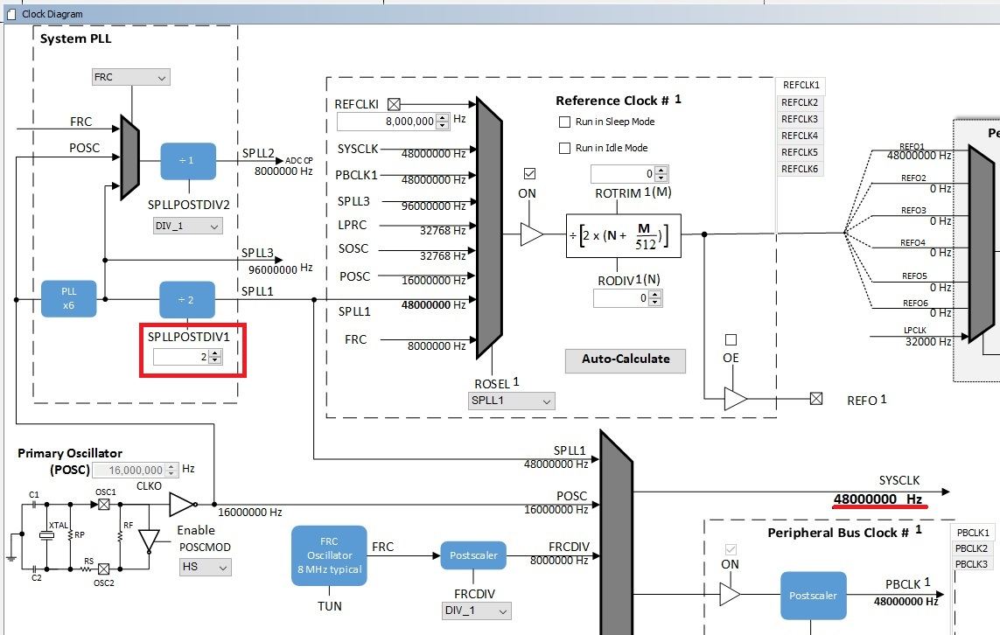
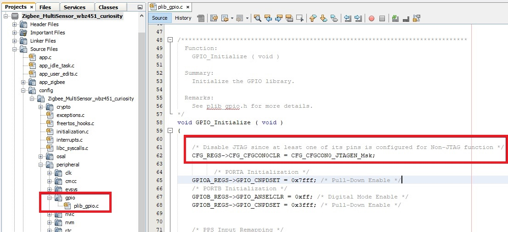
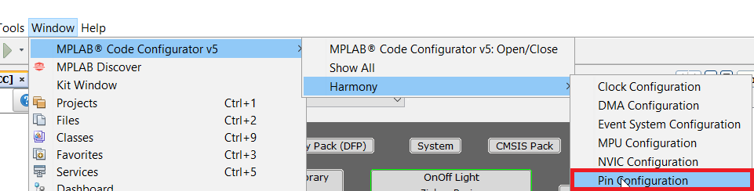

# ZigBee Low Power Configuration

---
Low power sleep mode functionality is mainly needed for zigbee end device type applications. Zigbee end device can enter sleep if there is no active data tx/reception. It can periodically wakeup and send the data poll request to its parent to see any data to be received from parent. Microchip Zigbee software framework allows low power functionalities on end device types only and is not applicable for Routers/co-ordinator.

During system sleep, clock (system PLL) will be disabled and system tick will be turned off. FreeRTOS timer needs to be compensated for the time spent in sleep. RTC timer which works in the sleep mode is used to accomplish this. The details of API's can be referred from [Low Power API](../docs/lowpower.md)

## # Low power Configuration

1.  For Zigbee applications, the System Sleep mode is automatically enabled when using the following device types - Multisensor, Intruder Alarm System and Color Scene controller as per the Zigbee End Device Spec.

	

2.  Upon adding specific end device type component for example multisensor as above picture in MCC tool, FreeRTOS related settings will be set automatically.
	- Tick Mode will be set to Tickless_Idle
	- Expected idle time before sleep will be set to 5 (ms)
	- Tick Hook will be enabled (For user to add any custom code needed to be executed within each tick interrupt)
	- RTC peripheral library will be added and configured
	

	**Note:** <i> RTC counter should not be reset (RTC_Timer32CounterSet()) arbitrarily when the system is running. </i>

3.  RTC clock source should be set manually, there are 4 options to choose from
	 - FRC (±1% offset)
	 - LPRC ( with larger offset, < ±5%)
	 - POSC  <- Candidate of the clock source (better clock accuracy)
	 - SOSC <- Candidate of the clock source (better clock accuracy)

	Users can select POSC or SOSC as the RTC clock source. In this example SOSC is configured as RTC clock source.

4.  In MPLABX Click "Window" -> "MPLAB Code Configurator" -> "Harmony" and select "Clock Configuration".

	

	 - Enable Secondary Oscillator (SOSC) by setting `SOSCEN` to `ON`

	 - Select `SOSC` as clock source for `VBKP_32KCSEL` and set `LPCLK_MOD` to `DIV_1_024` as shown in below below.

	 

	 - It is recommended to use 48MHz as SYS_CLOCK for better power savings. This can be configured by setting SPLLPOSTDIV1 to 2 as shown below.

	 

5. Ensure that JTAG Enable is disabled by clearing the JTAGEN bit in CFGCON0 (Configuration Control Register 0) as shown below.

     `CFG_REGS->CFG_CFGCON0CLR = CFG_CFGCON0_JTAGEN_Msk;`

	 **Note:** <i>This is done in `GPIO_Initialize()` as shown below.</i>

	 

6. In MPLABX Click "Window" -> "MPLAB Code Configurator" -> "Harmony" and select "Pin Configuration".

	

  - All Unused pins in the application needs to be set in input mode and the pulldown should be enabled for these pins. This can be configured through pin configuration in MCC as shown below.

     

7. Finally, open app_user_edits.c file. Comment out or remove the #error line. Update the freertos_hooks.c as mentioned in app_user_edits.c file

---
