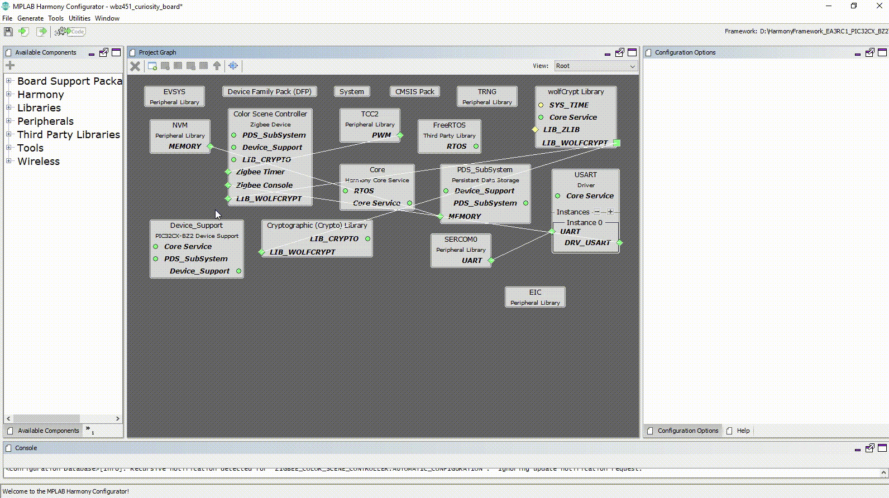

# Zigbee Applications Guide

##  Introduction

This is a generic document, which gives the user an overview of few key Zigbee 3.0 protocol concepts and guidance on implementing these features on PIC32CX-BZ using Microchip software. It shows how the protocol configurations(such as application, device types, clusters, commissioning) can be enabled/disabled, configured in a step by step manner, using Microchip's embedded software development framework tools (MHC GUI).

Harmony is a full-featured, production grade, embedded software development platform from Microchip. It provides a framework for creating zigbee devices running on PIC32CX-BZ family of device and modules.

##  Device Types and Clusters

 **Overview**
 

To allow interoperability among ZigBee products produced by various manufacturers, the
ZigBee Alliance has defined a set of standard device types. These device types
specify the functionality of a device.
This functionality is again dependent on independent functional entities, called clusters which is a container of attributes which can be read/written through command/responses defined by Zigbee Device Profile(ZDP). The alliance also provides a library, ZigBee Cluster Library (ZCL) is intended to act as a repository for cluster functionality. A developer constructing a new application should use the ZCL to find relevant cluster functionality that can be incorporated into the new application so as not to “re-invent the wheel”.

Zigbee Device reference application implements behavior of Zigbee Lighting and Occupancy (ZLO) devices and Green power device for operation on a Zigbee network.

#### Supported Device Types
The list of Application device types supported as part of this reference application are as follows:

 1. Combined Interface( Gateway / Coordinator)
 2. Light devices (OnOff  / Dimmable / Color / Extended Color / Temperature Color Light)
 3. Thermostat
 4. Color scene controller
 5. Multi Sensor
 6. Intruder Alarm System(IAS) - ACE
 7. Zigbee Green Power (Proxy, Sink) - An additional feature which is enabled on top of the above device types based on its capability

  **Explore** 
  
 For more details regarding Zigbee lighting and Occupancy device types, please refer to, Zigbee Lighting and Occupancy (ZLO) specification ->
 <a href=" https://zigbeealliance.org/wp-content/uploads/2019/11/docs-15-0014-05-0plo-Lighting-OccupancyDevice-Specification-V1.0.pdf" target="_top">Link to Zigbee Lighting and Occupancy (ZLO) device Specification by Zigbee Alliance</a>

#### Supported Clusters

The clusters in the ZigBee Cluster Library incorporate the concept of a client, who initiates the transaction, and the server, who performs the work. For example, a light switch (color scene controller device type, which implements on/off cluster in client role) initiates the transaction when someone taps the light switch. One or more lights (OnOff device type which implements on/off cluster in server role) complete the transaction by turning on or off and perhaps reporting the status change to some monitoring device(s) (combined interface device type which implements on/off cluster in client role).The table below shows the client/server clusters available for various device types in Microchip Zigbee stack.

|  S.No.  |  Device Type                     |  Server Clusters              |  Client Clusters          |
|---------|----------------------------------|-------------------------------|---------------------------|
| 1       |  Combined Interface              |  Basic                        |  Basic                    |
|         |                                  |  Identify                     |  Identify                 |
|         |                                  |  Groups                       |  Groups                   |
|         |                                  |  Time                         |  Scenes                   |
|         |                                  |  IAS ACE                      |  OnOff                    |
|         |                                  |  Level Control                |                           |
|         |                                  |  Color Control                |                           |
|         |                                  |  Alarms                       |                           |
|         |                                  |  Thermostat                   |                           |
|         |                                  |  FanControl                   |                           |
|         |                                  |  Occupancy Sensing            |                           |
|         |                                  |  Illuminance Measurement      |                           |
|         |                                  |  Temperature Measurement      |                           |
|         |                                  |  Thermostat UI                |                           |
|         |                                  |  IAS Zone                     |                           |
| 2       |  OnOff Light                     |  Basic                        |  Basic                    |
|         |                                  |  Identify                     |  Identify                 |
|         |                                  |  Groups                       |  Groups                   |
|         |                                  |  Scenes                       |                           |
|         |                                  |  OnOff                        |                           |
| 3       |  Dimmable Light                  |  Basic                        |  Basic                    |
|         |                                  |  Identify                     |  Identify                 |
|         |                                  |  Groups                       |  Groups                   |
|         |                                  |  Scenes                       |                           |
|         |                                  |  OnOff                        |                           |
|         |                                  |  Level Control                |                           |
| 4       |  Color Dimmable Light            |  Basic                        |  Basic                    |
|         |                                  |  Identify                     |  Identify                 |
|         |                                  |  Groups                       |  Groups                   |
|         |                                  |  Scenes                       |                           |
|         |                                  |  OnOff                        |                           |
|         |                                  |  Level Control                |                           |
|         |                                  |  Color Control                |                           |
| 5       |  Extended Color Light            |  Basic                        |  Basic                    |
|         |                                  |  Identify                     |  Identify                 |
|         |                                  |  Groups                       |  Groups                   |
|         |                                  |  Scenes                       |                           |
|         |                                  |  OnOff                        |                           |
|         |                                  |  Level Control                |                           |
|         |                                  |  Color Control                |                           |
| 6       |  Temperature Color Light         |  Basic                        |  Basic                    |
|         |                                  |  Identify                     |  Identify                 |
|         |                                  |  Groups                       |  Groups                   |
|         |                                  |  Scenes                       |                           |
|         |                                  |  OnOff                        |                           |
|         |                                  |  Level Control                |                           |
|         |                                  |  Color Control                |                           |
| 7       |  Thermostat                      |  Basic                        |  Basic                    |
|         |                                  |  Identify                     |  Identify                 |
|         |                                  |  Groups                       |  Groups                   |
|         |                                  |  Scenes                       |  Time                     |
|         |                                  |  Alarms                       |  Fan Control              |
|         |                                  |  Thermostat                   |  Occupancy Sensing        |
|         |                                  |  Fan Control                  |  Illuminance              |
|         |                                  |  Occupancy Sensing            |  Temperature Measurement  |
|         |                                  |  Temperature Measurement      |                           |
|         |                                  |  Thermostat UI Configuration  |                           |
| 8       |  Color Scene Controller          |  Basic                        |  Basic                    |
|         |                                  |  Identify                     |  Identify                 |
|         |                                  |  Groups                       |  Groups                   |
|         |                                  |  Scenes                       |                           |
|         |                                  |  OnOff                        |                           |
|         |                                  |  Level Control                |                           |
|         |                                  |  Color Control                |                           |
| 9       |  Multi Sensor                    |  Basic                        |  Basic                    |
|         |                                  |  Identify                     |  Identify                 |
|         |                                  |  Groups                       |  Groups                   |
|         |                                  |  Occupancy Sensing            |                           |
|         |                                  |  Illuminance Measurement      |                           |
|         |                                  |  Temperature Measurement      |                           |
|         |                                  |  Diagnostics                  |                           |
| 10      |  Intruder Alarm System(IAS) ACE  |  Basic                        |  Basic                    |
|         |                                  |  Identify                     |  Identify                 |
|         |                                  |  Groups                       |  Groups                   |
|         |                                  |  IAS Zones                    |  IAS ACE                  |

For more details regarding clusters, please refer to, the specification from Zigbee Alliance ->
<a href="https://zigbeealliance.org/wp-content/uploads/2019/12/07-5123-06-zigbee-cluster-library-specification.pdf" target="_top">Link to Zigbee Cluster Library Specification by Zigbee Alliance</a>
 

 **Explore** 
 
For more details regarding mandatory or optional clusters for specific device type, please refer to, the specification from Zigbee Alliance ->
<a href="https://zigbeealliance.org/wp-content/uploads/2019/11/docs-15-0014-05-0plo-Lighting-OccupancyDevice-Specification-V1.0.pdf" target="_top">Link to Zigbee Lighting and Occupancy Devices by Zigbee Alliance</a>
 
 

 **H3 Configuration**
 

Microchip H3 framework allows users to create applications for different supported device types. The GUI based configurator also allows user to select optional clusters as per their use case.

#### 1. Device Types :

Below device types example reference projects are readily available. Other supported device type project can be created by user from H3 framework.

- Below it can be observed that how the supported device types can be accessed using MPLABX Harmony 3 configurator tool :

 

- [Follow the step by step procedure to generate a zigbee based project of any support device type from MPLABX H3 framework](#tasks_1).

#### 2. Clusters:
How the available clusters can be accessed for a combined interface device type, using MPLABX Harmony 3 configurator tool is shown below. The optional clusters/attributes/commands as per zigbee device specification can be added/removed from the project through configuration as per custom use case.

## [Zigbee Network Security Models](./zigbee_security_model.md)

## [Zigbee Commissioning Procedure](./zigbee_commissioning.md)

## [Zigbee Green Power](./zigbee_greenpower.md)

## Reference Examples
 The list of Application device types supported as part of reference applications are as follows:

  1. **Combined Interface( Gateway / Coordinator)**
  2. Light devices (OnOff  / Dimmable / Color / **Extended Color** / Temperature Color Light)
  3. Thermostat
  4. Color scene controller
  5. Multi Sensor
  6. Intruder Alarm System(IAS) - ACE
  7. Zigbee Green Power (Proxy, Sink) - An additional feature which is enabled on top of the above device types based on its capability

##### - Sample projects: <a href="">Available for highlighted device types</a>

##### - Other device type projects: <a href="zigbee_project_generation.md"> Projects can be created from H3 framework by user by following very simple steps </a>

## Demo Steps
Detail demo steps of establishing zigbee network, zigbee commissioning and data exchange between zigbee devices are explained.

   - Light control and Monitoring using Combined Interface: <a href=""> Combined Interface and Extended Color light </a>

**Note:** Though the demo step takes 2 device types Combined interface and extended color light, the hardware setup, network formation, commissioning/joining procedures can be followed for other supported device types like Thermostat, IAS ACE, Multi sensor joining to combined interface network.   

##  [Serial Console Commands](./consoleCommands.md)

## Reference
[1] IEEE Std 802.15.4™-2006 Part 15.4: Wireless Medium Access Control (MAC) and Physical Layer (PHY) Specifications for Low-Rate Wireless Personal Area Networks (WPANs) 
[2] [https://zigbeealliance.org/ ](https://zigbeealliance.org/ )  
[3] [https://groups.zigbee.org/wg/progp-bg/document](https://groups.zigbee.org/wg/progp-bg/document)  
[4] [https://zigbeealliance.org/wp-content/uploads/2019/11/docs-15-0014-05-0plo-Lighting-OccupancyDevice-Specification-V1.0.pdf](https://zigbeealliance.org/wp-content/uploads/2019/11/docs-15-0014-05-0plo-Lighting-OccupancyDevice-Specification-V1.0.pdf)  
[5] [https://zigbeealliance.org/wp-content/uploads/2019/12/07-5123-06-zigbee-cluster-library-specification.pdf](https://zigbeealliance.org/wp-content/uploads/2019/12/07-5123-06-zigbee-cluster-library-specification.pdf)

---
