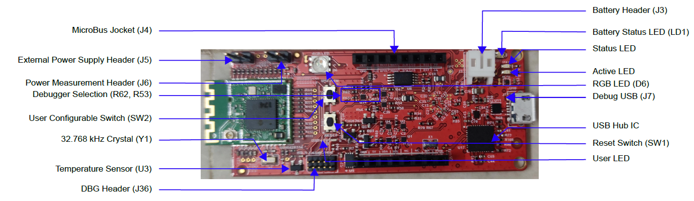
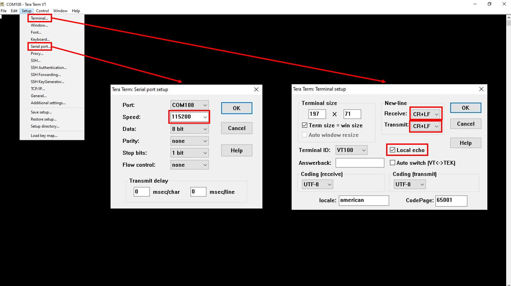
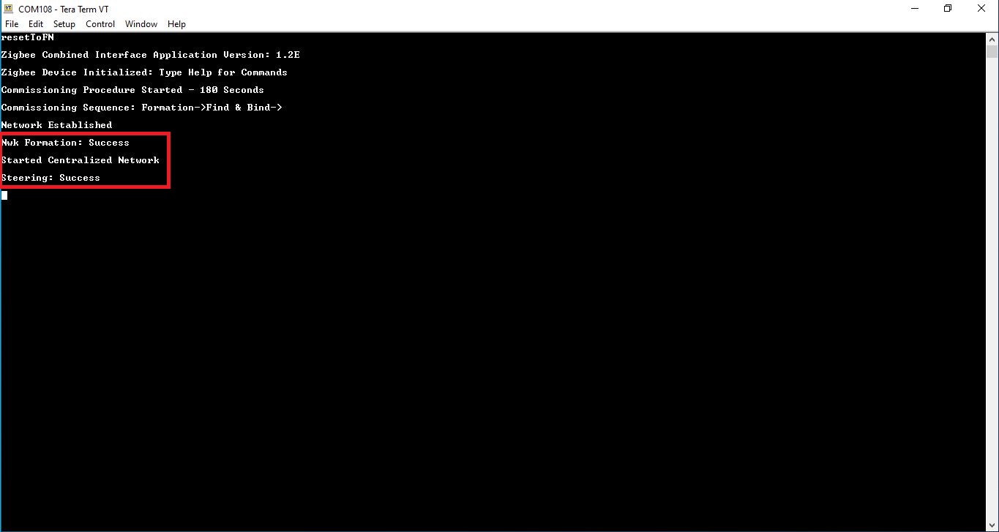

# WBZ451 Zigbee Application Demo: Light control and Monitoring using Combined Interface

> The hardware setup, network formation, commissioning/joining procedures are same for other supported device types like Thermostat, IAS ACE, Multi sensor joining to combined interface network.
---
### WBZ451 Curiosity Board

Devices (Device): \| **PIC32CX1012BZ25048(MCU) on WBZ451 module**  \|

Features : \| **PIC32CX1012BZ25048(MCU) on WBZ451 module**  \|

Devices (Used, On-Board): \| **RGB LED** \| **User Button**\| **UART-USB Converter**\|

## Introduction

This page describes the demo steps for Light control and Monitoring using Combined Interface on WBZ451 Curiosity boards.

An overview of the demo is shown below.

## Prerequisites :

+ ### Hardware Required

    |**Tool**                | **Qty**  |
    |------------------------| ---------|
    |PIC32 WBZ451 Curiosity Boards  | 2         |
    |Micro USB cable         | 2        |
    |Personal Computer     | 1        |

  #### Hardware Overview
  

  #### Hardware Block Diagram - Curiosity Board
  

+ ### Software - [TeraTerm](https://ttssh2.osdn.jp/index.html.en)

+ ### SDK Setup -   [SDK Setup](../docs/pic32cx_bz2_wbz45x_sdk_setup.md)

## Demo Description
The demo applications demonstrates the Zigbee protocol functionality of PIC32CXBZ family of devices and modules. It consists of a ZigBee 3.0 Coordinator and Router implemented as shown below :

|**Application**                | **Zigbee Logical Device Type**  | **Functionality**|
|------------------------| ---------|---------|
|Combined Interface | Coordinator        |      Device capable of controlling and monitoring other devices. It is typically a mains-powered device like a personal computer|
|Extended Lights        | Router        |             Is a lighting device that can be switched on/off , brightness & color of the light can be adjusted via the color commands.

#### Zigbee device commissioning:
- The Zigbee router i.e. Extended Lights can be commissioned and brought to the existing zigbee network formed by Zigbee coordinator i.e. Combined Interface or can create new zigbee Distributed network (if there is no nearby network).

#### Zigbee Light control:
- Extended light RGB LED can be controlled from Zigbee Gateway of the same network.
- When the light status is changed the light change report will be sent to zigbee gateway through Zigbee communication.

### Expected Demo Behavior
To run the demo , we need 2 devices . One is the Combined Interface and the other is extended color light.

1. One of the WBZ451 Curiosity board is programmed with Combined Interface, Zigbee only application which can act as Zigbee Gateway/Coordinator.
2. Another WBZ451 Curiosity board is programmed with Extended Lights application which can act as Zigbee Router.

Program the pre-compiled hex images [Programming the precompiled hex file using MPLABX IPE](#tasks) on curiosity boards to run the demo.

- If want to do changes in the demo code and would like to program/debug the customized code follow the instruction in [Build and Program The Application](#tasks_1)
- If want to generate an application for other Zigbee device types from scratch [Creating New Application Device Types](#tasks_3)

#### On-board Resource Usage
| **Sensor**         | **Peripheral Used**                   | **I/O Pin**   | **Comment**                                                                                     |
| ------------------ | ------------------------------------- | ------------- | ----------------------------------------------------------------------------------------------- |
| LED Control        | TC2 (WO0, WO1), TC3 (WO0) in PWM Mode | PB0, PB3, PB5 | RGB LED color control.                                                                          |
| Switch             | EXTINT0                               | PB4           | SW1 button in curiosity board to do Reset To Factory new                                         |

#### Demo Steps:

##### Hardware & Software Setup
1. Supply power to WBZ451 Curiosity Board consisting of Combined Interface application by connecting a USB cable. Power Supply (PS) Green LED will turn on when connect to PC.

  

2. The application activity is shown as "Console Log" through on board UART-USB converter
    - Open Terminal(eg: Tera Term) with the setup as shown below to look for these logs

    ``
        Receive, Transmit : Select CR+LF
    ``

    ``  
    Local Echo : Enabled (Input console commands are visible)
    ``

    ``
        UART baud settings: 115200 8-N-1 without flow control
    ``

  

##### Network Formation (Coordinator  - (Combined Interface))

3. Once the board is powered on and serial terminal setup is done, the board is ready to be operated as a coordinator. It is responsible for initially forming the network and then, via the Trust Centre functionality, managing which other devices are allowed to join the network and distributing
security keys to those that are allowed to join.

  * Input command : *resetToFN* and look for the below logs for successful zigbee network formation on CI. It will open up the network for other zigbee devices to join for first 180 seconds from the first powerON. The process to join a device after the timeout is explained in Step 4 Case 2.

    

     
    

  * The commissioning procedure will last for 180 seconds, in case no devices are there in vicinity we will observe the logs as shown below :

    

     
    

    We will discuss about the case, when devices are vicinity in the next steps.

##### Commissioning (Router - Extended Light)
4. The Extended Lights can be connected to any zigbee gateway. It could be either Amazon Echo Plus or another Combined interface running on WBZ451 Curiosity Board. Here, we will discuss about the steps followed for WBZ451 based combined interface acting as a Zigbee gateway.

 - Supply power to another WBZ451 Curiosity Board by connecting a USB cable. Power Supply (PS) Green LED will turn on when connect to PC.
 - Follow step 2 for UART terminal Setup

  - _Case1_ : In step 3 we have observed that CI has opened the network and waiting for devices to join within a finite duration of 180 seconds , if Lights is powered on within the time-frame it joins the network. Throughout  the commissioning procedure for the Extended Lights it is observed that RGB led is toggling (white color) i.e. for 180 seconds

  - _Case2_ : If commissioning of extended light is initiated after this 180sec, light will not get joined. To open up the network after 180 seconds, we have to input the below commands in CI, before commissioning is initiated in extended lights device.

    1. *setPermitJoin 180*  -> This command opens up the network for next 180sec
    2. *invokeCommissioning 8 0*  -> This command opens up the network for "finding and binding procedure"

      

            
      

  - _Success logs_  : When extended light commissioned with Combined Interface

    

     
    

##### Light Control

5. RGB LED on WBZ451 curiosity board is tied with Zigbee functionality. The LED color and brightness can be changed through Zigbee network .

  * RGB color control from Combined Interface

    - The RGB color can be controlled from Combined Interface through console commands.
    - RGB color is changed from Combined Interface, will be reflected  in next received report in combined Interface
    - The network address of the light is needed to send light control commands to light.

       1. This network address can be got from Combined interface console log while commissioning was done. Refer to Step 5 success log for light network address

       

             
       

       2. Another way to get the network address from light is executing the below command in light side.

        ``   
           Command: getNetworkAddress
           Response: f088
        ``

    - The table below shows few commands for light control(on /off, brightness, hue & saturation). Refer to doc [ Console Commands](consoleCommands.md) to get different parameters of the commands

        |Command Type|Commands|Paramter Details|
        |----|-----|-------|
        |RGB LED ON | onOff 0x0 0xf088 0x23 -on | 0x23 zigbee end-point number used for Light|
        |RGB LED OFF| onOff 0x0 0xf088 0x23 -off | 0x23 zigbee end-point number used for Light |
        RGB LED brightness change| moveToLevel 0x0 0xf088 0x23 0x45 0x0 0x1 0x0 0x0 | 0x45 is the configurable brightness value
        RGB LED color change|  moveToHueAndSaturation 0x0 0xf088 0x23 0x45 0x67 0x0 0x0 0x0 | 0x45 and 0x67 are the configurable Hue and Saturation values

##### Other Functionalities

6. On board button actions:
    - When the on board "User Button" is pressed for more than 10sec, it can delete all the networking information and will bring the device to factory default state. This functionality is available in both combined interface and light devices.

7. Persistent Data Storage (PDS):
 The RGB light status (On/Off) and brightness values are stored in NVM. So, power off/on of extended light, these values persist and RGB LED will reflect accordingly. This PDS storage is tied to zigbee network.
    -  The light On/Off status and light brightness is being stored in non-volatile memory in this case. So, power off/on, the LED will be updated with light on/off and brightness values retrieved from previous transaction, whereas color values remain default HS = 0x00,0x7F

---

## Programming the precompiled hex file using MPLABX IPE

1.  Precompiled Hex files for combined interface and Extended light are located <a href="zigbee_combined_interface/precompiled_hex/"> Combined Interface </a> , <a href="zigbee_lights/precompiled_hex/"> Extended Light </a>

2.  Follow the steps mentioned [here](https://microchipdeveloper.com/ipe:programming-device)

 **Caution:** Users should choose the correct Device and Tool information

3. Follow the steps for [running the demo](#tasks_2)

---

## Build and Program The Application

The source code of demo applications are available in Harmony 3 framework <a href="zigbee_combined_interface/firmware"> Combined Interface </a>, <a href="zigbee_lights/firmware"> Extended Light </a> . If want to do changes in the demo code and would like to program/debug the customized code follow the below instruction.

1. Open the "zigbee_lights/firmware/zigbee_ExtendedLight.X" MPLABX project from MPLABX

  
  ---->
    

2. Do your changes in the code. Clean and build your application by clicking on the Clean and Build button as shown below.

  

3. Program your application to the device, by clicking on the Make and Program button as shown below

  

---

## Creating Application Device Types From Scratch Using Harmony 3

The other supported device types in Microchip H3 framework  based on Zigbee Lighting and Occupancy (ZLO) devices and Green power device:

1. Thermostat
2. Color scene controller
3. Multi Sensor
4. Intruder Alarm System(IAS) - ACE
5. Zigbee Green Power - An additional feature which is enabled on top of the above deice types based on its capability.

Creating a project for a device type: [Generating project from H3](zigbee_project_generation.md)

---
