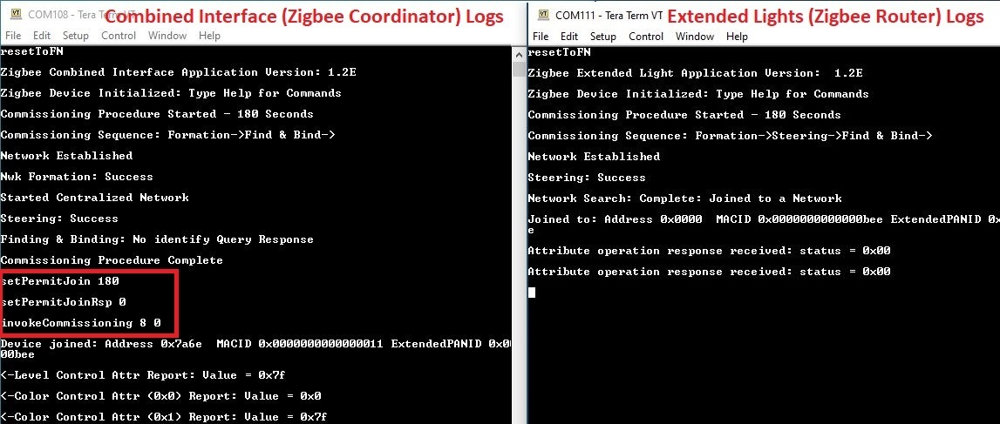

# Zigbee Application Demo: Zigbee Network Formation using Combined Interface

---
## WBZ451 Curiosity Board

Devices (Device): \| **PIC32CX1012BZ25048(MCU) on WBZ451 module**  \|

Peripherals (Used, On-Board): \| **User Button**\| **UART-USB Converter**\|

## Introduction

This page describes the zigbee network formation in Combined Interface on WBZ451 Curiosity boards. In zigbee centralized network, the network is formed by zigbee co-ordinator. Other routers and end-devices can enter into the network once it is formed. The demo steps explained here can be followed for any devices like light, thermostat, etc to bring into the CI formed network.

## Prerequisites :

+ ### Hardware Required

    |**Tool**                | **Qty**  |
    |------------------------| ---------|
    |WBZ451 Curiosity Boards  | 1         |
    |Micro USB cable         | 1        |
    |Personal Computer     | 1        |

+ ### SDK Setup -   [SDK Setup](../../docs/pic32cx_bz2_wbz45x_sdk_setup.md)

+ ### Terminal Software - [TeraTerm](https://ttssh2.osdn.jp/index.html.en)

## Demo Description

|**Application**                | **Zigbee Logical Device Type**  | **Functionality**|
|------------------------| ---------|---------|
|Combined Interface | Coordinator        |      Device capable of controlling and monitoring other devices. It is typically a mains-powered device like a personal computer|

WBZ451 Curiosity board is programmed with Combined Interface which can act as Zigbee Gateway/Coordinator.

Program the pre-compiled hex image [Programming the precompiled hex file using MPLABX IPE](#tasks) on curiosity boards to run the demo.

- If want to do changes in the demo code and would like to program/debug the customized code follow the instruction in [Build and Program The Application](#tasks_1)
- If want to generate an application from scratch refer: [Creating New Application Device Types](#tasks_3)

### On-board Resource Usage
| **Sensor**         | **Peripheral Used**                   | **I/O Pin**   | **Comment**                                                                                     |
| ------------------ | ------------------------------------- | ------------- | ----------------------------------------------------------------------------------------------                                                                          |
| Switch             | EXTINT0                               | PB4           | SW1 button in curiosity board to do Reset To Factory new                                         |

## Demo Steps: Network Formation in CI

### # Hardware & Software Setup
1. Supply power to WBZ451 Curiosity Board consisting of Combined Interface application by connecting a USB cable. Power Supply (PS) Green LED will turn on when connect to PC.

     

2. The application activity is shown as "Console Log" through on board UART-USB converter
    - Open Terminal(eg: Tera Term) with the setup as shown below to look for these logs

    On the PC side virtual COM port connection that corresponds to the board shall have following settings:

    - BAUD RATE: 115200 (as configured in SERCOM configuration)
    - PARITY: None
    - DATA BITS: 8
    - STOP BITS: 1
    - FLOW CONTROL: None

    Additionally, local echo and sending line ends with line feeds shall be enabled in the PC serial terminal application.

     

### # Network Formation (Coordinator  - (Combined Interface))

3. Once the board is powered on and serial terminal setup is done, the board is ready to be operated as a coordinator. It is responsible for initially forming the network and then, via the Trust Centre functionality, managing which other devices are allowed to join the network and distributing security keys to those that are allowed to join.

  * Input command : *resetToFN* and look for the below logs for successful zigbee network formation on CI. It will open up the network for other zigbee devices to join for first 180 seconds from the first powerON.

  * _Case1_: If a near by device is trying to join a network, and sees CI then will join the network as shown in below log.

  

  * _Case2_: The commissioning procedure will last for 180 seconds. In case no other devices are there in vicinity and at the end of 180 seconds the below log is observed :

  

  * _Case3_ : To open up the network after 180 seconds to allow other devices to join, we have to input the below commands in CI, before commissioning is initiated in another device.

    1. *setPermitJoin 180*  -> This command opens up the network for next 180sec
    2. *invokeCommissioning 8 0*  -> This command opens up the network for "finding and binding procedure"

  

  * _Success logs_ :  When another device for example extended light successfully commissioned with Combined Interface, below log will be seen.

  

### # Other Functionalities

4. On board button actions:
    - When the on board "User Button" is pressed for more than 10sec, it can delete all the networking information and will bring the device to factory default state.

---

## Programming the precompiled hex file using MPLABX IPE

1.  Precompiled Hex files for combined interface is located <a href="precompiled_hex/"> Combined Interface </a>

2.  Follow the steps mentioned [here](https://microchipdeveloper.com/ipe:programming-device)

 **Caution:** Users should choose the correct Device and Tool information

3. Follow the steps for [running the demo](#tasks_2)

---

## Build and Program The Application

The source code of demo application is available here <a href="firmware"> Combined Interface </a>. If want to do changes in the demo code and would like to program/debug the customized code follow the below instruction.

1. Open the firmware/zigbee_CombinedInterface.X" MPLABX project from MPLABX

  

  

2. Do your changes in the code. Clean and build your application by clicking on the Clean and Build button as shown below.
  

3. Program your application to the device, by clicking on the Make and Program button as shown below
  

---

## Creating Application Device Types From Scratch Using MCC

All the supported device types including this CI projects can be generated by following the steps in <a href="../zigbee_project_generation.md"> Generating project from MCC

---
