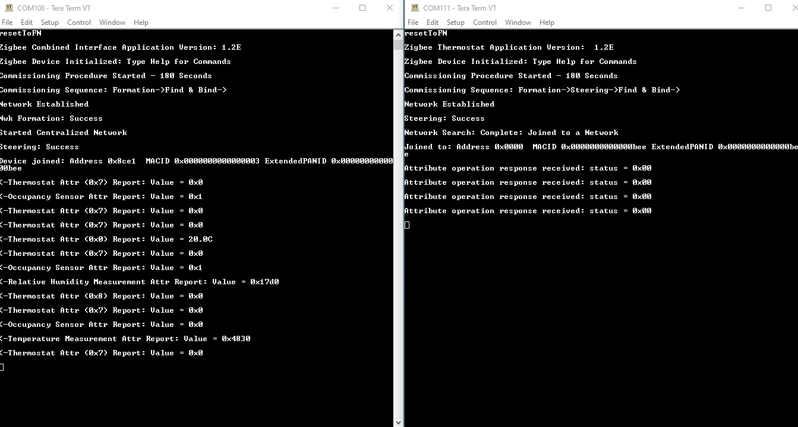

# Zigbee Commissioning Procedure

---

Commissioning is the process of initializing the devices to join a network and to work together.
The Zigbee Base Device Behaviour specification specifies the procedures for the following commissioning mechanisms which are executed in the order as given given below :

<a href="https://zigbeealliance.org/developer_resources/zigbee-base-device-behavior-bdb-v1-0/" target="_top">Link to Base Device Behaviour Specification by Zigbee Alliance</a>

|  Sequence  |  Commissioning Aspect  |  Details                                                                                                                                                                                                                                                                                                                                                  |
|------------|------------------------|-----------------------------------------------------------------------------------------------------------------------------------------------------------------------------------------------------------------------------------------------------------------------------------------------------------------------------------------------------------|
| 1          |  Touchlink             | 
 A node may support the proximity based commissioning mechanism. If touchlink commissioning is supported, the node shall support touchlink as an initiator, a target or both.
             
 <b>-  Initiator </b>--> Will be a member of an existing network or (if not) will create a new network
             
 <b> -  Target </b>--> Gets added to network by Initiator
  |
| 2          |  Network Steering      |  
All nodes shall support network steering.
             
  <b>-  Node not on a network</b>  -> Action of searching for and joining an open network. 
            
 <b> -  Node on a network</b>  -> It is the action of opening the network to allow new nodes to join 
                                                                                                     |
| 3          |  Network Formation     |  
The ability of a node to form a network with its network security model. It shall be dependent on the logical device type of the node.
               
 <b>-  Zigbee coordinator </b>  --> Forms a Centralized security networks
   
 <b>- Zigbee router </b> --> Forms a Distributed security network                                                           |
| 4          |  Finding & Binding     | 
 <b> Initiator Endpoint </b> -> Automatically searches and establishes application connections with target endpoint, by using the identify cluster with matching cluster 
 
- <b> Target Endpoint </b> -> Handles finding and binding requests from initiator endpoint  
                                                                                                                                                                                                                                                                                                                                                   |

 Here, Touchlink, Steering and Formation decides zigbee network joining procedure. Finding & binding is not related to joining procedure, but involves application level connections for cluster data transaction, to be done in any joining procedure.

 Default Mapping of Commissioning to zigbee device types :

 

 This is configurable from MPLAB Code Configurator (MCC) while generating the project:

 The commissioning procedure can be automatically started when the device is first powered on, based on the 4 Commissioning Aspects (Touchlink, steering, formation, finding & binding) chosen in above MPLAB Code Configurator (MCC). This is referred as auto commissioning.

 The application can also choose invoking this commisioning procedure manually through user input. In Microchip zigbee reference applications this is demonstrated through sending console commands through UART. This way of commissioning is referred as manual commissioning.

## 1. Auto Commissioning
Auto-commissioning/commissioning on startup is the easiest way of commissioning, which involves automatic commissioning of devices.
It allows for minimal (or no) human intervention, since most of the startup parameters are pre-configured .The flowchart for the commissioning mode based on 4 commissioning aspect flags in Zigbee Application is described below :

  

  This type of commissioning can be enabled by user, using the MPLAB Code Configurator (MCC) as shown below :

  

Below is the example of auto commissioning procedure between Combined Interface and Thermostat applications.
1. After Combined Interface application is programmed on the device, automatically device starts the commissioning procedure and creates the network.

  **Note:** <i>"resetToFN" console command is used to bring the device to factory default state and reset the device. This step is needed only if the UART terminal is not setup before the device gets power on first and if logs are missed in terminal.</i>

2. Program another device with Thermostat application.
3. After that the device joins , the joiner(Thermostat) starts reporting attribute data back to the Combined Interface device. Here there is no user input needed to initiate the commissioning.
It can be observed below in the console logs :

  

## 2. Manual Commissioning ( when uart is enabled)

Manual mode of commissioning is configured using the following MPLAB Code Configurator (MCC) :

To trigger the commissioning procedures manually, the user has to issue the following console commands as given below:

  <b>1. Touchlink</b> – “invokeCommissioning 1 0” (The device starts touchlink as an initiator)
  

  <b>2. Network Steering</b> – “invokeCommissioning 2 0” (the device start to search for a network to join. If device is already part of the network, it will open the network for other devices to join)
  

  <b>3. Network Formation</b> – “invokeCommissioning 4 0” (the device if it is a router or a coordinator, forms the network)
  

  <b>4. Finding & Binding</b>
     - “invokeCommissioning 8 0” (this command shall be given for any the devices which needs to be bound for clusters)
     - SetFBRole 1 (this command to be given on application endpoint acts as initiator which initiates the binding procedure by sending identify query request)
     - SetFBRole 0 (this command to be given on application endpoint acts as target)     

**Note:** <i> Permit Join flag is enabled for 180 secs after forming a network and opens up the network for a finite duration to allow other nodes to join. To allow the joining even after 180 secs, give "setPermitJoin 180" or “invokeCommissioning 2 0” command from the console. The above mentioned note holds good for both Commissioning on Startup (auto) and manual commissioning procedure </i>

The below table shows the list of manual commissioning command sequences to be followed between 2 joining devices.

|  S.No.  |  Coordinator         |  Router/End device  |  Commands |
|---------|----------------------|---------------------|-------------------------------------------------------------------------------------------------------------------------------------------------------------------------------------------------------------------------------------------------------------------------------------------------------------------------------------------------------------------------------------------------------------------------------------------------------------------------------------------------------------------------------------------------------------------------------------------------------------------------------------------------------------------------------------------------------------------------------------------------------------------------------------------------------------------------------------------------------------------------------------------------------------------------------------------------------------------------------------------------------------------------------------------------------------------------------------------------------------------------------------------------------------------------------------------------------------------------------------------------------------------------------------------------------------------------------------------------------------|
| 1       |  Combined interface  |  Thermostat         |  
1. Combined Interface and Thermostat - resetToFN
             
2.Combined Interface - invokeCommissioning 4 0
             
3. Combined Interface - invokeCommissioning 2 0
             
4. Thermostat - invokeCommissioning 2 0 (After this Thermostat joins Combined Interface)
            
 5. Combined Interface - SetFBRole 0
            
 6. Thermostat - SetFBRole 1             
7. Combined Interface - invokeCommissioning 8 0
             
8. Thermostat - invokeCommissioning 8 0
              
9. Thermostat Device will start reporting periodically. 
  |
| 2       |  Combined interface  |  Multi Sensor       |  
1. Combined Interface and Multi Sensor - resetToFN
             
2. Combined Interface - invokeCommissioning 4 0 
            
3. Combined Interface - invokeCommissioning 2 0
             
4. Multi Sensor - invokeCommissioning 2 0 (After this Multi Sensor joins Combined Interface) 
            
5. Combined Interface - SetFBRole 0
             
6. Combined Interface - invokeCommissioning 8 0
             
7. Multi Sensor - setSrcSensorType -ls  
           
8. Multi Sensor - SetFBRole 1
             
9. Multi Sensor - invokeCommissioning 8 0 (After this Light Sensor Finding and Binding happens) 
            
10. Multi Sensor - setSrcSensorType -os 
            
11. Multi Sensor - SetFBRole 1
             
12. Multi Sensor - invokeCommissioning 8 0 (After this Illuminance Measurement Finding and Binding happens)
             
13. Multi Sensor - setSrcSensorType -ts
             
14. Multi Sensor - SetFBRole 1
             
15. Multi Sensor - invokeCommissioning 8 0 (After this Temperature Measurement Finding and Binding happens)
             
16. Multi Sensor - setSrcSensorType -hs 
            
17. Multi Sensor - SetFBRole 1
             
18. Multi Sensor - invokeCommissioning 8 0 (After this Relative Humidity Measurement Finding and Binding happens)
             
19. Multi Sensor Device will start reporting periodically
  |
| 3       |  Combined interface  |  Lights             |  
1. Combined Interface and Light - resetToFN
            
2. Combined Interface - invokeCommissioning 4 0 
           
3. Combined Interface - invokeCommissioning 2 0
            
4. Light - invokeCommissioning 2 0 (After this Light joins Combined Interface)
           
 5. Combined Interface - SetFBRole 0
            
6. Light - SetFBRole 1
            
7. Combined Interface - invokeCommissioning 8 0 
           
8. Light - invokeCommissioning 8 0 (After this all the Finding and Binding happens)
            
9. Light Device will start reporting peridically
 |

**Note:** <i> invokeCommissioning 8 0 has to be executed first on target device then on initiator device. **SetFBRole 0** sets device as Target, **SetFBRole 1** sets the device as Initiator. A single device can act as initiator and/or target </i>

**Combined interface and Thermostat :**

 

**Combined interface and Multi-sensor :**

 

**Combined interface and Extended Lights :**

  

## 3. Touchlink Commissioning

The zigbee protocol provides special commissioning called Touchlink , which is an easy-to-use proximity mechanism for commisioning a device to a network. This method works by the Touchlink 'initiator' determining the proximity of the target device (to be commissioned) and negotiating/transferring network parameters. Touchlink commissioning can be used to form a new network and/or join a node to an existing network. Touchlink is initiated on a node called the ‘initiator’. Touchlink is provided as a cluster in the ZigBee Cluster Library (ZCL). The initiator must support the Touchlink cluster as a client and the target node must support the cluster as a server. If it is required on a node, Touchlink commissioning must be enabled via the ZigBee Base Device attribute bdbCommissioningMode.

**Wireshark Sniffer logs**

Let us look into an example. Here a ColorSceneController which is an end device type will bring the light into the network and by asking light to form the distributed network via Touchlink. For touchlink, a color scene controller shall be brought close to a target( Light) device around like 20-30cms range. It can be done in the following 2 ways :

**(a). Auto-commissioning :**
In order to establish touchlink via auto-commissioning , each of the application e.g. extended lights and color scene controller, MPLAB Code Configuration (MCC) has to be updated as shown below :

During auto commissioning mode , the device would perform touchlink by default. To initiate the process, input <i>"resetToFN"</i> console command on the light device first followed by the color scene controller. After that the device joins via touchlink, the Light device starts reporting attribute data back to the ColorSceneController device. It can be observed below in :

 **Console Logs**

**(b). Manual commisioning  :**
In order to establish touchlink commissioning manually, each of the application e.g. extended lights and  color scene controller, MPLAB Code Configurator (MCC) has to be updated as shown below :

During manual commissioning mode , we need to issue console commands on the color scene controller device to perform touchlink. In order to initiate the process, input resetToFN console comand on the light device first followed by the color scene controller. Follow the below sequence of commands

1. Light and CSC - resetToFN
2. CSC - invokeCommissioning 1 0   (Touchlink commisioning, wait for touchlinking to be completed)
3. CSC - SetFBRole 0
4. Light - SetFBRole 1
5. CSC - invokeCommissioning 8 0
6. Light - invokeCommissioning 8 0             
7. Light Device will start reporting periodically.

 **Console Logs**
  

 For more details regarding the commisioning procedures, please refer to, the Commisioning section(8) of the base device behaviour specification from Zigbee Alliance ->
 <a href="https://zigbeealliance.org/developer_resources/zigbee-base-device-behavior-bdb-v1-0/" target="_top">Link to Base Device Behaviour Specification by Zigbee Alliance</a>

---
