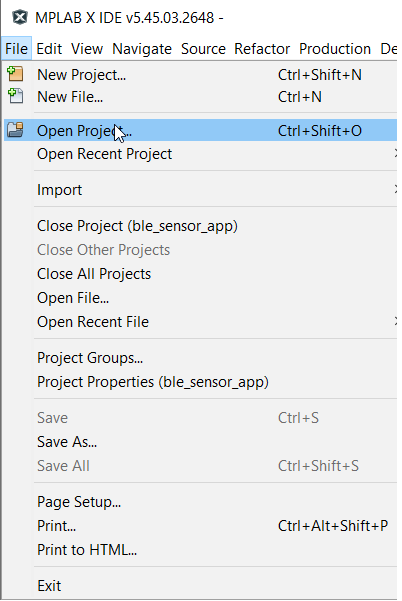

# Zigbee Application Demo: Multi-Sensor with Low Power Functionality

---
## WBZ451 Curiosity Board

Devices (Device): \| **PIC32CX1012BZ25048(MCU) on WBZ451 module**  \|

Peripherals (Used, On-Board): \| **UART-USB Converter**\|

## Introduction
This tutorial will help users to create a low power enabled multi sensor application

## Prerequisites :

+ ### Hardware Required

    |**Tool**                | **Qty**  |
    |------------------------| ---------|
    |WBZ451 Curiosity Boards  | 2         |
    |Micro USB cable         | 2        |
    |Personal Computer     | 1        |

+ ### SDK Setup -   [SDK Setup](../../docs/pic32cx_bz2_wbz45x_sdk_setup.md)

+ ### Terminal Software - [TeraTerm](https://ttssh2.osdn.jp/index.html.en)

## Demo Description

This application demonstrate the Zigbee Multi-Sensor end device joining to Zigbee Coordinator (Combined Interface or third-party gateway's such as Amazon Echo plus can also be used instead of CI.) After joining, multisensor device will start ZCL attribute reporting of sensor data such as temperature, occupancy, light, and humidity after connecting to the network.

|**Application**                | **Zigbee Logical Device Type**  | **Functionality**|
|------------------------| ---------|---------|
|Combined Interface | Coordinator        |      Device capable of controlling and monitoring other devices. It is typically a mains-powered device like a personal computer|
|Multi-Sensor        | End Device        |             Reports sensor data such as temperature, occupancy, light, and humidity periodically to gateway

To run the demo , we need 2 devices. One is the Combined Interface and the other is multi sensor.

1. One of the WBZ451 Curiosity board is programmed with Combined Interface which can act as Zigbee Gateway/Coordinator. Program the CI pre-compiled hex image by following [steps](../zigbee_combined_interface/readme.md) on one curiosity board.
2. Another WBZ451 Curiosity board is programmed with Multi sensor application which can act as Zigbee end device. Program the pre-compiled hex image by following [Programming the precompiled hex file using MPLABX IPE](#tasks) on another curiosity board.

- If want to do changes in the demo code and would like to program/debug the customized code follow the instruction in [Build and Program The Application](#tasks_1)
- If want to generate an application from scratch refer: [Creating New Application Device Types](#tasks_3). The steps for adding low power functionality is also explained here.

## Demo Steps: Commissioning

The Zigbee Multi-Sensor can be connected to any zigbee network.
- The steps explained in [Joining Multi-Sensor with Amazon Echo](#tasks_4) can be followed to connect Zigbee Multi-Sensor to Amazon Echo, if Amazon Echo has Built-in Zigbee smart home hub.
- The steps explained in [Joining Multi-Sensor with WBZ451 Combined Interface (CI) Coordinator](#tasks_5) can be followed to connect with WBZ451 based combined interface which acts as Zigbee Coordinator.

### Joining Multi-Sensor with Amazon Echo

1. Multi-Sensor can be added to Alexa's Zigbee network by voice commands or by using Alexa mobile app
	- **Voice Commands:** Open Alexa to discover the Multi-Sensor device. Say “Discover my devices”. or
	- **Alexa App:**
	1. Launch Alexa app, from the menu, select the Add Device.
	2. Select the type of smart home device “Motion Sensor” and select other.
	3. Initiate Discover Devices
	4. Power on the Multi-Sensor device. The Multi-Sensor will be discovered and shown as motion sensor in Alexa app as shown below.

	

	**Note:** Echo Plus is in discovery mode for 45 secs. Devices wanting to join Echo Plus should initiate joining/connecting procedure within this time limit for a successful join

### Joining Multi-Sensor with WBZ451 Combined Interface (CI) Coordinator

#### # Hardware & Software Setup
1. Supply power to WBZ451 Curiosity Board consisting of Combined Interface application by connecting a USB cable. Power Supply (PS) Green LED will turn on when connect to PC.

	

2. The application activity is shown as "Console Log" through on board UART-USB converter
    - Open Terminal(eg: Tera Term) with the setup as shown below to look for these logs

    On the PC side virtual COM port connection that corresponds to the board shall have following settings:

    - BAUD RATE: 115200 (as configured in SERCOM configuration)
    - PARITY: None
    - DATA BITS: 8
    - STOP BITS: 1
    - FLOW CONTROL: None

    Additionally, local echo and sending line ends with line feeds shall be enabled in the PC serial terminal application.

     

#### # Network Formation (Coordinator  - (Combined Interface))

3. Follow the steps either _case1_ or _case2_ explained in [Network Formation (Coordinator  - (Combined Interface))](../zigbee_combined_interface/readme.md) to open up the network in CI.

#### # Commissioning (End Device - Multi-Sensor)
4. Supply power to WBZ451 Curiosity Board which is programmed with Multi-Sensor image by connecting a USB cable. The Multi-Sensor will search for Zigbee coordinator device and will join to network and intiate Finding & Binding.
5. Once Multi-Sensor finishes Finding & Binding procedure, it will start attribute reporting. The Combined interface terminal log will print the received attribute information as shown below.
	

## Programming the precompiled hex file using MPLABX IPE

1.  Precompiled Hex file Extended light is located <a href="precompiled_hex/"> Multi Senso </a>

2.  Follow the steps mentioned [here](https://microchipdeveloper.com/ipe:programming-device)

 **Caution:** Users should choose the correct Device and Tool information

3. Follow the steps for [running the demo](#tasks_2)

---

## Build and Program The Application

The source code of demo application is available here <a href="firmware"> Multi Sensor </a> . The source code implements the low power application as well and the configuration details are explained [here](#tasks_6) for reference. If want to do changes in the demo code and would like to program/debug the customized code follow the below instruction.

1. Open the "firmware/Zigbee_MultiSensor_wbz451_curiosity.X" MPLABX project from MPLABX

  

  

    

2. Do your changes in the code. Clean and build your application by clicking on the Clean and Build button as shown below.
	  

3. Program your application to the device, by clicking on the Make and Program button as shown below
	  

---

## Creating Application Device Types From Scratch Using MCC

1. All the supported device types including this Multi Sensor projects can be generated by following the steps in <a href="../zigbee_project_generation.md"> Generating project from MCC </a>

2. Multi sensor is zigbee end device type. So, the low power sleep functionality can be enabled for this application. Follow the steps in <a href="../low_power_configuration.md"> low power configuration doc </a>

3. Compile and Run the project in WBZ45x device.
---
