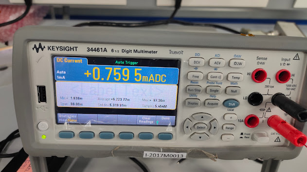
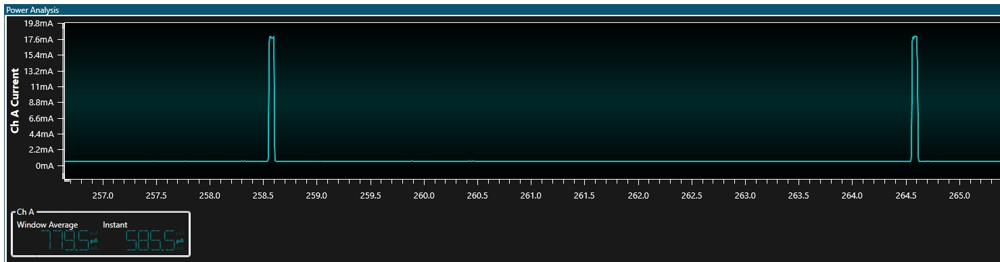

# PIC32CX-BZ/WBZ451 Zigbee Multi-Sensor Device (Low power)
____

## Release v0.1.0.1 (02/02/2022)

### New Features
- Example converted to MCC based project

### Bug fixes
- None

### Known Issues
- When the device goes through a power reset after commisioning, the sleep current consumption increases by 250uA (approx)

## Release v0.1.0.0

### New Features
- The average current consumption observed during the sleep time is 760uA approximately. The measuring setup is shown below.
  

- The instantaneous current consumed during sleep time is observed to be 585uA (approx)
  

### Bug fixes
- None

### Known Issues
- When the device goes through a power reset after commisioning, the sleep current consumption increases by 250uA (approx)

### Development Tools
- [MPLAB X v5.50]((https://www.microchip.com/en-us/development-tools-tools-and-software/mplab-xc-compilers))
- [MPLAB® XC32 C/C++ Compiler v3.01](https://www.microchip.com/en-us/development-tools-tools-and-software/mplab-xc-compilers#tabs)
- Device Pack: PIC32CX-BZ_DFP (1.0.80)
