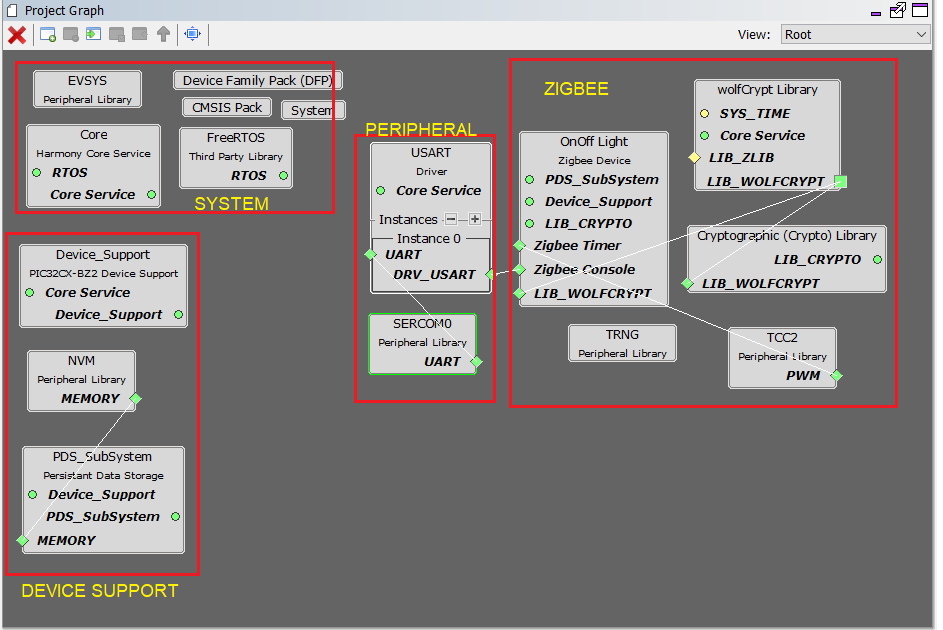
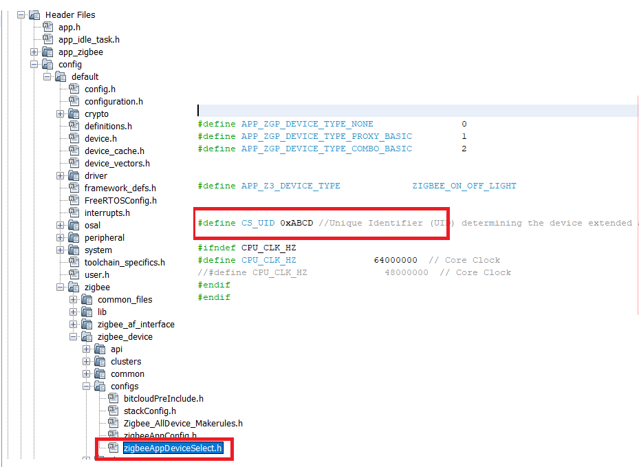
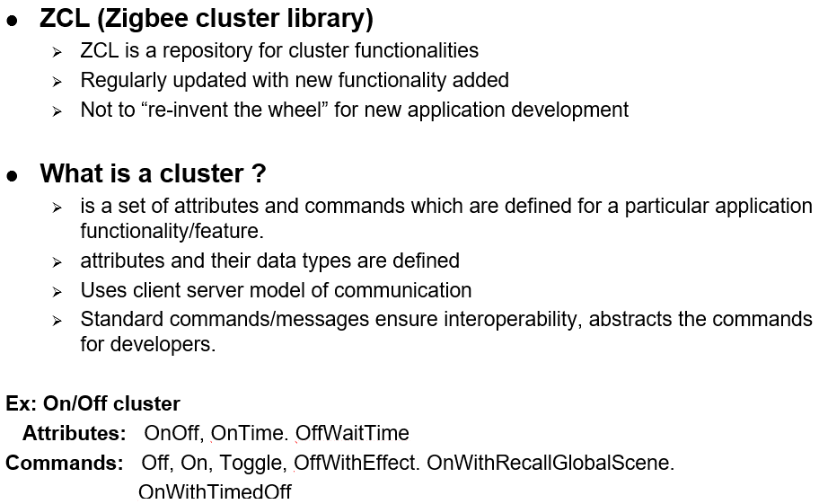
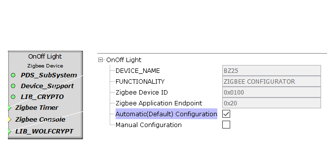

#  Zigbee Application Project Generation

There are different zigbee device types supported in Microchip Zigbee framework. Few sample application projects are available as reference <a href="../zigbee/"> here </a>. The projects for other device types can be generated by following the step by step procedure in this document.

## SDK Setup

<a href="../docs/pic32cx_bz2_wbz45x_sdk_setup.md"> SDK Setup </a>

## Generating Intended Device Type Project using Harmony 3

## Pull-in H3 Components

1.  Create a new MPLAB Harmony 3 Project -- <a href="../docs/creating_new_mplabx_harmony_project.md"> link </a> for instructions

2.  Drag and Drop the Intended Zigbee Device Type component from "Available" components to Project Graph
    - "OnOffLight" Device component is shown for example

    "Accept Dependencies or satisfiers, select "Yes""

    

      

3.  Add UART components needed for console logs and commands (optional)

    

4.  Verify if the Project Graph window has all the expected Harmony 3
    configuration

    

---
## Generate Code <a href="../docs/generate_code.md"> link </a> for instructions

---

## Files and Routines Automatically generated by the MHC

After generating the code from MHC interface by clicking Generate Code, below is the project folder structure.

  

1. Zigbee Stack Initialization and Application callback registration:

The RF System, ZIGBEE, PERIPHERAL  initialization routine executed during program initialization can be found in **SYS_Initialize()** of **initialization.c** file

Zigbee Stack provides various APIs for application, and those APIs belong to the specific module within dedicated group. The sequence of initialization is already taken care in the stack when **Zigbee_Init()** from **initialization.c** is called.

 Zigbee Stack generate events to inform application if there is any status changed or activity. Application may need to get the relevant information from Zigbee Stack and do the corresponding procedure.

2. Zigbee Stack application events handling:
  **app.c** file is autogenerated and has a state machine for application callback handling from Zigbee stacks

---

## User Application Development

### 1. Compile H3 auto generated project

1. Compile the H3 auto generated project as below

       

2. Addressing the mandatory error: User action required in app_idle_task.c. Follow the steps mentioned in the note and do the necessary changes. Then comment the **#error** message as below.

### 2. Edit device unique ID (zigbeeAppDeviceSelect.h)
All the zigbee devices/modules will hold their unique IEEE address purchased from IEEE. For the demo purpose, where UID is not present in internal NVM, the pre-compiled fixed UID to be used. Edit the CS_UID to user defined value and not matching with combined interface UID (default 0xbee) as below in **zigbeeAppDeviceSelect.h**

## Programming the Application using MPLABX IDE
- Build the project after doing all the above changes and program on Curiosity board

---

## Hints: Custom code modification (app_zigbee_handler.c)

There will be 3 major events which the stack would provide to the user application in **app_zigbee_handler.c** file. They are ,

- Zigbee Events which is defined as "EVENT_ZIGBEE"
- ZCL and Cluster Events defined as "EVENT_CLUSTER"
- Board Specific Package (BSP) Events defined as "EVENT_BSP"

### 1. ZCL EVENT_CLUSTER event handling

       

 

 **Explore**
 

For more details regarding clusters, please refer to, the specification from Zigbee Alliance ->
<a href="https://zigbeealliance.org/wp-content/uploads/2019/12/07-5123-06-zigbee-cluster-library-specification.pdf" target="_top">Link to Zigbee Cluster Library Specification by Zigbee Alliance</a>

ZCL specific cluster events are received in ZCL EVENT_CLUSTER **Cluster_Event_Handler()** in application layer. For the all the supported device types, most of the ZCL specific activities are automatically handled in middleware. If user wish to take some action of ZCL events, can do changes in this Cluster_Event_Handler() for the specific ZCL event.

### 2. EVENT_BSP event handling
In addition to above ZCL event, BSP event will also be called when specific ZCL command is received. **BSP_Event_Handler()** API is called for EVENT_BSP event. This will enable the user to write the board specific functionality code like switch on/off the on board LED, controlling the thermostat. Refer to <a href="zigbee_lights/firmware/src/app_zigbee/app_zigbee_handler.c"> Extended Light BSP Handling </a>

---

## Hints: Zigbee Specific H3 Configurations
- H3 based Microchip Zigbee stack framework allows, user to do different configurations and generate the code based on that configurations.

### Auto and Manual Configuration
- When the device type component is added in project graph, the default it will be auto configuration. All the allowable configurations will take already defined default values in the generated code.
- Enabling "Manual Configuration" will allow user to change the configurations.

### Stack Configuration
- Zigbee stack specific configurations like routing table size, maximum allowable children to get joined in one parent, etc., can be changed based on the customer application use case. The changed configurations will be reflected in **stackConfig.h**.

**Tip: The table size configurations will have impact on RAM memory size. So, care must be taken while choosing the values.**

### Commissioning Configuration
- Commissioning is the process of initializing the devices to join a network and to work together. The Zigbee Base Device Behaviour specification specifies the procedures for different commissioning mechanisms. H3 configuration allows user to configure this from configurator. The details of different commissioning procedure is explained in <a href="readme.md"> Zigbee Applications Guide </a>

These configuration changes are reflected in **zigbeeAppConfig.h**.

### Application Configuration
- Application specific configurations like enabling the console commands is done here.
- The console based commands would be practically needed during development stage. This may not be needed end product stage. So, this configuration gives flexibility to enable/disable based on the need.  
    - "Enable Zigbee Console Commands" to be checked always.
    - When the console command is enabled, make sure the required UART driver is configured as done in [UART Component Addition](#tasks_1)
    The details of manual commands and usage is explained <a href="consoleCommands.md"> Console commands </a>
- Another configuration is zigbee primary/secondary channel masks configuration. Zigbee supports 16 channels (channel 11 to 26) in 2.4GHz frequency band. These 16 channels are bit mapped to bits 11 to 26. For example in channel mask 0x0000800, bit 11 is set. This means channel 11 is enabled.
These configuration changes are reflected in **zigbeeAppConfig.h** and **stackConfig.h** files.

### Cluster Configuration
- All the supported mandatory and optional clusters in specific device type as per specification are implemented. The H3 configurator allows user to add/remove the optional clusters/attributes/commands.

 

**Explore** 
 
For more details regarding Zigbee lighting and Occupancy device types, please refer to, Zigbee Lighting and Occupancy (ZLO) specification ->
<a href=" https://zigbeealliance.org/wp-content/uploads/2019/11/docs-15-0014-05-0plo-Lighting-OccupancyDevice-Specification-V1.0.pdf" target="_top">Link to Zigbee Lighting and Occupancy (ZLO) device Specification by Zigbee Alliance</a>
 
 

---
