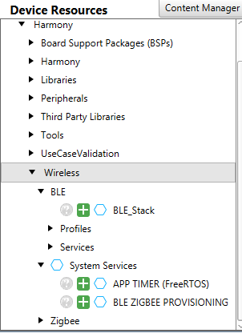
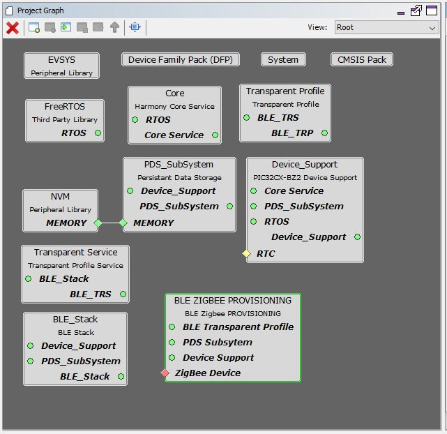
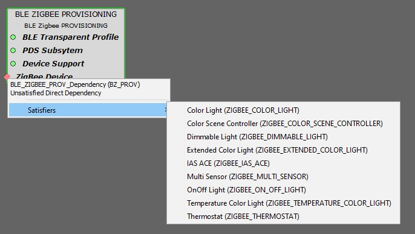
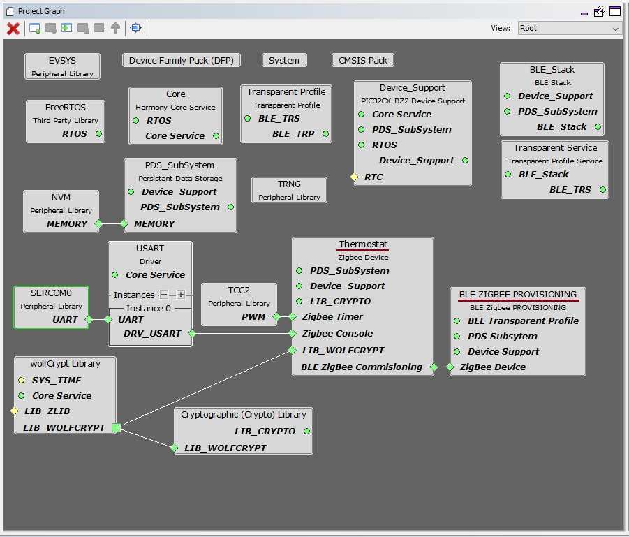
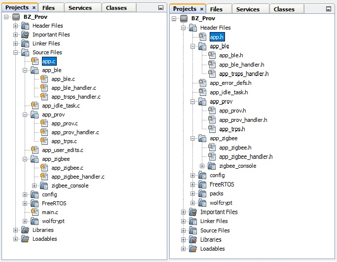
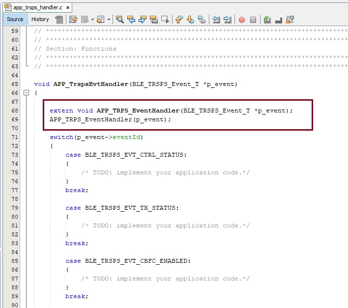

# BLE ZIGBEE Provisioning

This document explains how to use the Harmony 3 framework to add an application service for commissioning a Zigbee device using the BLE link to provide the commissioning parameters.

 

## Introduction

The BLE Zigbee Provisioning service can used to commission a ZigBee device into ZigBee network using a mobile phone via BLE link.
The BLE provisioner in the MBD App (available in Google Play Store and Apple Store) is utilized to demo the provisioning functionality.

 

## Hardware Required

  |**Tool**                | **Qty**  |
  |------------------------| ---------|
  |WBZ451 Curiosity Board  | 1        |
  |Micro USB cable         | 1        |

## SDK Setup

1.  [SDK Setup](../../../../docs/pic32cx_bz2_wbz45x_sdk_setup.md)

## Software

1.  [TeraTerm](https://ttssh2.osdn.jp/index.html.en) 

## Smartphone App

1.  Microchip Bluetooth Data (MBD)

## Developing this Application from scratch using Harmony 3

This section explains the steps required by a user to develop this application example from scratch using MPLABx Harmony 3 Framework

**Tip:** New Harmony 3 Users are recommended to go through the [overview](https://microchip-mplab-harmony.github.io/mhc/doc/readme.html) of Harmony 3. Users can add/remove different components like peripheral support and other wireless functionality by following steps mentioned [here](https://microchip-mplab-harmony.github.io/mhc/doc/readme_mhc_configuration.html). 

1.  Create a new MPLAB Harmony 3 Project -- [link](../../../../docs/creating_new_mplabx_harmony_project.md) for instructions

2.  Ensure that wireless_system_pic32cxbz2_wbz45 repo is checked out from MPLAB Harmony 3 Content Manager.

3.  Open MPLABx Harmony 3 Configurator. The Wireless System Service components will be displayed in available components --> Wireless --> System Services as shown in the below figure.

 

4.  Drag BLE ZIGBEE PROVISIONING component from available components to project graph area as shown in below figure. Accept Dependencies or satisfiers, select "Yes".

 

5.  To add the Zigbee Device into the project, right click on the Zigbee Device in BLE ZIGBEE PROVISIONING component as shown in below figure. Click on the satisfiers tab and select the required ZigBee Device.

 

 
6.  Accept Dependencies or satisfiers, select "Yes"

7.  Add Zigbee Console, if necessary. Ensure that the Transmit pinout and Receive pinout are selected as per the board configuration, if added.

8.  Here for e.g., Thermostat device is added in the project as shown in below figure.

 

9.  Select the Zigbee device component by click on the component (here Thermostat) in the project graph. Now the *Configuration Options* tab will list the Configurations for the selected Zigbee device.
	Ensure that the *Manual Configuration* is selected and *Network Formation Commissioning Enable* and *AUTOMATIC COMMISSIONING ON STARTUP* is deselected as shown in below figure.
	
 

10. Select the BLE Stack component by click on the component. In the *Configuration Options* tab, Expand *Generic Access Profile (GAP)* --> *Advertising* and then expand *Advertising Data* and *Scan Response Data*.

11. In *Advertising Data* menu, ensure that *Local Name* is deselected and selected in *Scan Response Data* --> *Local Name*. 
	In *Advertising Data* menu, ensure that *Service Data* is selected, *Service UUID* is selected as 0xFEDA and *Service Data* is set as 0xFF03 as shown in below figure.

 

**Note**: 
- 0xFEDA is a 16-bit Service UUID which is purchased by Microchip from Bluetooth SIG. 
- In order to list the device while scanning in Microchip Bluetooth Data (MBD) mobile application, the device should advertise with Service UUID as 0xFEDA and Service Data as 0xFF03.

12. Generate the code. Refer section *Harmony 3 Code Generation* for more details.

13. After generating the program source from MHC interface by clicking Generate Code, the BLE Zigbee Provisioning application service can be found in the following project directories.

 

## User Application Development

1.  Open app.c file and include the header file app_prov.h as shown in below figure.

    `#include "app_prov/app_prov.h"`

 

2.  In app.c, Add the following code after APP_BleStackInit() in APP_Tasks function.

    `APP_Prov_TRPS_Init();`

 

3.  Open app_ble_handler.c file located in app_ble project folder. In APP_BleGapEvtHandler() function, add the below code as shown in figure.

    `extern void BZ_Prov_BleGapEvtHandler(BLE_GAP_Event_T *p_event);`\
    `BZ_Prov_BleGapEvtHandler(p_event);`
	
 

4.  Open app_trsps_handler.c file. In APP_TrspsEvtHandler() function, add the below code as shown in figure.

    `extern void APP_TRPS_EventHandler(BLE_TRSPS_Event_T *p_event);`\
    `APP_TRPS_EventHandler(p_event);`

 

 
5.  Open app_zigbee_handler.c file located in app_zigbee project folder. In Zigbee_Event_Handler() function, add the below code as shown in figure.

    `extern void BZ_Prov_Zigbee_Event_Handler(APP_Zigbee_Event_t event);`\
    `BZ_Prov_Zigbee_Event_Handler(event);`

 

6.  Open app_user_edits.c file. Comment out or remove the #error line. Update the freertos_hooks.c as mentioned in app_user_edits.c file

7.  Compile and Run the project in WBZ45x device.

  
 
